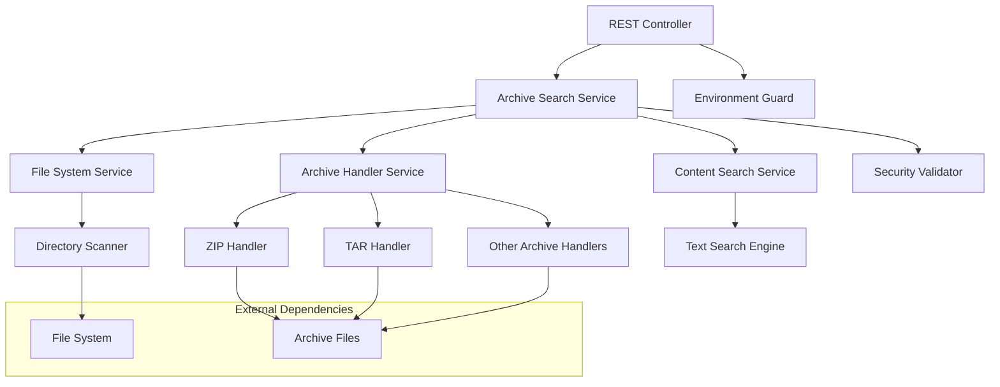

# Archive Search API Design Document

## Overview

The Archive Search API provides REST endpoints for searching and downloading files from both regular directories and archive files. This feature will be integrated into the existing database-script-watcher project (interfaces-utils) and will be restricted to non-production environments only. The API will be fully documented and testable through Swagger UI.

## Architecture

### High-Level Architecture



### Integration with Existing Project

The Archive Search API will be integrated into the database-script-watcher project as follows:

- **Package Structure**: `com.fabric.watcher.archive`
- **Configuration**: Extend existing application properties
- **Security**: Leverage existing security framework
- **Monitoring**: Integrate with existing metrics and health checks

## Components and Interfaces

### 1. REST Controller Layer

#### ArchiveSearchController
```java
@RestController
@RequestMapping("/api/v1/archive")
@ConditionalOnProperty(name = "archive.search.enabled", havingValue = "true")
public class ArchiveSearchController {
    
    @GetMapping("/search")
    public ResponseEntity<FileSearchResponse> searchFiles(
        @RequestParam String path,
        @RequestParam String pattern
    );
    
    @GetMapping("/download")
    public ResponseEntity<Resource> downloadFile(
        @RequestParam String filePath
    );
    
    @PostMapping("/content-search")
    public ResponseEntity<ContentSearchResponse> searchContent(
        @RequestBody ContentSearchRequest request
    );
}
```

### 2. Service Layer

#### ArchiveSearchService
```java
@Service
public class ArchiveSearchService {
    
    public FileSearchResponse searchFiles(String path, String pattern);
    public InputStream downloadFile(String filePath);
    public ContentSearchResponse searchContent(String filePath, String searchTerm);
    private boolean isPathAllowed(String path);
    private List<FileInfo> searchInArchive(Path archivePath, String pattern);
}
```

#### FileSystemService
```java
@Service
public class FileSystemService {
    
    public List<FileInfo> scanDirectory(Path directory, String pattern);
    public boolean isValidPath(String path);
    public FileMetadata getFileMetadata(Path file);
}
```

#### ArchiveHandlerService
```java
@Service
public class ArchiveHandlerService {
    
    public List<FileInfo> extractAndSearch(Path archivePath, String pattern);
    public InputStream extractFile(Path archivePath, String fileName);
    public boolean isArchiveFile(Path file);
    private ArchiveHandler getHandler(String fileExtension);
}
```

#### ContentSearchService
```java
@Service
public class ContentSearchService {
    
    public ContentSearchResponse searchInFile(Path filePath, String searchTerm);
    public ContentSearchResponse searchInArchiveFile(Path archivePath, String fileName, String searchTerm);
    private List<String> findMatchingLines(InputStream content, String searchTerm);
}
```

### 3. Security and Validation Layer

#### SecurityValidator
```java
@Component
public class SecurityValidator {
    
    public boolean isPathAllowed(String path);
    public boolean isFileAccessible(Path file);
    public String sanitizePath(String path);
    private boolean isPathTraversalAttempt(String path);
}
```

#### EnvironmentGuard
```java
@Component
@ConditionalOnProperty(name = "archive.search.enabled", havingValue = "true")
public class EnvironmentGuard {
    
    @PostConstruct
    public void validateEnvironment();
    public boolean isNonProductionEnvironment();
}
```

## Data Models

### Request/Response Models

#### FileSearchResponse
```java
public class FileSearchResponse {
    private List<FileInfo> files;
    private int totalCount;
    private String searchPath;
    private String searchPattern;
    private long searchTimeMs;
}
```

#### FileInfo
```java
public class FileInfo {
    private String fileName;
    private String fullPath;
    private String relativePath;
    private long size;
    private LocalDateTime lastModified;
    private FileType type; // REGULAR, ARCHIVE_ENTRY
    private String archivePath; // null for regular files
}
```

#### ContentSearchRequest
```java
public class ContentSearchRequest {
    private String filePath;
    private String searchTerm;
    private boolean caseSensitive = false;
    private boolean wholeWord = false;
}
```

#### ContentSearchResponse
```java
public class ContentSearchResponse {
    private List<SearchMatch> matches;
    private int totalMatches;
    private boolean truncated;
    private String downloadSuggestion;
    private long searchTimeMs;
}
```

#### SearchMatch
```java
public class SearchMatch {
    private int lineNumber;
    private String lineContent;
    private int columnStart;
    private int columnEnd;
}
```

### Configuration Models

#### ArchiveSearchProperties
```java
@ConfigurationProperties(prefix = "archive.search")
public class ArchiveSearchProperties {
    private boolean enabled = false;
    private List<String> allowedPaths = new ArrayList<>();
    private List<String> excludedPaths = new ArrayList<>();
    private int maxFileSize = 100 * 1024 * 1024; // 100MB
    private int maxSearchResults = 100;
    private int searchTimeoutSeconds = 30;
    private List<String> supportedArchiveTypes = Arrays.asList("zip", "tar", "tar.gz", "jar");
}
```

## Error Handling

### Exception Hierarchy

```java
public class ArchiveSearchException extends RuntimeException {
    private final ErrorCode errorCode;
    private final String details;
}

public enum ErrorCode {
    PATH_NOT_ALLOWED("ARCH001", "Path access denied"),
    FILE_NOT_FOUND("ARCH002", "File not found"),
    ARCHIVE_CORRUPTED("ARCH003", "Archive file is corrupted"),
    SEARCH_TIMEOUT("ARCH004", "Search operation timed out"),
    UNSUPPORTED_FORMAT("ARCH005", "Unsupported file format"),
    ENVIRONMENT_RESTRICTED("ARCH006", "Feature disabled in production");
}
```

### Global Exception Handler

```java
@ControllerAdvice
public class ArchiveSearchExceptionHandler {
    
    @ExceptionHandler(ArchiveSearchException.class)
    public ResponseEntity<ErrorResponse> handleArchiveSearchException(ArchiveSearchException ex);
    
    @ExceptionHandler(SecurityException.class)
    public ResponseEntity<ErrorResponse> handleSecurityException(SecurityException ex);
}
```

## Testing Strategy

### Unit Testing
- **Controller Tests**: Mock service dependencies, test request/response mapping
- **Service Tests**: Test business logic with mocked dependencies
- **Security Tests**: Validate path traversal prevention and access controls
- **Archive Handler Tests**: Test different archive formats and edge cases

### Integration Testing
- **End-to-End API Tests**: Test complete request flow through REST endpoints
- **File System Integration**: Test with real files and directories
- **Archive Processing**: Test with various archive formats and sizes
- **Environment Configuration**: Test production vs non-production behavior

### Performance Testing
- **Large File Handling**: Test with files approaching size limits
- **Concurrent Requests**: Test multiple simultaneous search operations
- **Memory Usage**: Monitor memory consumption during archive processing
- **Timeout Handling**: Verify proper timeout behavior for long operations

## Security Considerations

### Path Traversal Prevention
- Validate all input paths against allowed directories
- Sanitize path parameters to prevent "../" attacks
- Use canonical path resolution to detect traversal attempts

### Access Control
- Implement role-based access if authentication is available
- Log all file access attempts for audit purposes
- Restrict file types that can be accessed

### Resource Protection
- Implement file size limits to prevent memory exhaustion
- Set operation timeouts to prevent resource starvation
- Limit concurrent operations per user/session

### Environment Isolation
- Automatically detect production environment
- Disable API endpoints in production
- Provide clear error messages when disabled

## Configuration

### Application Properties

```yaml
archive:
  search:
    enabled: ${ARCHIVE_SEARCH_ENABLED:false}
    allowed-paths:
      - "/data/archives"
      - "/tmp/search"
    excluded-paths:
      - "/data/archives/sensitive"
    max-file-size: 104857600  # 100MB
    max-search-results: 100
    search-timeout-seconds: 30
    supported-archive-types:
      - zip
      - tar
      - tar.gz
      - jar

# Environment detection
spring:
  profiles:
    active: ${SPRING_PROFILES_ACTIVE:dev}

# Swagger configuration
springdoc:
  api-docs:
    groups:
      enabled: true
  group-configs:
    - group: archive-search
      paths-to-match: /api/v1/archive/**
      display-name: Archive Search API
```

### Environment Variables

- `ARCHIVE_SEARCH_ENABLED`: Enable/disable the API (default: false)
- `SPRING_PROFILES_ACTIVE`: Environment profile (prod disables API)
- `ARCHIVE_ALLOWED_PATHS`: Comma-separated list of allowed base paths
- `ARCHIVE_MAX_FILE_SIZE`: Maximum file size for processing

## Monitoring and Observability

### Metrics
- Request count and response times for each endpoint
- File search operation duration and result counts
- Archive processing times by format
- Error rates by error type

### Health Checks
- Archive search service availability
- File system access validation
- Configuration validation

### Logging
- All API requests with parameters (excluding sensitive data)
- File access attempts and results
- Security violations and blocked requests
- Performance metrics for large operations

## Deployment Considerations

### Environment Detection
The application will automatically detect the environment using:
1. `SPRING_PROFILES_ACTIVE` environment variable
2. System properties
3. Default to production (disabled) if detection fails

### Resource Requirements
- Additional memory for archive processing (recommend +512MB)
- Temporary disk space for archive extraction
- Network bandwidth for file downloads

### Monitoring Integration
- Integrate with existing Prometheus metrics
- Add Grafana dashboard panels for archive search metrics
- Configure alerts for high error rates or performance issues