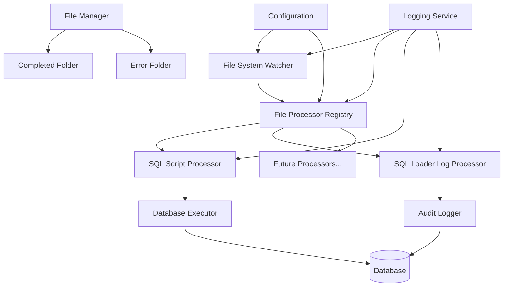

# Design Document

## Overview

The File Watcher Service is a Spring Boot service that provides automated file processing through configurable file system monitoring. The service uses Java NIO WatchService for efficient file system monitoring and supports pluggable file processors for different types of tasks. The initial implementation focuses on SQL script execution, with extensibility for future processors like SQL loader log processing and audit logging. The architecture emphasizes transaction safety, error handling, and operational visibility.

## Architecture

### High-Level Architecture



### Component Architecture

The system follows a layered architecture with clear separation of concerns:

1. **Presentation Layer**: REST endpoints for monitoring and control
2. **Service Layer**: Core business logic for file processing and SQL execution
3. **Infrastructure Layer**: File system operations, database access, and configuration
4. **Cross-cutting Concerns**: Logging, error handling, and monitoring

## Components and Interfaces

### 1. FileWatcherService

**Responsibility**: Monitor multiple configured folders and coordinate file processing through appropriate processors.

**Key Methods**:
- `startWatching()`: Initialize file system monitoring for all configured folders
- `stopWatching()`: Gracefully shutdown monitoring
- `processDetectedFiles(WatchConfig config)`: Handle newly detected files based on configuration
- `registerWatchConfig(WatchConfig config)`: Add new folder monitoring configuration

**Implementation Details**:
- Uses Java NIO `WatchService` for efficient file system monitoring
- Supports multiple watch configurations with different processors
- Handles file system events (CREATE, MODIFY) per configuration
- Filters files by configurable extensions and patterns
- Routes files to appropriate processors based on configuration

### 2. FileProcessorRegistry

**Responsibility**: Manage and route files to appropriate processors based on configuration.

**Key Methods**:
- `registerProcessor(String type, FileProcessor processor)`: Register new processor types
- `getProcessor(String type)`: Retrieve processor for given type
- `processFile(File file, WatchConfig config)`: Route file to appropriate processor

**Implementation Details**:
- Maintains registry of available file processors
- Supports dynamic processor registration
- Handles processor lifecycle management
- Provides fallback processing for unknown file types

### 3. SqlScriptProcessor (implements FileProcessor)

**Responsibility**: Parse and validate SQL scripts before execution.

**Key Methods**:
- `supports(WatchConfig config)`: Check if processor supports the configuration
- `processFile(File file, WatchConfig config)`: Process SQL script file
- `validateScript(File sqlFile)`: Validate SQL syntax and structure
- `parseStatements(String sqlContent)`: Split multi-statement files

**Implementation Details**:
- Supports both single and multi-statement SQL files
- Validates SQL syntax using basic parsing
- Categorizes scripts for appropriate transaction handling
- Handles SQL comments and whitespace normalization

### 4. SqlLoaderLogProcessor (implements FileProcessor)

**Responsibility**: Parse SQL*Loader log files and extract audit information for database logging.

**Key Methods**:
- `supports(WatchConfig config)`: Check if processor supports log file configuration
- `processFile(File file, WatchConfig config)`: Process SQL*Loader log file
- `parseLogFile(File logFile)`: Extract relevant information from log
- `writeAuditRecord(LogAuditInfo auditInfo)`: Write audit information to database

**Implementation Details**:
- Parses SQL*Loader log format and extracts key metrics
- Identifies successful/failed loads and record counts
- Writes structured audit information to configured audit table
- Handles various SQL*Loader log formats and versions

### 5. DatabaseExecutor

**Responsibility**: Execute SQL scripts against the configured database with proper transaction management.

**Key Methods**:
- `executeScript(File sqlFile, List<String> statements)`: Execute SQL with transaction management
- `executeDDL(String statement)`: Handle DDL operations
- `executeDML(String statement)`: Handle DML operations with transactions

**Implementation Details**:
- Uses Spring's `JdbcTemplate` for database operations
- Implements transaction management with rollback capability
- Provides connection retry logic with exponential backoff
- Supports multiple database types through JDBC

### 6. FileManager

**Responsibility**: Handle file operations including moving completed and failed files for any processor type.

**Key Methods**:
- `moveToCompleted(File file, WatchConfig config)`: Move successfully processed files
- `moveToError(File file, String errorDetails, WatchConfig config)`: Move failed files with error info
- `ensureDirectoriesExist(WatchConfig config)`: Create required folder structure

**Implementation Details**:
- Creates timestamped filenames for completed files
- Appends error details to failed file filenames
- Handles file system permissions and access issues
- Maintains atomic file operations to prevent corruption
- Supports different folder structures per watch configuration

### 7. FileWatcherController

**Responsibility**: Provide REST endpoints for monitoring and controlling the service.

**Key Methods**:
- `getStatus()`: Return current service status and statistics for all watch configurations
- `pauseWatching(String configName)`: Temporarily pause specific folder monitoring
- `resumeWatching(String configName)`: Resume specific folder monitoring
- `getProcessingHistory(String configName)`: Return recent processing history
- `addWatchConfig(WatchConfig config)`: Dynamically add new watch configuration

### 8. ConfigurationProperties

**Responsibility**: Externalize configuration through Spring Boot properties supporting multiple watch configurations.

**Configuration Properties**:
```yaml
file-watcher:
  global:
    max-retry-attempts: ${FILE_WATCHER_MAX_RETRIES:3}
    retry-delay: ${FILE_WATCHER_RETRY_DELAY:1000}
  
  watch-configs:
    sql-scripts:
      name: "SQL Script Processor"
      processor-type: "sql-script"
      watch-folder: ${SQL_WATCH_FOLDER:./sql-scripts}
      completed-folder: ${SQL_COMPLETED_FOLDER:./sql-scripts/completed}
      error-folder: ${SQL_ERROR_FOLDER:./sql-scripts/error}
      file-patterns: ["*.sql"]
      polling-interval: ${SQL_POLLING_INTERVAL:5000}
      enabled: true
    
    sqlloader-logs:
      name: "SQL Loader Log Processor"
      processor-type: "sqlloader-log"
      watch-folder: ${SQLLOADER_LOG_FOLDER:./sqlloader-logs}
      completed-folder: ${SQLLOADER_COMPLETED_FOLDER:./sqlloader-logs/completed}
      error-folder: ${SQLLOADER_ERROR_FOLDER:./sqlloader-logs/error}
      file-patterns: ["*.log", "*.ctl"]
      polling-interval: ${SQLLOADER_POLLING_INTERVAL:10000}
      enabled: false
```

## Data Models

### WatchConfig

```java
public class WatchConfig {
    private String name;
    private String processorType;
    private Path watchFolder;
    private Path completedFolder;
    private Path errorFolder;
    private List<String> filePatterns;
    private long pollingInterval;
    private boolean enabled;
    private Map<String, Object> processorSpecificConfig;
}
```

### FileProcessor Interface

```java
public interface FileProcessor {
    boolean supports(WatchConfig config);
    ProcessingResult processFile(File file, WatchConfig config);
    String getProcessorType();
}
```

### ProcessingResult

```java
public class ProcessingResult {
    private String filename;
    private String processorType;
    private LocalDateTime executionTime;
    private ExecutionStatus status;
    private String errorMessage;
    private long executionDurationMs;
    private Map<String, Object> metadata;
}
```

### ProcessingStatistics

```java
public class ProcessingStatistics {
    private String configName;
    private String processorType;
    private long totalFilesProcessed;
    private long successfulExecutions;
    private long failedExecutions;
    private LocalDateTime lastProcessingTime;
    private String currentStatus;
}
```

### LogAuditInfo (for SQL*Loader processor)

```java
public class LogAuditInfo {
    private String logFilename;
    private String controlFilename;
    private String dataFilename;
    private LocalDateTime loadStartTime;
    private LocalDateTime loadEndTime;
    private long recordsLoaded;
    private long recordsRejected;
    private String loadStatus;
    private String errorDetails;
}
```

## Error Handling

### Error Categories

1. **File System Errors**:
   - File access permissions
   - Disk space issues
   - Network drive connectivity

2. **Database Errors**:
   - Connection failures
   - SQL syntax errors
   - Constraint violations
   - Transaction timeouts

3. **Application Errors**:
   - Configuration issues
   - Resource exhaustion
   - Unexpected exceptions

### Error Handling Strategy

1. **Retry Logic**: Implement exponential backoff for transient failures
2. **Circuit Breaker**: Prevent cascade failures during database outages
3. **Dead Letter Queue**: Move persistently failing files to error folder
4. **Graceful Degradation**: Continue monitoring even when database is unavailable
5. **Comprehensive Logging**: Log all errors with context for troubleshooting

### Error Recovery

- **Database Connection Failures**: Retry with exponential backoff up to 3 times
- **File Access Errors**: Log error and skip file, retry on next polling cycle
- **SQL Execution Errors**: Move file to error folder with detailed error information
- **Configuration Errors**: Fail fast on startup with clear error messages

## Testing Strategy

### Unit Testing

1. **FileWatcherService**: Mock file system events and verify processing logic
2. **SqlScriptProcessor**: Test SQL parsing and validation with various script types
3. **DatabaseExecutor**: Use H2 in-memory database for transaction testing
4. **FileManager**: Test file operations with temporary directories
5. **Configuration**: Validate property binding and default values

### Integration Testing

1. **End-to-End Flow**: Test complete file processing workflow
2. **Database Integration**: Test against real database instances
3. **File System Integration**: Test with actual file system operations
4. **Error Scenarios**: Test failure modes and recovery mechanisms
5. **Performance Testing**: Validate performance under load

### Test Data Strategy

- **SQL Scripts**: Create test scripts for DDL, DML, and mixed operations
- **Error Scenarios**: Scripts with syntax errors, constraint violations
- **Edge Cases**: Empty files, very large files, special characters
- **Concurrent Processing**: Multiple files arriving simultaneously

## Security Considerations

1. **File System Access**: Restrict service account permissions to necessary directories
2. **SQL Injection Prevention**: Use parameterized queries where applicable
3. **Database Credentials**: Store credentials securely using Spring Boot's encryption
4. **Audit Logging**: Log all SQL executions for security auditing
5. **Input Validation**: Validate file extensions and content before processing

## Performance Considerations

1. **File System Monitoring**: Use efficient NIO WatchService instead of polling
2. **Database Connections**: Use connection pooling for optimal resource usage
3. **Transaction Management**: Minimize transaction scope for better concurrency
4. **Memory Usage**: Stream large files instead of loading entirely into memory
5. **Concurrent Processing**: Process multiple files concurrently when safe

## Monitoring and Observability

### Metrics

- Files processed per minute
- Average execution time per script
- Success/failure rates
- Database connection pool statistics
- File system operation latencies

### Health Checks

- Database connectivity
- File system accessibility
- Service status (running/paused/stopped)
- Configuration validation

### Logging

- Structured logging with correlation IDs
- Different log levels for different environments
- Separate log files for audit trail
- Integration with centralized logging systems