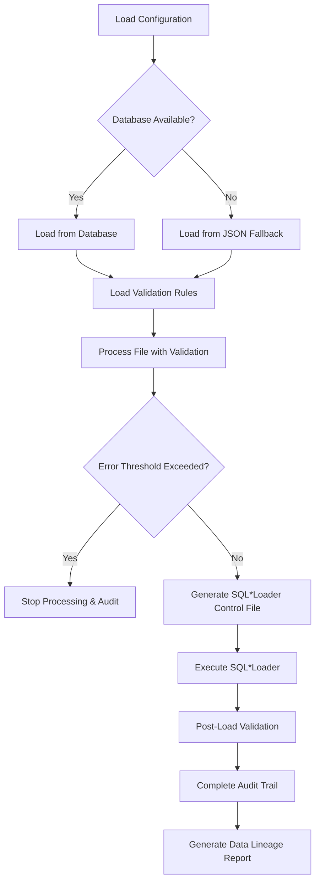

# Fabric Platform - Enterprise Data Loading & Batch Processing Framework

A comprehensive enterprise-grade data loading and batch processing platform with modular architecture, featuring configurable ETL operations, comprehensive validation, audit trails, and SQL*Loader integration.

## 🏗️ Architecture Overview

The Fabric Platform implements a modern, scalable modular architecture with integrated applications:

- **fabric-core**: Modular Spring Boot 3.4.6 + Spring Batch backend (4 modules)
  - **fabric-utils**: Common utilities and shared components
  - **fabric-data-loader**: Comprehensive data loading framework with SQL*Loader integration
  - **fabric-batch**: Spring Batch processing engine
  - **fabric-api**: REST API layer and controllers
- **fabric-ui**: React 18 + TypeScript frontend for configuration management

```
┌─────────────────┐    HTTP/REST    ┌──────────────────┐    JDBC    ┌─────────────┐
│   fabric-ui     │ ◄──────────────► │   fabric-api     │ ◄─────────► │   Oracle    │
│ (React/TypeScript) │                │  (REST Layer)    │             │  Database   │
│ Port: 3000      │                │                  │             │             │
└─────────────────┘                └──────────────────┘             └─────────────┘
                                             │
                                             ▼
                                    ┌──────────────────┐    SQL*Loader    ┌─────────────┐
                                    │ fabric-data-loader│ ◄──────────────► │ Data Files  │
                                    │  (Validation &    │                  │ (Pipe-     │
                                    │   Loading)        │                  │ Delimited)  │
                                    └──────────────────┘                  └─────────────┘
                                             │
                                             ▼
                                    ┌──────────────────┐
                                    │  fabric-batch    │
                                    │ (Spring Batch)   │
                                    └──────────────────┘
                                             │
                                             ▼
                                    ┌──────────────────┐
                                    │  fabric-utils    │
                                    │ (Common Utils)   │
                                    └──────────────────┘
```

## 🚀 Quick Start

### Prerequisites

- **Java 17+** (for fabric-core modular backend)
- **Node.js 16+** (for fabric-ui)
- **Oracle Database** (with SQL*Loader for fabric-data-loader)
- **Maven 3.6+**
- **Oracle SQL*Loader** (for data loading operations)

### Backend Setup (fabric-core)

```bash
cd fabric-core

# Configure database connection
cp src/main/resources/application-template.yml src/main/resources/application.yml
# Edit application.yml with your database credentials

# Build and run
./mvnw clean install
./mvnw spring-boot:run

# Backend will be available at http://localhost:8080
```

### Frontend Setup (fabric-ui)

```bash
cd fabric-ui

# Install dependencies
npm install

# Configure API endpoint
cp .env.template .env
# Edit .env with backend URL if needed

# Start development server
npm start

# Frontend will be available at http://localhost:3000
```

### Full Stack Development

```bash
# Terminal 1 - Backend
cd fabric-core && ./mvnw spring-boot:run

# Terminal 2 - Frontend  
cd fabric-ui && npm start

# Access application at http://localhost:3000
```

## 📁 Modular Project Structure

```
fabric-platform/
├── fabric-core/                    # Modular Spring Boot Backend
│   ├── pom.xml                    # Parent POM with module management
│   ├── fabric-utils/              # Common Utilities Module
│   │   ├── src/main/java/com/truist/utils/
│   │   │   ├── common/            # Shared utility classes
│   │   │   ├── exception/         # Custom exception handling
│   │   │   └── constants/         # Application constants
│   │   └── pom.xml
│   ├── fabric-data-loader/        # Data Loading Framework Module
│   │   ├── src/main/java/com/truist/batch/
│   │   │   ├── audit/             # Comprehensive audit trail system
│   │   │   ├── config/            # Database + JSON fallback configuration
│   │   │   ├── entity/            # JPA entities for data loading
│   │   │   ├── orchestrator/      # Main data loading orchestrator
│   │   │   ├── repository/        # Data access layer
│   │   │   ├── sqlloader/         # Oracle SQL*Loader integration
│   │   │   ├── threshold/         # Configurable error threshold management
│   │   │   └── validation/        # Comprehensive validation engine
│   │   ├── src/main/resources/
│   │   │   ├── config/            # JSON fallback configurations
│   │   │   ├── sql/               # Database schema for data loading
│   │   │   └── templates/         # SQL*Loader control file templates
│   │   └── pom.xml
│   ├── fabric-batch/              # Spring Batch Processing Module
│   │   ├── src/main/java/com/truist/batch/
│   │   │   ├── adapter/           # Data source adapters (JDBC, REST, File)
│   │   │   ├── config/            # Spring Batch configuration
│   │   │   ├── reader/            # Spring Batch ItemReaders
│   │   │   ├── processor/         # Data transformation logic
│   │   │   └── writer/            # Output generation
│   │   └── pom.xml
│   └── fabric-api/                # REST API Module
│       ├── src/main/java/com/truist/api/
│       │   ├── controller/        # REST API endpoints
│       │   ├── dto/               # Data transfer objects
│       │   ├── service/           # Business logic layer
│       │   └── Application.java   # Main Spring Boot application
│       ├── src/main/resources/
│       │   ├── application.yml    # Main configuration
│       │   └── db/migration/      # Database schema
│       └── pom.xml
├── fabric-ui/                     # React Frontend
│   ├── src/
│   │   ├── components/            # Reusable UI components
│   │   ├── pages/                 # Route-level components
│   │   ├── contexts/              # React Context providers
│   │   ├── hooks/                 # Custom React hooks
│   │   ├── services/              # API integration layer
│   │   └── types/                 # TypeScript definitions
│   ├── public/                    # Static assets
│   └── package.json               # Node.js dependencies
└── README.md                      # This file
```

## 🔧 Key Features

### 🏗️ Modular Architecture (fabric-core)

#### fabric-data-loader (NEW)
- **🎯 Comprehensive Data Loading Framework**: Enterprise-grade data loading with Oracle SQL*Loader integration
- **📋 Database + JSON Fallback Configuration**: Primary database storage with automatic JSON fallback
- **✅ Advanced Validation Engine**: Field length, required field, and data type validations (15+ validation types)
- **🚨 Configurable Error Thresholds**: Continue/stop processing based on configurable error and warning thresholds
- **📊 Detailed Audit System**: Complete data lineage tracking, compliance reporting, and performance metrics
- **🔄 Data Loading Orchestrator**: Comprehensive orchestration of validation, loading, and audit processes
- **📁 Multi-format Support**: Pipe-delimited files (extensible to other formats)
- **🛡️ Enterprise Security**: PII detection, encryption support, data classification, retention policies

#### fabric-batch
- **Plugin Architecture**: Extensible data source adapters (JDBC, REST API, File)
- **Dynamic Configuration**: YAML-based job configuration with runtime loading
- **Spring Batch Integration**: Robust ETL processing with partitioning support
- **Transaction Support**: Multi-transaction type processing (200, 300, 900)

#### fabric-api
- **REST API Layer**: Clean separation of API endpoints and business logic
- **Monitoring**: Micrometer + Prometheus metrics integration
- **Audit Trail**: Complete configuration change tracking

#### fabric-utils
- **Shared Components**: Common utilities and exception handling
- **Cross-cutting Concerns**: Logging, validation, and constants management

### Frontend (fabric-ui)

- **Drag & Drop Interface**: Intuitive field mapping with React Beautiful DnD
- **Real-time Validation**: Live configuration validation
- **YAML Preview**: Generated configuration preview with Monaco Editor
- **Template Management**: Reusable configuration templates
- **Responsive Design**: Material-UI based responsive interface
- **Type Safety**: Full TypeScript implementation

## 🎯 Data Loading Framework (fabric-data-loader)

### Overview
The fabric-data-loader module provides a comprehensive, enterprise-grade data loading framework designed for high-volume, mission-critical data processing with Oracle SQL*Loader integration.

### Core Components

#### 🔧 Configuration Management
- **Database-First Approach**: Primary configuration storage in database tables
- **JSON Fallback**: Automatic fallback to JSON configuration files when database is unavailable
- **Runtime Switching**: Seamless switching between database and file-based configurations
- **Configuration Versioning**: Full version control and audit trail for configuration changes

#### ✅ Comprehensive Validation Engine
```java
// Validation Types Supported:
- REQUIRED_FIELD_VALIDATION     // Mandatory field validation
- LENGTH_VALIDATION             // Field length constraints
- DATA_TYPE_VALIDATION          // Data type validation (Integer, Decimal, Date, etc.)
- PATTERN_VALIDATION            // Regex pattern matching
- EMAIL_VALIDATION              // Email format validation
- PHONE_VALIDATION              // Phone number format validation
- SSN_VALIDATION                // Social Security Number validation
- NUMERIC_VALIDATION            // Numeric format validation
- DATE_FORMAT_VALIDATION        // Date format validation
- RANGE_VALIDATION              // Numeric range validation
- REFERENTIAL_INTEGRITY         // Database foreign key validation
- UNIQUE_FIELD_VALIDATION       // Uniqueness constraints
- ACCOUNT_NUMBER_VALIDATION     // Account number format validation
- CUSTOM_SQL_VALIDATION         // Custom SQL-based validation
- BUSINESS_RULE_EXECUTION       // Custom business rule validation
```

#### 🚨 Error Threshold Management
```java
// Configurable thresholds per data loading configuration
- Maximum Error Count           // Stop processing after N errors
- Warning Threshold            // Alert after N warnings
- Error Rate Percentage        // Stop if error rate exceeds threshold
- Configurable Actions         // Continue, Stop, or Alert based on thresholds
```

#### 📊 Comprehensive Audit System
```java
// Audit Trail Components:
- Data Lineage Tracking        // Complete data flow documentation
- Performance Metrics          // Execution time, memory usage, throughput
- Security Events              // PII access, encryption, masking activities
- Compliance Reporting         // Regulatory compliance status
- Error Event Logging          // Detailed error analysis and stack traces
- Configuration Change Audit   // Complete configuration change history
```

#### 🗄️ SQL*Loader Integration
- **Dynamic Control File Generation**: Template-based control file creation
- **Multi-format Support**: Pipe-delimited, comma-delimited, fixed-width files
- **Performance Optimization**: Parallel loading, direct path insertion
- **Error Handling**: Bad file management, discard file processing
- **Execution Monitoring**: Real-time progress tracking and status reporting

### Data Loading Workflow



### Database Schema (Data Loading)

```sql
-- Main configuration table
CREATE TABLE data_load_configs (
    config_id VARCHAR2(100) PRIMARY KEY,
    job_name VARCHAR2(50) NOT NULL,
    source_system VARCHAR2(50) NOT NULL,
    target_table VARCHAR2(100) NOT NULL,
    file_type VARCHAR2(20) DEFAULT 'PIPE_DELIMITED',
    max_errors NUMBER DEFAULT 1000,
    validation_enabled VARCHAR2(1) DEFAULT 'Y',
    -- ... additional configuration fields
    enabled VARCHAR2(1) DEFAULT 'Y'
);

-- Validation rules table
CREATE TABLE validation_rules (
    rule_id NUMBER GENERATED BY DEFAULT AS IDENTITY PRIMARY KEY,
    config_id VARCHAR2(100) NOT NULL,
    field_name VARCHAR2(100) NOT NULL,
    rule_type VARCHAR2(50) NOT NULL,
    data_type VARCHAR2(50),
    max_length NUMBER,
    required_field VARCHAR2(1) DEFAULT 'N',
    error_message VARCHAR2(500),
    execution_order NUMBER DEFAULT 1,
    enabled VARCHAR2(1) DEFAULT 'Y',
    FOREIGN KEY (config_id) REFERENCES data_load_configs(config_id)
);

-- Comprehensive audit trail
CREATE TABLE data_load_audit (
    audit_id NUMBER GENERATED BY DEFAULT AS IDENTITY PRIMARY KEY,
    config_id VARCHAR2(100) NOT NULL,
    job_execution_id VARCHAR2(100),
    correlation_id VARCHAR2(100) NOT NULL,
    audit_type VARCHAR2(50) NOT NULL,
    event_name VARCHAR2(100) NOT NULL,
    record_count NUMBER,
    processed_count NUMBER,
    error_count NUMBER,
    data_quality_score NUMBER,
    compliance_status VARCHAR2(20) DEFAULT 'COMPLIANT',
    audit_timestamp TIMESTAMP DEFAULT CURRENT_TIMESTAMP,
    -- ... additional audit fields
    FOREIGN KEY (config_id) REFERENCES data_load_configs(config_id)
);

-- Processing job execution tracking
CREATE TABLE processing_jobs (
    job_execution_id VARCHAR2(100) PRIMARY KEY,
    config_id VARCHAR2(100) NOT NULL,
    correlation_id VARCHAR2(100) NOT NULL,
    file_name VARCHAR2(500),
    job_status VARCHAR2(20) DEFAULT 'SUBMITTED',
    total_records NUMBER DEFAULT 0,
    successful_records NUMBER DEFAULT 0,
    failed_records NUMBER DEFAULT 0,
    sql_loader_return_code NUMBER,
    -- ... additional execution tracking fields
    FOREIGN KEY (config_id) REFERENCES data_load_configs(config_id)
);
```

### Configuration Examples

#### Database Configuration
```sql
INSERT INTO data_load_configs (
    config_id, job_name, source_system, target_table, 
    file_type, max_errors, validation_enabled
) VALUES (
    'HR-P327-001', 'p327', 'hr', 'CUSTOMER_DATA',
    'PIPE_DELIMITED', 1000, 'Y'
);
```

#### JSON Fallback Configuration
```json
{
  "configurations": [
    {
      "configId": "HR-P327-001",
      "jobName": "p327",
      "sourceSystem": "hr",
      "targetTable": "CUSTOMER_DATA",
      "fileType": "PIPE_DELIMITED",
      "fieldDelimiter": "|",
      "maxErrors": 1000,
      "validationEnabled": "Y"
    }
  ],
  "validationRules": [
    {
      "configId": "HR-P327-001",
      "fieldName": "CUSTOMER_ID",
      "ruleType": "REQUIRED_FIELD_VALIDATION",
      "dataType": "INTEGER",
      "requiredField": "Y",
      "errorMessage": "Customer ID is required"
    }
  ]
}
```

### Usage Example

```java
@Autowired
private DataLoadOrchestrator orchestrator;

// Execute complete data loading process
DataLoadResult result = orchestrator.executeDataLoad(
    "HR-P327-001",           // Configuration ID
    "customer_data.dat",     // File name
    "/data/input/hr/customer_data.dat"  // File path
);

// Check results
if (result.isSuccess()) {
    System.out.println("Data load completed successfully");
    System.out.println("Total records: " + result.getTotalRecords());
    System.out.println("Successful: " + result.getSuccessfulRecords());
    System.out.println("Failed: " + result.getFailedRecords());
} else {
    System.out.println("Data load failed: " + result.getErrorMessage());
}
```

## 🛠️ Technology Stack

### Backend Technologies
- **Framework**: Spring Boot 3.4.6, Spring Batch
- **Database**: Oracle Database with HikariCP connection pooling
- **Security**: Spring Security (integration ready)
- **Monitoring**: Micrometer, Prometheus, Spring Actuator
- **Testing**: JUnit 5, TestContainers, WireMock
- **Build**: Maven 3.6+

### Frontend Technologies
- **Framework**: React 18, TypeScript 4.9
- **UI Library**: Material-UI 5.17
- **State Management**: React Context API
- **Forms**: React Hook Form
- **HTTP Client**: Axios
- **Build**: Create React App, Webpack
- **Testing**: Jest, React Testing Library

## 🔌 API Endpoints

### Data Loading Operations (NEW)
```
POST   /api/data-loader/execute/{configId}        # Execute data loading job
GET    /api/data-loader/status/{jobId}            # Get job execution status
GET    /api/data-loader/configs                   # Get all data loading configurations
GET    /api/data-loader/configs/{configId}        # Get specific configuration
POST   /api/data-loader/configs                   # Create new configuration
PUT    /api/data-loader/configs/{configId}        # Update configuration
DELETE /api/data-loader/configs/{configId}        # Delete configuration
GET    /api/data-loader/validation-rules/{configId} # Get validation rules
POST   /api/data-loader/validation-rules          # Create validation rule
GET    /api/data-loader/audit/{correlationId}     # Get audit trail
GET    /api/data-loader/audit/lineage/{correlationId} # Get data lineage report
GET    /api/data-loader/statistics                # Get loading statistics
GET    /api/data-loader/health                    # Get system health status
```

### Threshold Management
```
GET    /api/thresholds/{configId}                 # Get error thresholds
POST   /api/thresholds/{configId}                 # Configure thresholds
GET    /api/thresholds/statistics                 # Get threshold statistics
POST   /api/thresholds/{configId}/reset           # Reset threshold counters
```

### Configuration Management
```
GET    /api/ui/source-systems              # Get available source systems
GET    /api/ui/mappings/{system}/{job}     # Get field mappings for job
POST   /api/ui/mappings/save               # Save configuration
POST   /api/ui/mappings/validate           # Validate configuration
POST   /api/ui/mappings/generate-yaml      # Generate YAML config
```

### Template Operations
```
GET    /api/ui/templates                   # Get all templates
POST   /api/ui/templates                   # Create template
PUT    /api/ui/templates/{id}              # Update template
DELETE /api/ui/templates/{id}              # Delete template
```

### Batch Execution
```
POST   /api/batch/jobs/execute             # Execute batch job
GET    /api/batch/jobs/status/{jobId}      # Get job status
GET    /api/batch/jobs/history             # Get execution history
```

## 🗄️ Database Schema

### Data Loading Framework Tables (NEW)
```sql
-- Data loading configurations with comprehensive settings
data_load_configs (
    config_id VARCHAR2(100) PRIMARY KEY,
    job_name VARCHAR2(50) NOT NULL,
    source_system VARCHAR2(50) NOT NULL,
    target_table VARCHAR2(100) NOT NULL,
    file_type VARCHAR2(20) DEFAULT 'PIPE_DELIMITED',
    field_delimiter VARCHAR2(10) DEFAULT '|',
    max_errors NUMBER DEFAULT 1000,
    validation_enabled VARCHAR2(1) DEFAULT 'Y',
    encryption_required VARCHAR2(1) DEFAULT 'N',
    pii_data VARCHAR2(1) DEFAULT 'N',
    data_classification VARCHAR2(20) DEFAULT 'INTERNAL',
    retention_days NUMBER DEFAULT 2555,
    created_date TIMESTAMP DEFAULT CURRENT_TIMESTAMP,
    enabled VARCHAR2(1) DEFAULT 'Y'
);

-- Comprehensive validation rules with 15+ validation types
validation_rules (
    rule_id NUMBER GENERATED BY DEFAULT AS IDENTITY PRIMARY KEY,
    config_id VARCHAR2(100) NOT NULL,
    field_name VARCHAR2(100) NOT NULL,
    rule_type VARCHAR2(50) NOT NULL, -- REQUIRED_FIELD, LENGTH, DATA_TYPE, etc.
    data_type VARCHAR2(50),
    max_length NUMBER,
    min_length NUMBER,
    required_field VARCHAR2(1) DEFAULT 'N',
    pattern VARCHAR2(500),
    error_message VARCHAR2(500),
    execution_order NUMBER DEFAULT 1,
    enabled VARCHAR2(1) DEFAULT 'Y',
    FOREIGN KEY (config_id) REFERENCES data_load_configs(config_id)
);

-- Processing job execution tracking with detailed metrics
processing_jobs (
    job_execution_id VARCHAR2(100) PRIMARY KEY,
    config_id VARCHAR2(100) NOT NULL,
    correlation_id VARCHAR2(100) NOT NULL,
    file_name VARCHAR2(500),
    job_status VARCHAR2(20) DEFAULT 'SUBMITTED',
    total_records NUMBER DEFAULT 0,
    successful_records NUMBER DEFAULT 0,
    failed_records NUMBER DEFAULT 0,
    validation_errors NUMBER DEFAULT 0,
    sql_loader_return_code NUMBER,
    duration_ms NUMBER,
    started_date TIMESTAMP,
    completed_date TIMESTAMP,
    FOREIGN KEY (config_id) REFERENCES data_load_configs(config_id)
);

-- Comprehensive audit trail for compliance and data lineage
data_load_audit (
    audit_id NUMBER GENERATED BY DEFAULT AS IDENTITY PRIMARY KEY,
    config_id VARCHAR2(100) NOT NULL,
    job_execution_id VARCHAR2(100),
    correlation_id VARCHAR2(100) NOT NULL,
    audit_type VARCHAR2(50) NOT NULL, -- DATA_LINEAGE, SECURITY_EVENT, etc.
    event_name VARCHAR2(100) NOT NULL,
    record_count NUMBER,
    processed_count NUMBER,
    error_count NUMBER,
    data_quality_score NUMBER,
    compliance_status VARCHAR2(20) DEFAULT 'COMPLIANT',
    user_id VARCHAR2(50) NOT NULL,
    audit_timestamp TIMESTAMP DEFAULT CURRENT_TIMESTAMP,
    FOREIGN KEY (config_id) REFERENCES data_load_configs(config_id)
);

-- Detailed execution logs for debugging and monitoring
job_execution_logs (
    log_id NUMBER GENERATED BY DEFAULT AS IDENTITY PRIMARY KEY,
    job_execution_id VARCHAR2(100) NOT NULL,
    correlation_id VARCHAR2(100) NOT NULL,
    step_name VARCHAR2(100) NOT NULL,
    step_status VARCHAR2(20) NOT NULL,
    log_level VARCHAR2(10) DEFAULT 'INFO',
    log_message VARCHAR2(4000),
    step_start_time TIMESTAMP DEFAULT CURRENT_TIMESTAMP,
    step_duration_ms NUMBER,
    records_processed NUMBER DEFAULT 0,
    FOREIGN KEY (job_execution_id) REFERENCES processing_jobs(job_execution_id)
);
```

### Legacy Batch Configuration Tables
```sql
-- Original batch configuration storage
batch_configurations (
    id VARCHAR(100),
    source_system VARCHAR(50),
    job_name VARCHAR(50),
    transaction_type VARCHAR(10),
    configuration_json CLOB,
    created_date TIMESTAMP,
    version NUMBER,
    enabled CHAR(1)
);

-- Configuration change audit trail
configuration_audit (
    audit_id NUMBER,
    config_id VARCHAR(100),
    action VARCHAR(20),
    old_value CLOB,
    new_value CLOB,
    changed_by VARCHAR(50),
    change_date TIMESTAMP
);
```

## 🧪 Testing

### Backend Testing
```bash
cd fabric-core

# Run all tests
./mvnw test

# Run integration tests
./mvnw test -Dtest="*IntegrationTest"

# Run with coverage
./mvnw test jacoco:report
```

### Frontend Testing
```bash
cd fabric-ui

# Run unit tests
npm test

# Run tests with coverage
npm test -- --coverage

# Run e2e tests
npm run test:e2e
```

## 📊 Monitoring and Observability

### Health Checks
- **Backend**: `http://localhost:8080/actuator/health`
- **Frontend**: Built-in Create React App health monitoring

### Metrics
- **Prometheus**: `http://localhost:8080/actuator/prometheus`
- **Spring Boot Actuator**: `http://localhost:8080/actuator`

### Logging
- **Backend**: SLF4J + Logback with structured JSON logging
- **Frontend**: Console-based logging with error boundaries

## 🔒 Security

### Implementation Status
- ✅ SQL injection prevention with parameterized queries
- ✅ Input validation and sanitization
- ✅ Audit trail for configuration changes
- ✅ Environment-specific configuration
- 🔄 Authentication/Authorization (framework ready)
- 🔄 JWT token support (client-side ready)
- 🔄 Role-based access control structure

### Security Best Practices
- Database credentials externalized to environment variables
- CORS configuration for cross-origin requests
- Request/response interceptors for authentication
- Error handling without information disclosure

## 🚀 Deployment

### Development
```bash
# Backend
cd fabric-core && ./mvnw spring-boot:run

# Frontend
cd fabric-ui && npm start
```

### Production Build
```bash
# Backend JAR
cd fabric-core && ./mvnw clean package

# Frontend static files
cd fabric-ui && npm run build
```

### Docker Support (Recommended)
```dockerfile
# Backend Dockerfile
FROM openjdk:17-jre-slim
COPY target/fabric-core-*.jar app.jar
EXPOSE 8080
ENTRYPOINT ["java", "-jar", "/app.jar"]

# Frontend Dockerfile
FROM node:16-alpine as build
WORKDIR /app
COPY package*.json ./
RUN npm install
COPY . .
RUN npm run build

FROM nginx:alpine
COPY --from=build /app/build /usr/share/nginx/html
```

## 📈 Performance Considerations

### Backend Optimizations
- **Connection Pooling**: HikariCP with optimized pool size (20 connections)
- **Batch Processing**: Configurable chunk size (default: 1000)
- **Parallel Processing**: Grid-based partitioning (default: 10 threads)
- **Caching**: Template and configuration caching

### Frontend Optimizations
- **Code Splitting**: Lazy loading for route components
- **Memoization**: React.memo for expensive components
- **Virtual Scrolling**: For large data lists
- **Bundle Optimization**: Webpack optimization in CRA

## 🐛 Troubleshooting

### Common Issues

#### Backend Won't Start
```bash
# Check Java version
java -version  # Should be 17+

# Check database connectivity
telnet your-db-host 1521

# Check application.yml configuration
cat src/main/resources/application.yml
```

#### Frontend Build Fails
```bash
# Clear node_modules and reinstall
rm -rf node_modules package-lock.json
npm install

# Check Node.js version
node -v  # Should be 16+
```

#### Database Connection Issues
- Verify Oracle JDBC driver compatibility
- Check database URL format: `jdbc:oracle:thin:@host:port/service`
- Ensure database user has required permissions
- Check firewall/network connectivity

## 🤝 Contributing

### Development Workflow
1. **Branch Strategy**: Feature branches from `feature/enhanced-batch-framework`
2. **Code Style**: 
   - Backend: Google Java Style Guide
   - Frontend: Prettier + ESLint configuration
3. **Testing**: All new features require tests
4. **Documentation**: Update README for significant changes

### Code Quality
- **Backend**: SonarQube integration ready
- **Frontend**: ESLint + Prettier enforced
- **Git Hooks**: Pre-commit hooks for code formatting

## 📚 Additional Resources

### Documentation
- [Spring Batch Documentation](https://spring.io/projects/spring-batch)
- [React Documentation](https://reactjs.org/docs)
- [Material-UI Documentation](https://mui.com/)
- [TypeScript Documentation](https://www.typescriptlang.org/docs/)

### Architecture Decision Records
- ADR-001: Plugin-based Data Source Architecture
- ADR-002: React Context vs Redux for State Management
- ADR-003: TypeScript Implementation Strategy
- ADR-004: Database Schema Design Decisions

## 📞 Support

For questions or issues:
- **Technical Issues**: Create GitHub issue with detailed reproduction steps
- **Feature Requests**: Submit feature request with business justification
- **Security Concerns**: Follow responsible disclosure process

---

## 🎉 Recent Updates (July 2025)

### Major Enhancements
- ✅ **Modular Architecture**: Split fabric-core into 4 specialized modules
- ✅ **Data Loading Framework**: Complete enterprise-grade data loading system
- ✅ **Database + JSON Fallback**: Flexible configuration management
- ✅ **Comprehensive Validation**: 15+ validation types with configurable rules
- ✅ **Error Threshold Management**: Configurable error and warning thresholds
- ✅ **Audit & Compliance**: Complete data lineage and audit trail system
- ✅ **SQL*Loader Integration**: Oracle SQL*Loader with template-based control files
- ✅ **Performance Monitoring**: Real-time metrics and health monitoring

### Framework Capabilities
- **Enterprise Security**: PII detection, encryption, data classification
- **Scalability**: Parallel processing and performance optimization
- **Compliance**: SOX, PCI-DSS, GDPR compliance reporting
- **Monitoring**: Comprehensive audit trails and data lineage tracking
- **Flexibility**: Plugin architecture and extensible validation engine

**Version**: 2.0.0  
**Last Updated**: July 29, 2025  
**License**: Enterprise Internal Use