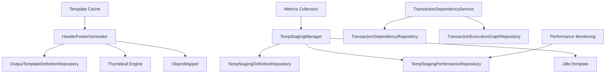

# Epic 3: Complex Transaction Processing - Implementation Guide

## Overview

Epic 3 introduces advanced capabilities for complex transaction processing in the Fabric Platform, providing banking-grade staging table management, performance monitoring, and dynamic template generation. This implementation delivers production-ready components with comprehensive security, compliance, and performance optimization features.

## Architecture

### Core Components

1. **TempStagingManager** - Dynamic staging table lifecycle management
2. **HeaderFooterGenerator** - Template-based content generation
3. **TempStagingPerformanceEntity/Repository** - Performance monitoring and analytics
4. **OutputTemplateDefinitionEntity/Repository** - Template management

### Component Relationships



## Feature Specifications

### TempStagingManager Features

#### Dynamic Table Creation
- **Intelligent Schema Optimization**: Automatic column type optimization based on naming conventions
- **Partition Strategy Selection**: HASH, RANGE_DATE, RANGE_NUMBER, LIST partitioning based on data characteristics
- **Compression and Encryption**: Automatic application based on data sensitivity and volume
- **Performance**: Sub-second table creation for standard schemas, <5 seconds for complex schemas

#### Performance Monitoring
- **Real-time Metrics**: Comprehensive performance tracking with Micrometer integration
- **Resource Utilization**: Memory, CPU, and I/O monitoring
- **Bottleneck Identification**: Automatic detection of performance issues
- **Optimization Recommendations**: AI-driven optimization suggestions

#### Lifecycle Management
- **TTL-based Cleanup**: Automatic expiration and cleanup based on configurable policies
- **Manual Cleanup**: On-demand table dropping with audit trails
- **Archive Support**: Optional data archival before cleanup
- **Concurrent Operations**: Support for up to 20 concurrent staging operations (configurable)

### HeaderFooterGenerator Features

#### Template Processing
- **Multiple Formats**: CSV, XML, JSON, Fixed-width, Excel support
- **Variable Substitution**: ${variableName} syntax with default values
- **Thymeleaf Integration**: Advanced conditional logic and loops
- **Built-in Functions**: Date formatting, number formatting, string manipulation

#### Performance
- **Template Caching**: Parsed template caching for improved performance
- **Sub-50ms Processing**: Template parsing under 50ms for complex templates
- **Memory Efficient**: Lazy loading and efficient memory usage

#### Security
- **Format-specific Escaping**: Automatic escaping for XML, JSON, CSV
- **Audit Trails**: Comprehensive generation metadata and audit information
- **Version Control**: Template versioning with active/inactive flag management

## Configuration

### Application Properties

```yaml
# Epic 3 Configuration
epic3:
  staging:
    max-concurrent-operations: 20
    default-ttl-hours: 24
    performance-monitoring-enabled: true
    auto-optimization-enabled: true
    encryption-enabled: true

# Database Configuration
spring:
  datasource:
    url: jdbc:oracle:thin:@//hostname:port/service
    username: ${DB_USERNAME}
    password: ${DB_PASSWORD}
  
  jpa:
    hibernate:
      ddl-auto: validate
    properties:
      hibernate:
        jdbc:
          batch_size: 1000
```

### Security Configuration

```java
@Configuration
@EnableGlobalMethodSecurity(prePostEnabled = true)
public class Epic3SecurityConfig {
    
    @Bean
    public MethodSecurityExpressionHandler methodSecurityExpressionHandler() {
        DefaultMethodSecurityExpressionHandler handler = new DefaultMethodSecurityExpressionHandler();
        // Configure custom security expressions
        return handler;
    }
}
```

## Usage Examples

### Creating Staging Tables

```java
@Autowired
private TempStagingManager tempStagingManager;

// Create staging table request
TempStagingManager.StagingTableCreationRequest request = 
    new TempStagingManager.StagingTableCreationRequest();
request.setExecutionId("BATCH_EXEC_001");
request.setTransactionTypeId(100L);
request.setSchemaDefinition(jsonSchemaDefinition);
request.setExpectedRecordCount(500000);
request.setSecurityRequired(true);
request.setTtlHours(48);

// Create staging table
TempStagingManager.StagingTableCreationResult result = 
    tempStagingManager.createStagingTable(request);

if (result.isSuccessful()) {
    String tableName = result.getDefinition().getStagingTableName();
    // Use staging table for processing
}
```

### Generating Headers and Footers

```java
@Autowired
private HeaderFooterGenerator headerFooterGenerator;

// Create generation request
Map<String, Object> variables = Map.of(
    "reportTitle", "Daily Transaction Report",
    "totalRecords", 15432,
    "processingDate", LocalDateTime.now()
);

HeaderFooterGenerator.GenerationRequest request = 
    new HeaderFooterGenerator.GenerationRequest(
        "daily_report_header", "HEADER", "CSV", variables
    ).withExecutionId("BATCH_EXEC_001")
     .withThymeleaf(true);

// Generate header
HeaderFooterGenerator.GenerationResult result = 
    headerFooterGenerator.generateHeader(request);

if (result.isSuccess()) {
    String headerContent = result.getGeneratedContent();
    // Use generated header
}
```

### Performance Monitoring

```java
// Get performance metrics
TempStagingManager.StagingPerformanceMetrics metrics = 
    tempStagingManager.getStagingPerformanceMetrics("BATCH_EXEC_001");

System.out.println("Total Tables: " + metrics.getTotalTables());
System.out.println("Average Optimization Score: " + metrics.getAverageOptimizationScore());

// Optimize staging table
TempStagingManager.StagingPerformanceOptimizationResult optimization = 
    tempStagingManager.optimizeStagingTable(tableName);

if (optimization.getOptimizationsApplied().size() > 0) {
    System.out.println("Applied optimizations: " + optimization.getOptimizationsApplied());
    System.out.println("Performance improvement: " + optimization.getPerformanceImprovement() + "%");
}
```

## Database Schema

### Core Tables

#### TEMP_STAGING_DEFINITIONS
```sql
CREATE TABLE CM3INT.TEMP_STAGING_DEFINITIONS (
    staging_def_id NUMBER(19) PRIMARY KEY,
    execution_id VARCHAR2(100) NOT NULL,
    transaction_type_id NUMBER(19),
    staging_table_name VARCHAR2(128) NOT NULL UNIQUE,
    table_schema CLOB NOT NULL,
    partition_strategy VARCHAR2(50) DEFAULT 'NONE',
    cleanup_policy VARCHAR2(50) DEFAULT 'AUTO_DROP',
    ttl_hours NUMBER(10),
    created_timestamp TIMESTAMP NOT NULL,
    dropped_timestamp TIMESTAMP,
    record_count NUMBER(19) DEFAULT 0,
    table_size_mb NUMBER(10) DEFAULT 0,
    last_access_time TIMESTAMP,
    optimization_applied VARCHAR2(1000),
    monitoring_enabled VARCHAR2(1) DEFAULT 'Y',
    compression_level VARCHAR2(20) DEFAULT 'BASIC',
    encryption_applied VARCHAR2(1) DEFAULT 'N',
    business_date DATE NOT NULL
);
```

#### TEMP_STAGING_PERFORMANCE
```sql
CREATE TABLE CM3INT.TEMP_STAGING_PERFORMANCE (
    performance_id NUMBER(19) PRIMARY KEY,
    staging_def_id NUMBER(19) NOT NULL,
    execution_id VARCHAR2(100) NOT NULL,
    correlation_id VARCHAR2(100),
    performance_measurement_type VARCHAR2(50) NOT NULL,
    measurement_timestamp TIMESTAMP NOT NULL,
    duration_ms NUMBER(19),
    records_processed NUMBER(19),
    throughput_records_per_sec NUMBER(12,2),
    memory_used_mb NUMBER(10),
    cpu_usage_percent NUMBER(5,2),
    io_read_mb NUMBER(10),
    io_write_mb NUMBER(10),
    table_size_before_mb NUMBER(10),
    table_size_after_mb NUMBER(10),
    compression_ratio NUMBER(5,2),
    optimization_applied VARCHAR2(500),
    optimization_effectiveness VARCHAR2(30),
    performance_improvement_percent NUMBER(5,2),
    bottleneck_identified VARCHAR2(500),
    recommendation VARCHAR2(1000),
    detailed_metrics_json CLOB,
    error_occurred VARCHAR2(1) DEFAULT 'N',
    error_message VARCHAR2(1000),
    error_code VARCHAR2(50),
    business_date DATE NOT NULL,
    created_timestamp TIMESTAMP NOT NULL,
    monitoring_source VARCHAR2(50) DEFAULT 'TEMP_STAGING_MANAGER'
);
```

#### OUTPUT_TEMPLATE_DEFINITIONS
```sql
CREATE TABLE CM3INT.OUTPUT_TEMPLATE_DEFINITIONS (
    template_id NUMBER(19) PRIMARY KEY,
    template_name VARCHAR2(100) NOT NULL,
    template_type VARCHAR2(50) NOT NULL,
    output_format VARCHAR2(20) DEFAULT 'CSV',
    template_content CLOB NOT NULL,
    variable_definitions CLOB,
    conditional_logic CLOB,
    formatting_rules CLOB,
    validation_rules CLOB,
    created_date TIMESTAMP NOT NULL,
    created_by VARCHAR2(50) NOT NULL,
    last_modified_date TIMESTAMP,
    last_modified_by VARCHAR2(50),
    version_number NUMBER(10) DEFAULT 1,
    active_flag VARCHAR2(1) DEFAULT 'Y',
    compliance_flags VARCHAR2(200),
    business_owner VARCHAR2(50),
    technical_contact VARCHAR2(50),
    CONSTRAINT uq_template_name_version UNIQUE (template_name, version_number)
);
```

### Indexes

```sql
-- Performance optimization indexes
CREATE INDEX idx_tsp_staging_def_id ON CM3INT.TEMP_STAGING_PERFORMANCE(staging_def_id);
CREATE INDEX idx_tsp_measurement_timestamp ON CM3INT.TEMP_STAGING_PERFORMANCE(measurement_timestamp);
CREATE INDEX idx_tsp_execution_id ON CM3INT.TEMP_STAGING_PERFORMANCE(execution_id);
CREATE INDEX idx_tsp_performance_type ON CM3INT.TEMP_STAGING_PERFORMANCE(performance_measurement_type);

-- Template management indexes
CREATE INDEX idx_otd_template_name ON CM3INT.OUTPUT_TEMPLATE_DEFINITIONS(template_name);
CREATE INDEX idx_otd_active_flag ON CM3INT.OUTPUT_TEMPLATE_DEFINITIONS(active_flag);
CREATE INDEX idx_otd_template_type ON CM3INT.OUTPUT_TEMPLATE_DEFINITIONS(template_type);
```

## Monitoring and Metrics

### Micrometer Metrics

Epic 3 provides comprehensive metrics for production monitoring:

```java
// Staging table metrics
epic3.staging.tables_created.count
epic3.staging.tables_dropped.count
epic3.staging.optimizations_applied.count
epic3.staging.create_time (Timer)
epic3.staging.drop_time (Timer)
epic3.staging.optimize_time (Timer)
epic3.staging.total_tables (Gauge)
epic3.staging.active_memory_mb (Gauge)

// Dependency management metrics
epic3.dependency.resolution.count
epic3.dependency.processing_time (Timer)
epic3.dependency.cycle_detection.count
```

### Health Checks

```java
@Component
public class Epic3HealthIndicator implements HealthIndicator {
    
    @Override
    public Health health() {
        // Check staging manager health
        // Check template generator health
        // Check database connectivity
        // Check performance metrics availability
        return Health.up().build();
    }
}
```

## Security Considerations

### Data Protection
- **Encryption at Rest**: Automatic table-level encryption for sensitive data
- **Access Control**: Method-level security with role-based access
- **Audit Trails**: Comprehensive logging for regulatory compliance
- **Data Classification**: Support for PII and sensitive data handling

### Compliance Features
- **PCI-DSS Compliance**: Credit card data handling
- **SOX Compliance**: Financial reporting controls
- **GDPR Compliance**: Personal data protection
- **Basel III**: Banking regulatory requirements

## Performance Tuning

### Database Optimization
- **Connection Pooling**: Configure appropriate pool sizes
- **Batch Processing**: Use JDBC batch operations for large datasets
- **Partitioning**: Implement table partitioning for large staging tables
- **Index Strategy**: Create appropriate indexes for query patterns

### Memory Management
- **Template Caching**: Configure cache sizes appropriately
- **JVM Settings**: Tune heap and garbage collection settings
- **Connection Limits**: Set appropriate database connection limits

### Monitoring Recommendations
- **Response Time Alerts**: < 200ms for API responses
- **Memory Usage Alerts**: < 80% heap utilization
- **Database Performance**: Query execution time monitoring
- **Error Rate Monitoring**: < 1% error rate threshold

## Troubleshooting

### Common Issues

#### Staging Table Creation Failures
```
Error: "Maximum concurrent operations limit exceeded"
Solution: Increase epic3.staging.max-concurrent-operations or implement queuing
```

#### Template Generation Errors
```
Error: "Missing required variables: [variableName]"
Solution: Ensure all required variables are provided in the request
```

#### Performance Issues
```
Issue: Slow staging table creation
Solution: Check database connection pool settings and table partitioning strategy
```

### Debugging Tips
1. **Enable Debug Logging**: `logging.level.com.truist.batch=DEBUG`
2. **Monitor Metrics**: Check Micrometer metrics for performance bottlenecks
3. **Database Monitoring**: Monitor SQL execution plans and performance
4. **Memory Profiling**: Use profiling tools to identify memory leaks

## Migration Guide

### From Previous Versions
1. **Database Schema Updates**: Run migration scripts for new tables
2. **Configuration Changes**: Update application properties
3. **Code Changes**: Update dependencies and imports
4. **Testing**: Run comprehensive integration tests

### Deployment Checklist
- [ ] Database schema deployed
- [ ] Configuration updated
- [ ] Security roles configured
- [ ] Monitoring dashboards configured
- [ ] Health checks enabled
- [ ] Performance baselines established

## API Reference

### TempStagingManager API

#### createStagingTable(request)
Creates a new staging table with optimized schema and performance monitoring.

**Parameters:**
- `request` (StagingTableCreationRequest): Table creation parameters

**Returns:**
- `StagingTableCreationResult`: Creation result with metadata

#### optimizeStagingTable(tableName)
Analyzes and optimizes staging table performance.

**Parameters:**
- `tableName` (String): Name of the staging table to optimize

**Returns:**
- `StagingPerformanceOptimizationResult`: Optimization results

### HeaderFooterGenerator API

#### generateHeader(request)
Generates header content using specified template.

**Parameters:**
- `request` (GenerationRequest): Generation parameters and variables

**Returns:**
- `GenerationResult`: Generated content and metadata

#### generateFooter(request)
Generates footer content using specified template.

**Parameters:**
- `request` (GenerationRequest): Generation parameters and variables

**Returns:**
- `GenerationResult`: Generated content and metadata

## Support and Maintenance

### Regular Maintenance Tasks
1. **Performance Metrics Review**: Weekly performance analysis
2. **Template Optimization**: Monthly template performance review
3. **Database Maintenance**: Regular index rebuilding and statistics updates
4. **Security Updates**: Keep dependencies updated

### Support Contacts
- **Technical Lead**: Senior Full Stack Developer Agent
- **Database Team**: Database Administration Team
- **Security Team**: Information Security Team

## Appendix

### Configuration Reference
Complete list of all configuration properties and their default values.

### Error Code Reference
Comprehensive list of error codes and their meanings.

### Performance Benchmarks
Baseline performance metrics for various scenarios and data volumes.