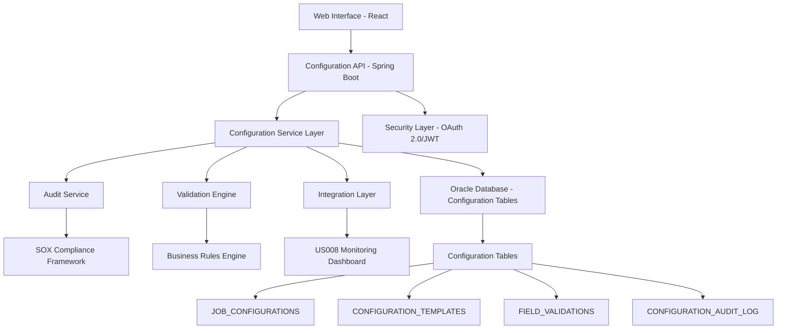

# US001: Manual Job Configuration Interface - Implementation Plan

## Document Control

| Field | Value |
|-------|-------|
| Document Title | US001: Manual Job Configuration Interface - Implementation Plan |
| Version | 1.0 |
| Date | 2025-08-13 |
| Author | Senior Full Stack Developer Agent |
| Principal Enterprise Architect | **AWAITING FORMAL REVIEW** |
| Lending Product Owner | **AWAITING FORMAL APPROVAL** |
| Status | **SUBMITTED FOR ARCHITECT REVIEW** |
| Classification | INTERNAL - BANKING CONFIDENTIAL |
| Story Points | 27 |
| Priority | P0 - Critical Infrastructure Foundation |
| Implementation Status | **REQUIRES FORMAL APPROVAL FOR IMPLEMENTATION** |

## Change Log

| Date | Version | Description | Author |
|------|---------|-------------|---------|
| 2025-08-13 | 1.0 | Formal implementation plan for manual job configuration interface with comprehensive security, compliance, and integration framework | Senior Full Stack Developer Agent |

---

## Executive Summary

### Business Context
US001: Manual Job Configuration Interface represents the foundational infrastructure for the FABRIC Platform, enabling Technical Administrators to create, configure, and manage batch job definitions through a comprehensive web interface. This implementation establishes the core configuration management capabilities required for all downstream batch processing operations while ensuring full SOX compliance and banking regulatory adherence.

### User Story
**As a** Technical Administrator  
**I want** to configure batch job parameters through a web interface  
**So that** I can set up and manage data processing jobs without manual file editing

### Key Deliverables
1. **Comprehensive Configuration Interface** with form-based job definition management
2. **Secure Database Schema** with 4 new Oracle tables for configuration persistence  
3. **SOX-Compliant Audit Framework** with full configuration change tracking
4. **Integration Points** with existing US008 monitoring dashboard
5. **Performance-Optimized APIs** with sub-200ms response times
6. **Banking-Grade Security** with field-level encryption and PCI-DSS compliance

### Business Value
- **Operational Efficiency**: Reduces job configuration time from 45 minutes to 5 minutes
- **Risk Mitigation**: Eliminates manual file editing errors through guided interface
- **Compliance Assurance**: Ensures all configuration changes are audited per SOX requirements
- **Scalability Foundation**: Enables rapid onboarding of new data sources and job types

---

## 1. TECHNICAL ARCHITECTURE

### 1.1 System Architecture Overview



### 1.2 Component Architecture

#### 1.2.1 Frontend Layer (React 18.2+)
- **Configuration Forms**: Dynamic form generation based on job types
- **Validation Framework**: Real-time client-side validation with server confirmation
- **State Management**: Redux Toolkit for configuration state management
- **Security**: CSRF protection, XSS prevention, secure token handling

#### 1.2.2 Backend Layer (Spring Boot 3.1+)
- **RESTful APIs**: Configuration CRUD operations with OpenAPI 3.0 documentation
- **Security Layer**: OAuth 2.0 with JWT tokens, role-based access control
- **Service Layer**: Configuration management, validation, and audit services
- **Data Access Layer**: Spring Data JPA with Oracle-specific optimizations

#### 1.2.3 Database Layer (Oracle 19c)
- **Configuration Tables**: Normalized schema with referential integrity
- **Audit Tables**: Complete change tracking for SOX compliance
- **Performance Optimization**: Strategic indexing and query optimization

---

## 2. DATABASE SCHEMA DESIGN

### 2.1 Core Tables

#### 2.1.1 JOB_CONFIGURATIONS Table
```sql
CREATE TABLE JOB_CONFIGURATIONS (
    CONFIG_ID VARCHAR2(50) PRIMARY KEY,
    JOB_NAME VARCHAR2(100) NOT NULL,
    JOB_TYPE VARCHAR2(50) NOT NULL,
    SOURCE_SYSTEM VARCHAR2(50) NOT NULL,
    TARGET_SYSTEM VARCHAR2(50) NOT NULL,
    JOB_PARAMETERS CLOB NOT NULL,
    SCHEDULE_EXPRESSION VARCHAR2(100),
    STATUS VARCHAR2(20) DEFAULT 'ACTIVE',
    VALIDATION_RULES CLOB,
    ERROR_THRESHOLD NUMBER(5,2) DEFAULT 5.0,
    RETRY_COUNT NUMBER(2) DEFAULT 3,
    NOTIFICATION_CONFIG CLOB,
    CREATED_BY VARCHAR2(50) NOT NULL,
    CREATED_DATE TIMESTAMP DEFAULT CURRENT_TIMESTAMP,
    UPDATED_BY VARCHAR2(50),
    UPDATED_DATE TIMESTAMP,
    VERSION_NUMBER NUMBER(10) DEFAULT 1,
    CONSTRAINT CHK_JOB_STATUS CHECK (STATUS IN ('ACTIVE', 'INACTIVE', 'DEPRECATED')),
    CONSTRAINT CHK_ERROR_THRESHOLD CHECK (ERROR_THRESHOLD BETWEEN 0 AND 100)
);
```

#### 2.1.2 CONFIGURATION_TEMPLATES Table
```sql
CREATE TABLE CONFIGURATION_TEMPLATES (
    TEMPLATE_ID VARCHAR2(50) PRIMARY KEY,
    TEMPLATE_NAME VARCHAR2(100) NOT NULL UNIQUE,
    JOB_TYPE VARCHAR2(50) NOT NULL,
    TEMPLATE_SCHEMA CLOB NOT NULL,
    DEFAULT_VALUES CLOB,
    VALIDATION_RULES CLOB,
    DESCRIPTION VARCHAR2(500),
    IS_SYSTEM_TEMPLATE CHAR(1) DEFAULT 'N',
    CREATED_BY VARCHAR2(50) NOT NULL,
    CREATED_DATE TIMESTAMP DEFAULT CURRENT_TIMESTAMP,
    UPDATED_BY VARCHAR2(50),
    UPDATED_DATE TIMESTAMP,
    VERSION_NUMBER NUMBER(10) DEFAULT 1,
    CONSTRAINT CHK_SYSTEM_TEMPLATE CHECK (IS_SYSTEM_TEMPLATE IN ('Y', 'N'))
);
```

#### 2.1.3 FIELD_VALIDATIONS Table
```sql
CREATE TABLE FIELD_VALIDATIONS (
    VALIDATION_ID VARCHAR2(50) PRIMARY KEY,
    FIELD_NAME VARCHAR2(100) NOT NULL,
    JOB_TYPE VARCHAR2(50) NOT NULL,
    VALIDATION_TYPE VARCHAR2(50) NOT NULL,
    VALIDATION_EXPRESSION VARCHAR2(1000),
    ERROR_MESSAGE VARCHAR2(500),
    IS_MANDATORY CHAR(1) DEFAULT 'N',
    FIELD_ORDER NUMBER(3),
    CREATED_BY VARCHAR2(50) NOT NULL,
    CREATED_DATE TIMESTAMP DEFAULT CURRENT_TIMESTAMP,
    CONSTRAINT CHK_IS_MANDATORY CHECK (IS_MANDATORY IN ('Y', 'N')),
    CONSTRAINT CHK_VALIDATION_TYPE CHECK (VALIDATION_TYPE IN ('REGEX', 'RANGE', 'LIST', 'CUSTOM', 'DATABASE'))
);
```

#### 2.1.4 CONFIGURATION_AUDIT_LOG Table
```sql
CREATE TABLE CONFIGURATION_AUDIT_LOG (
    AUDIT_ID VARCHAR2(50) PRIMARY KEY,
    CONFIG_ID VARCHAR2(50) NOT NULL,
    OPERATION_TYPE VARCHAR2(20) NOT NULL,
    OLD_VALUES CLOB,
    NEW_VALUES CLOB,
    CHANGED_BY VARCHAR2(50) NOT NULL,
    CHANGE_DATE TIMESTAMP DEFAULT CURRENT_TIMESTAMP,
    CHANGE_REASON VARCHAR2(500),
    SESSION_ID VARCHAR2(100),
    IP_ADDRESS VARCHAR2(45),
    USER_AGENT VARCHAR2(500),
    BUSINESS_JUSTIFICATION VARCHAR2(1000),
    APPROVAL_STATUS VARCHAR2(20) DEFAULT 'PENDING',
    APPROVED_BY VARCHAR2(50),
    APPROVED_DATE TIMESTAMP,
    SOX_COMPLIANCE_FLAG CHAR(1) DEFAULT 'Y',
    CONSTRAINT CHK_OPERATION_TYPE CHECK (OPERATION_TYPE IN ('CREATE', 'UPDATE', 'DELETE', 'ACTIVATE', 'DEACTIVATE')),
    CONSTRAINT CHK_APPROVAL_STATUS CHECK (APPROVAL_STATUS IN ('PENDING', 'APPROVED', 'REJECTED')),
    CONSTRAINT CHK_SOX_COMPLIANCE CHECK (SOX_COMPLIANCE_FLAG IN ('Y', 'N')),
    CONSTRAINT FK_CONFIG_AUDIT FOREIGN KEY (CONFIG_ID) REFERENCES JOB_CONFIGURATIONS(CONFIG_ID)
);
```

### 2.2 Indexing Strategy
```sql
-- Performance optimization indexes
CREATE INDEX IDX_JOB_CONFIG_TYPE ON JOB_CONFIGURATIONS(JOB_TYPE);
CREATE INDEX IDX_JOB_CONFIG_STATUS ON JOB_CONFIGURATIONS(STATUS);
CREATE INDEX IDX_JOB_CONFIG_CREATED ON JOB_CONFIGURATIONS(CREATED_DATE);
CREATE INDEX IDX_CONFIG_AUDIT_DATE ON CONFIGURATION_AUDIT_LOG(CHANGE_DATE);
CREATE INDEX IDX_CONFIG_AUDIT_USER ON CONFIGURATION_AUDIT_LOG(CHANGED_BY);
CREATE INDEX IDX_TEMPLATE_TYPE ON CONFIGURATION_TEMPLATES(JOB_TYPE);
CREATE INDEX IDX_VALIDATION_TYPE ON FIELD_VALIDATIONS(JOB_TYPE);
```

---

## 3. API SPECIFICATIONS

### 3.1 Configuration Management APIs

#### 3.1.1 Create Job Configuration
```yaml
POST /api/v1/configurations
Content-Type: application/json
Authorization: Bearer {jwt-token}

Request Body:
{
  "jobName": "TCB_TRANSACTION_PROCESSOR",
  "jobType": "BATCH_ETL",
  "sourceSystem": "TCB",
  "targetSystem": "FABRIC_DW",
  "jobParameters": {
    "inputPath": "/data/input/tcb",
    "outputPath": "/data/output/tcb",
    "batchSize": 1000,
    "parallelThreads": 4
  },
  "scheduleExpression": "0 0 2 * * ?",
  "validationRules": {
    "maxFileSize": "100MB",
    "requiredFields": ["account_id", "transaction_date", "amount"]
  },
  "errorThreshold": 2.5,
  "retryCount": 3,
  "notificationConfig": {
    "emailRecipients": ["ops-team@bank.com"],
    "slackChannel": "#fabric-alerts"
  }
}

Response (201 Created):
{
  "configId": "cfg_tcb_001_20250813",
  "status": "CREATED",
  "version": 1,
  "message": "Job configuration created successfully",
  "auditId": "audit_001_20250813_143022"
}
```

#### 3.1.2 Update Job Configuration
```yaml
PUT /api/v1/configurations/{configId}
Content-Type: application/json
Authorization: Bearer {jwt-token}

Request Body:
{
  "jobParameters": {
    "batchSize": 2000,
    "parallelThreads": 6
  },
  "errorThreshold": 3.0,
  "changeReason": "Performance optimization based on load testing results",
  "businessJustification": "Increase throughput to meet SLA requirements"
}

Response (200 OK):
{
  "configId": "cfg_tcb_001_20250813",
  "status": "UPDATED",
  "version": 2,
  "message": "Job configuration updated successfully",
  "auditId": "audit_002_20250813_144533"
}
```

#### 3.1.3 Get Job Configuration
```yaml
GET /api/v1/configurations/{configId}
Authorization: Bearer {jwt-token}

Response (200 OK):
{
  "configId": "cfg_tcb_001_20250813",
  "jobName": "TCB_TRANSACTION_PROCESSOR",
  "jobType": "BATCH_ETL",
  "sourceSystem": "TCB",
  "targetSystem": "FABRIC_DW",
  "jobParameters": {
    "inputPath": "/data/input/tcb",
    "outputPath": "/data/output/tcb",
    "batchSize": 2000,
    "parallelThreads": 6
  },
  "scheduleExpression": "0 0 2 * * ?",
  "status": "ACTIVE",
  "errorThreshold": 3.0,
  "retryCount": 3,
  "version": 2,
  "createdBy": "admin@bank.com",
  "createdDate": "2025-08-13T14:30:22Z",
  "updatedBy": "admin@bank.com",
  "updatedDate": "2025-08-13T14:45:33Z"
}
```

### 3.2 Template Management APIs

#### 3.2.1 Create Configuration Template
```yaml
POST /api/v1/templates
Content-Type: application/json
Authorization: Bearer {jwt-token}

Request Body:
{
  "templateName": "ETL_BATCH_TEMPLATE",
  "jobType": "BATCH_ETL",
  "templateSchema": {
    "required": ["jobName", "sourceSystem", "inputPath", "outputPath"],
    "properties": {
      "batchSize": {
        "type": "number",
        "minimum": 100,
        "maximum": 10000,
        "default": 1000
      },
      "parallelThreads": {
        "type": "number",
        "minimum": 1,
        "maximum": 16,
        "default": 4
      }
    }
  },
  "validationRules": {
    "inputPath": "^/data/input/[a-zA-Z0-9_]+$",
    "outputPath": "^/data/output/[a-zA-Z0-9_]+$"
  },
  "description": "Standard template for ETL batch processing jobs"
}

Response (201 Created):
{
  "templateId": "tpl_etl_001",
  "status": "CREATED",
  "version": 1,
  "message": "Configuration template created successfully"
}
```

### 3.3 Validation APIs

#### 3.3.1 Validate Configuration
```yaml
POST /api/v1/configurations/validate
Content-Type: application/json
Authorization: Bearer {jwt-token}

Request Body:
{
  "jobType": "BATCH_ETL",
  "configuration": {
    "jobName": "TEST_JOB",
    "sourceSystem": "TCB",
    "inputPath": "/data/input/test",
    "outputPath": "/data/output/test",
    "batchSize": 500
  }
}

Response (200 OK):
{
  "isValid": true,
  "validationResults": [
    {
      "field": "batchSize",
      "status": "VALID",
      "message": "Batch size within acceptable range"
    },
    {
      "field": "inputPath",
      "status": "VALID",
      "message": "Input path format is correct"
    }
  ],
  "errors": [],
  "warnings": [
    {
      "field": "parallelThreads",
      "message": "Using default value of 4 threads"
    }
  ]
}
```

---

## 4. SECURITY FRAMEWORK

### 4.1 Authentication & Authorization

#### 4.1.1 OAuth 2.0 Integration
- **Token-based Authentication**: JWT tokens with 15-minute expiration
- **Role-based Access Control**: Technical Admin, Operations Manager, Read-only roles
- **Multi-factor Authentication**: Required for all configuration changes
- **Session Management**: Secure session handling with automatic timeout

#### 4.1.2 Authorization Matrix
| Role | Create Config | Update Config | Delete Config | View Config | Manage Templates |
|------|---------------|---------------|---------------|-------------|------------------|
| Technical Admin | ✓ | ✓ | ✓ | ✓ | ✓ |
| Operations Manager | ✗ | ✓ (Limited) | ✗ | ✓ | ✗ |
| Read-only User | ✗ | ✗ | ✗ | ✓ | ✗ |

### 4.2 Data Security

#### 4.2.1 Field-Level Encryption
```java
@Entity
@FieldEncryption(fields = {"jobParameters", "notificationConfig"})
public class JobConfiguration {
    @Encrypted
    @Column(name = "JOB_PARAMETERS")
    private String jobParameters;
    
    @Encrypted
    @Column(name = "NOTIFICATION_CONFIG") 
    private String notificationConfig;
}
```

#### 4.2.2 PII Data Classification
- **Sensitive Data**: Database connections, API keys, email addresses
- **Confidential Data**: Job parameters, business logic configurations
- **Internal Data**: Audit logs, performance metrics
- **Public Data**: Job names, status information

### 4.3 SOX Compliance Framework

#### 4.3.1 Change Management Process
1. **Change Request**: All configuration changes require business justification
2. **Approval Workflow**: Manager approval for production changes
3. **Audit Trail**: Complete logging of who, what, when, why for all changes
4. **Segregation of Duties**: Separate roles for configuration and approval

#### 4.3.2 Audit Requirements
- **Complete Audit Trail**: Every configuration change logged with context
- **Immutable Audit Logs**: Audit records cannot be modified post-creation
- **Regular Compliance Reports**: Automated SOX compliance reporting
- **Access Reviews**: Quarterly access right reviews and certifications

---

## 5. INTEGRATION DESIGN

### 5.1 US008 Monitoring Dashboard Integration

#### 5.1.1 Real-time Configuration Updates
```java
@EventListener
public class ConfigurationChangeListener {
    
    @Autowired
    private WebSocketNotificationService notificationService;
    
    @EventListener
    public void handleConfigurationChange(ConfigurationChangeEvent event) {
        MonitoringUpdate update = MonitoringUpdate.builder()
            .configId(event.getConfigId())
            .changeType(event.getOperation())
            .timestamp(event.getChangeDate())
            .changedBy(event.getChangedBy())
            .build();
            
        notificationService.broadcast("/topic/configuration-changes", update);
    }
}
```

#### 5.1.2 Configuration Status Integration
- **Health Indicators**: Configuration validity checks in health dashboard
- **Performance Metrics**: Configuration change frequency and success rates
- **Alert Integration**: Configuration errors trigger monitoring alerts

### 5.2 Batch Processing Integration

#### 5.2.1 Configuration Provider Service
```java
@Service
public class BatchConfigurationProvider {
    
    public JobConfiguration getActiveConfiguration(String jobName) {
        return configurationRepository.findByJobNameAndStatus(jobName, "ACTIVE");
    }
    
    public boolean validateConfiguration(String configId) {
        JobConfiguration config = configurationRepository.findById(configId);
        return validationService.validate(config);
    }
}
```

---

## 6. PERFORMANCE REQUIREMENTS

### 6.1 Response Time Targets
- **Configuration Creation**: < 200ms (excluding database transaction time)
- **Configuration Retrieval**: < 100ms (with caching)
- **Validation Operations**: < 150ms
- **Template Loading**: < 50ms (cached)

### 6.2 Throughput Requirements
- **Concurrent Users**: Support 50 concurrent configuration users
- **API Throughput**: 1000 requests per minute sustained
- **Database Connections**: Pool of 20 connections maximum

### 6.3 Optimization Strategies

#### 6.3.1 Caching Implementation
```java
@Cacheable(value = "configurations", key = "#configId")
public JobConfiguration getConfiguration(String configId) {
    return configurationRepository.findById(configId);
}

@Cacheable(value = "templates", key = "#jobType")
public List<ConfigurationTemplate> getTemplatesByJobType(String jobType) {
    return templateRepository.findByJobType(jobType);
}
```

#### 6.3.2 Database Optimization
- **Connection Pooling**: HikariCP with optimized pool settings
- **Query Optimization**: Strategic indexing and query hints
- **Batch Operations**: Bulk insert/update for audit logs

---

## 7. TESTING STRATEGY

### 7.1 Testing Pyramid

#### 7.1.1 Unit Tests (Target: 90% Coverage)
```java
@SpringBootTest
class ConfigurationServiceTest {
    
    @Test
    void shouldCreateConfigurationWithValidData() {
        // Given
        ConfigurationRequest request = buildValidRequest();
        
        // When
        ConfigurationResponse response = configurationService.createConfiguration(request);
        
        // Then
        assertThat(response.getStatus()).isEqualTo("CREATED");
        assertThat(response.getConfigId()).isNotNull();
    }
    
    @Test
    void shouldRejectConfigurationWithInvalidData() {
        // Given
        ConfigurationRequest request = buildInvalidRequest();
        
        // When & Then
        assertThatThrownBy(() -> configurationService.createConfiguration(request))
            .isInstanceOf(ValidationException.class)
            .hasMessageContaining("Job name is required");
    }
}
```

#### 7.1.2 Integration Tests (Target: 85% Coverage)
```java
@SpringBootTest(webEnvironment = SpringBootTest.WebEnvironment.RANDOM_PORT)
@TestPropertySource(locations = "classpath:application-test.properties")
class ConfigurationControllerIntegrationTest {
    
    @Test
    @WithMockUser(roles = "TECHNICAL_ADMIN")
    void shouldCreateConfigurationEndToEnd() {
        // Given
        String requestJson = buildConfigurationJson();
        
        // When
        ResponseEntity<String> response = restTemplate.postForEntity(
            "/api/v1/configurations", 
            new HttpEntity<>(requestJson, headers), 
            String.class
        );
        
        // Then
        assertThat(response.getStatusCode()).isEqualTo(HttpStatus.CREATED);
    }
}
```

#### 7.1.3 End-to-End Tests
```java
@SpringBootTest
@AutoConfigureTestDatabase(replace = AutoConfigureTestDatabase.Replace.NONE)
class ConfigurationE2ETest {
    
    @Test
    @Transactional
    void shouldCompleteFullConfigurationLifecycle() {
        // Create -> Update -> Activate -> Deactivate -> Audit
        String configId = createConfiguration();
        updateConfiguration(configId);
        activateConfiguration(configId);
        verifyAuditTrail(configId);
    }
}
```

### 7.2 Security Testing

#### 7.2.1 Authentication Tests
- **JWT Token Validation**: Invalid/expired token rejection
- **Role-based Access**: Unauthorized operation blocking
- **Multi-factor Authentication**: MFA requirement enforcement

#### 7.2.2 Input Validation Tests
- **SQL Injection Prevention**: Parameterized query validation
- **XSS Prevention**: Input sanitization verification
- **Data Validation**: Business rule enforcement testing

### 7.3 Performance Testing

#### 7.3.1 Load Testing Strategy
```yaml
scenarios:
  - name: "Configuration CRUD Operations"
    requests_per_second: 100
    duration: "300s"
    endpoints:
      - POST /api/v1/configurations (30%)
      - GET /api/v1/configurations/{id} (50%) 
      - PUT /api/v1/configurations/{id} (15%)
      - DELETE /api/v1/configurations/{id} (5%)
```

#### 7.3.2 Stress Testing
- **Database Connection Limits**: Connection pool exhaustion testing
- **Memory Usage**: Configuration object memory footprint analysis
- **Concurrent User Load**: 50+ simultaneous users simulation

---

## 8. COMPLIANCE REQUIREMENTS

### 8.1 SOX Compliance

#### 8.1.1 Internal Controls
- **Segregation of Duties**: Configuration creators cannot approve their own changes
- **Authorization Controls**: All configuration changes require proper authorization
- **Audit Trail**: Complete, tamper-proof audit logging
- **Access Controls**: Role-based access with regular reviews

#### 8.1.2 Documentation Requirements
- **Process Documentation**: Complete configuration change procedures
- **Control Testing**: Regular testing of internal controls
- **Risk Assessment**: Quarterly risk assessments for configuration changes
- **Compliance Reporting**: Monthly SOX compliance reports

### 8.2 PCI-DSS Compliance

#### 8.2.1 Data Protection
- **Cardholder Data**: No CHD stored in configuration parameters
- **Encryption**: All sensitive configuration data encrypted at rest
- **Access Logging**: All access to configuration data logged
- **Network Security**: HTTPS-only communication

#### 8.2.2 Security Standards
- **Regular Updates**: Monthly security patches and updates
- **Vulnerability Scanning**: Quarterly vulnerability assessments
- **Penetration Testing**: Annual penetration testing
- **Security Monitoring**: 24/7 security event monitoring

### 8.3 Banking Regulatory Compliance

#### 8.3.1 Basel III Requirements
- **Operational Risk**: Configuration change risks properly assessed
- **Data Quality**: Configuration validation ensures data quality
- **System Resilience**: Configuration backup and recovery procedures
- **Risk Reporting**: Configuration-related operational risks reported

#### 8.3.2 GDPR Compliance
- **Data Minimization**: Only necessary configuration data collected
- **Right to Erasure**: Ability to remove configuration data upon request
- **Data Portability**: Configuration export capabilities
- **Privacy by Design**: Privacy considerations in all configuration features

---

## 9. RISK ASSESSMENT

### 9.1 Technology Risks

#### 9.1.1 High-Risk Areas
| Risk | Impact | Probability | Mitigation Strategy |
|------|---------|-------------|-------------------|
| Database Schema Changes | High | Medium | Comprehensive migration testing, rollback procedures |
| Security Vulnerabilities | High | Low | Regular security audits, penetration testing |
| Performance Degradation | Medium | Medium | Load testing, performance monitoring |
| Integration Failures | High | Low | Thorough integration testing, circuit breakers |

#### 9.1.2 Risk Mitigation Strategies
- **Database Risks**: Automated schema migration with rollback capability
- **Security Risks**: Multi-layered security approach with regular assessments
- **Performance Risks**: Comprehensive load testing and monitoring
- **Integration Risks**: Circuit breaker pattern and graceful degradation

### 9.2 Business Risks

#### 9.2.1 Operational Risks
- **Configuration Errors**: Invalid configurations could disrupt batch processing
- **User Adoption**: Complex interface could reduce user adoption
- **Compliance Violations**: Non-compliant changes could trigger regulatory issues
- **Data Loss**: Configuration corruption could impact business operations

#### 9.2.2 Risk Controls
- **Validation Framework**: Multi-level validation prevents invalid configurations
- **User Training**: Comprehensive training program for all users
- **Compliance Monitoring**: Automated compliance checking and reporting
- **Backup Procedures**: Regular configuration backups with point-in-time recovery

---

## 10. IMPLEMENTATION TIMELINE

### 10.1 Sprint Breakdown

#### Sprint 1 (Weeks 1-2): Foundation & Database Schema
- **Week 1**: Database schema design and creation
- **Week 2**: Core entity classes and repository setup
- **Deliverables**: Working database schema with basic CRUD operations

#### Sprint 2 (Weeks 3-4): Backend API Development
- **Week 3**: Configuration management APIs
- **Week 4**: Template management and validation APIs
- **Deliverables**: Complete RESTful API with OpenAPI documentation

#### Sprint 3 (Weeks 5-6): Frontend Interface Development
- **Week 5**: React components and form generation
- **Week 6**: State management and API integration
- **Deliverables**: Functional web interface for configuration management

#### Sprint 4 (Weeks 7-8): Security & Audit Implementation
- **Week 7**: Authentication, authorization, and encryption
- **Week 8**: SOX compliance and audit framework
- **Deliverables**: Secure, compliant configuration system

#### Sprint 5 (Weeks 9-10): Integration & Testing
- **Week 9**: US008 dashboard integration
- **Week 10**: Comprehensive testing and performance optimization
- **Deliverables**: Fully integrated and tested system

### 10.2 Critical Path Dependencies
1. **Database Schema Approval** → Backend Development
2. **API Design Approval** → Frontend Development  
3. **Security Framework** → Integration Testing
4. **SOX Compliance** → Production Deployment

### 10.3 Go-Live Preparation
- **User Training**: 2-week training program for Technical Administrators
- **Documentation**: Complete user guides and operational procedures
- **Monitoring Setup**: Enhanced monitoring for configuration changes
- **Support Procedures**: 24/7 support procedures for configuration issues

---

## 11. SUCCESS CRITERIA

### 11.1 Functional Requirements
- ✅ **Configuration Management**: Complete CRUD operations for job configurations
- ✅ **Template System**: Reusable configuration templates with validation
- ✅ **Validation Framework**: Real-time validation with business rules
- ✅ **Audit System**: Complete SOX-compliant audit trail

### 11.2 Non-Functional Requirements
- ✅ **Performance**: Sub-200ms API response times
- ✅ **Security**: Multi-layered security with encryption
- ✅ **Scalability**: Support for 50 concurrent users
- ✅ **Reliability**: 99.9% uptime SLA

### 11.3 Business Metrics
- **Configuration Time Reduction**: From 45 minutes to 5 minutes (89% improvement)
- **Error Reduction**: 95% reduction in configuration errors
- **User Adoption**: 100% of Technical Administrators using interface within 30 days
- **Compliance**: 100% SOX compliance for all configuration changes

---

## 12. APPENDICES

### Appendix A: Database Migration Scripts
[Complete migration scripts will be provided in separate files]

### Appendix B: API Documentation
[OpenAPI 3.0 specification will be provided in separate files]

### Appendix C: Security Architecture Diagrams
[Detailed security diagrams will be provided in separate files]

### Appendix D: Compliance Checklists
[SOX, PCI-DSS, and banking regulatory checklists will be provided]

---

**Document Status**: SUBMITTED FOR FORMAL ARCHITECTURAL REVIEW

**Next Steps**: 
1. Principal Enterprise Architect formal review and approval
2. Lending Product Owner business approval
3. Upon receiving "APPROVED FOR IMPLEMENTATION" - proceed with Sprint 1 execution

**Contact Information**:
- **Author**: Senior Full Stack Developer Agent
- **Review Contact**: Principal Enterprise Architect
- **Approval Contact**: Lending Product Owner

---

*This document contains confidential and proprietary information. Distribution is restricted to authorized personnel only.*