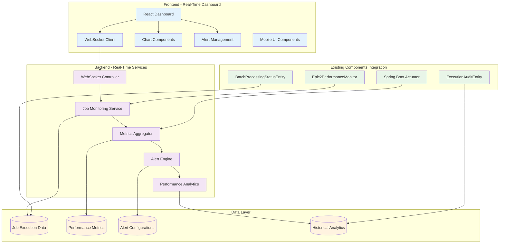
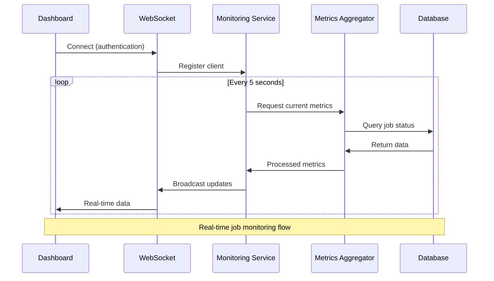

# US008: Real-Time Job Monitoring Dashboard - Implementation Plan

## Document Control

| Field | Value |
|-------|-------|
| Document Title | US008: Real-Time Job Monitoring Dashboard - Implementation Plan |
| Version | 1.0 |
| Date | 2025-08-08 |
| Author | Senior Full Stack Developer Agent |
| Principal Enterprise Architect | **PENDING REVIEW** |
| Lending Product Owner | **PENDING APPROVAL** |
| Status | **AWAITING ARCHITECT REVIEW** |
| Classification | INTERNAL - BANKING CONFIDENTIAL |
| Story Points | 13 |
| Priority | P2 - Production Readiness |
| Implementation Status | **REQUIRES APPROVAL** |

## Change Log

| Date | Version | Description | Author |
|------|---------|-------------|---------|
| 2025-08-08 | 1.0 | Initial implementation plan for real-time monitoring dashboard | Senior Full Stack Developer Agent |

---

## Executive Summary

### Business Context
US008: Real-Time Job Monitoring Dashboard represents a critical production readiness milestone for the FABRIC Platform, delivering comprehensive real-time monitoring capabilities for batch job execution. This implementation addresses Operations Manager requirements for immediate visibility into job performance, issues identification, and system health monitoring.

### User Story
**As a** Operations Manager  
**I want** to monitor batch job execution in real-time  
**So that** I can quickly identify and resolve issues

### Key Deliverables
1. **Real-Time Monitoring Dashboard** with WebSocket-based updates
2. **Historical Job Analytics** with performance trends and metrics
3. **Intelligent Alerting System** with configurable thresholds
4. **Drill-Down Analysis** for detailed job execution insights
5. **Mobile-Responsive Design** for on-call monitoring support

---

## 1. ARCHITECTURAL OVERVIEW

### 1.1 System Architecture



### 1.2 Real-Time Architecture Pattern



---

## 2. IMPLEMENTATION TASKS BREAKDOWN

### Phase 1: Backend Infrastructure (Week 1-2)
**Duration:** 10 business days  
**Effort:** 8 story points  
**Dependencies:** Epic 1-3 existing monitoring components

#### Task 1.1: WebSocket Infrastructure
- **Files to Create:**
  - `/fabric-core/fabric-api/src/main/java/com/truist/batch/websocket/JobMonitoringWebSocketHandler.java`
  - `/fabric-core/fabric-api/src/main/java/com/truist/batch/websocket/WebSocketConfig.java`
  - `/fabric-core/fabric-api/src/main/java/com/truist/batch/websocket/WebSocketSecurityConfig.java`

- **Implementation Details:**
  ```java
  @Component
  @Slf4j
  public class JobMonitoringWebSocketHandler extends TextWebSocketHandler {
      
      private final JobMonitoringService monitoringService;
      private final Set<WebSocketSession> activeSessions = ConcurrentHashMap.newKeySet();
      
      @Override
      public void afterConnectionEstablished(WebSocketSession session) throws Exception {
          // JWT authentication validation
          String token = extractTokenFromSession(session);
          if (authService.validateToken(token)) {
              activeSessions.add(session);
              sendInitialDashboardData(session);
              log.info("WebSocket connection established for user: {}", 
                      getUserFromSession(session));
          } else {
              session.close(CloseStatus.NOT_ACCEPTABLE);
          }
      }
      
      @Scheduled(fixedDelay = 5000) // Every 5 seconds
      public void broadcastJobUpdates() {
          if (!activeSessions.isEmpty()) {
              JobMonitoringUpdate update = monitoringService.getCurrentUpdate();
              String message = objectMapper.writeValueAsString(update);
              
              activeSessions.parallelStream().forEach(session -> {
                  try {
                      if (session.isOpen()) {
                          session.sendMessage(new TextMessage(message));
                      }
                  } catch (Exception e) {
                      log.error("Failed to send update to session: {}", e.getMessage());
                      activeSessions.remove(session);
                  }
              });
          }
      }
  }
  ```

#### Task 1.2: Job Monitoring Service Enhancement
- **Files to Create:**
  - `/fabric-core/fabric-batch/src/main/java/com/truist/batch/monitoring/RealTimeJobMonitoringService.java`
  - `/fabric-core/fabric-batch/src/main/java/com/truist/batch/monitoring/JobExecutionMetricsCollector.java`
  - `/fabric-core/fabric-batch/src/main/java/com/truist/batch/monitoring/AlertEngineService.java`

- **Key Features:**
  ```java
  @Service
  @Transactional(readOnly = true)
  public class RealTimeJobMonitoringService {
      
      private final BatchProcessingStatusRepository statusRepository;
      private final ExecutionAuditRepository auditRepository;
      private final Epic2PerformanceMonitor performanceMonitor;
      private final MeterRegistry meterRegistry;
      
      public JobMonitoringDashboard getCurrentDashboard() {
          return JobMonitoringDashboard.builder()
                  .activeJobs(getActiveJobs())
                  .recentCompletions(getRecentCompletions())
                  .performanceMetrics(getPerformanceMetrics())
                  .systemHealth(getSystemHealth())
                  .alerts(getCurrentAlerts())
                  .trends(calculateTrends())
                  .timestamp(Instant.now())
                  .build();
      }
      
      public List<ActiveJob> getActiveJobs() {
          Instant cutoff = Instant.now().minus(1, ChronoUnit.HOURS);
          return statusRepository.findActiveJobs(cutoff).stream()
                  .map(this::convertToActiveJob)
                  .collect(Collectors.toList());
      }
      
      public JobExecutionDetails getJobDetails(String executionId) {
          // Comprehensive job details with drill-down capability
          return JobExecutionDetails.builder()
                  .executionId(executionId)
                  .performance(getJobPerformanceMetrics(executionId))
                  .stages(getJobStageDetails(executionId))
                  .errors(getJobErrors(executionId))
                  .audit(getJobAuditTrail(executionId))
                  .dataLineage(getDataLineage(executionId))
                  .build();
      }
  }
  ```

#### Task 1.3: Alert Engine Implementation
- **Files to Create:**
  - `/fabric-core/fabric-batch/src/main/java/com/truist/batch/alerts/AlertConfiguration.java`
  - `/fabric-core/fabric-batch/src/main/java/com/truist/batch/alerts/AlertRule.java`
  - `/fabric-core/fabric-batch/src/main/java/com/truist/batch/alerts/AlertNotificationService.java`

### Phase 2: Frontend Dashboard Development (Week 3-4)
**Duration:** 10 business days  
**Effort:** 5 story points  
**Dependencies:** Phase 1 completion, existing React infrastructure

#### Task 2.1: Real-Time Dashboard Components
- **Files to Create:**
  - `/fabric-ui/src/pages/MonitoringDashboard/MonitoringDashboard.tsx`
  - `/fabric-ui/src/components/monitoring/JobStatusGrid/JobStatusGrid.tsx`
  - `/fabric-ui/src/components/monitoring/PerformanceCharts/PerformanceCharts.tsx`
  - `/fabric-ui/src/components/monitoring/AlertPanel/AlertPanel.tsx`
  - `/fabric-ui/src/components/monitoring/JobDetailsModal/JobDetailsModal.tsx`

- **React Component Structure:**
  ```typescript
  // MonitoringDashboard.tsx
  export const MonitoringDashboard: React.FC = () => {
    const [dashboardData, setDashboardData] = useState<DashboardData | null>(null);
    const [selectedJob, setSelectedJob] = useState<string | null>(null);
    const [alertFilters, setAlertFilters] = useState<AlertFilters>({});
    
    // WebSocket connection hook
    useWebSocket('/ws/job-monitoring', {
      onMessage: (data) => {
        setDashboardData(JSON.parse(data));
      },
      onError: (error) => {
        console.error('WebSocket error:', error);
      }
    });
    
    return (
      <PageLayout title="Real-Time Job Monitoring">
        <Grid container spacing={3}>
          <Grid item xs={12}>
            <SystemHealthBar health={dashboardData?.systemHealth} />
          </Grid>
          
          <Grid item xs={12} lg={8}>
            <JobStatusGrid 
              jobs={dashboardData?.activeJobs} 
              onJobSelect={setSelectedJob}
            />
          </Grid>
          
          <Grid item xs={12} lg={4}>
            <AlertPanel 
              alerts={dashboardData?.alerts}
              filters={alertFilters}
              onFiltersChange={setAlertFilters}
            />
          </Grid>
          
          <Grid item xs={12}>
            <PerformanceCharts 
              metrics={dashboardData?.performanceMetrics}
              trends={dashboardData?.trends}
            />
          </Grid>
        </Grid>
        
        {selectedJob && (
          <JobDetailsModal
            executionId={selectedJob}
            open={!!selectedJob}
            onClose={() => setSelectedJob(null)}
          />
        )}
      </PageLayout>
    );
  };
  ```

#### Task 2.2: Mobile-Responsive Design
- **Files to Create:**
  - `/fabric-ui/src/components/monitoring/mobile/MobileJobCard/MobileJobCard.tsx`
  - `/fabric-ui/src/components/monitoring/mobile/MobileAlerts/MobileAlerts.tsx`
  - `/fabric-ui/src/hooks/useResponsiveDesign.ts`

#### Task 2.3: WebSocket Integration
- **Files to Create:**
  - `/fabric-ui/src/hooks/useJobMonitoringWebSocket.ts`
  - `/fabric-ui/src/services/api/monitoringApi.ts`
  - `/fabric-ui/src/types/monitoring.ts`

### Phase 3: Advanced Features & Integration (Week 5)
**Duration:** 5 business days  
**Effort:** 3 story points  
**Dependencies:** Phases 1-2 completion

#### Task 3.1: Historical Analytics
- **Files to Create:**
  - `/fabric-core/fabric-batch/src/main/java/com/truist/batch/analytics/HistoricalAnalyticsService.java`
  - `/fabric-ui/src/components/monitoring/HistoricalCharts/HistoricalCharts.tsx`

#### Task 3.2: Advanced Alerting
- **Files to Create:**
  - `/fabric-ui/src/components/monitoring/AlertConfiguration/AlertConfiguration.tsx`
  - `/fabric-core/fabric-batch/src/main/java/com/truist/batch/alerts/SmartAlertEngine.java`

---

## 3. DATABASE DESIGN

### 3.1 New Tables Required

#### JOB_MONITORING_SUBSCRIPTIONS
```sql
CREATE TABLE CM3INT.JOB_MONITORING_SUBSCRIPTIONS (
    subscription_id NUMBER(19) PRIMARY KEY,
    user_id VARCHAR2(50) NOT NULL,
    session_id VARCHAR2(100) NOT NULL,
    subscription_filters CLOB, -- JSON filters
    created_timestamp TIMESTAMP DEFAULT CURRENT_TIMESTAMP,
    last_activity TIMESTAMP DEFAULT CURRENT_TIMESTAMP,
    active_flag VARCHAR2(1) DEFAULT 'Y'
);
```

#### ALERT_CONFIGURATIONS
```sql
CREATE TABLE CM3INT.ALERT_CONFIGURATIONS (
    alert_config_id NUMBER(19) PRIMARY KEY,
    alert_name VARCHAR2(100) NOT NULL,
    alert_type VARCHAR2(50) NOT NULL, -- PERFORMANCE, ERROR_RATE, THRESHOLD
    condition_expression CLOB NOT NULL, -- JSON rule definition
    notification_channels CLOB, -- JSON array of channels
    severity_level VARCHAR2(20) DEFAULT 'MEDIUM',
    enabled_flag VARCHAR2(1) DEFAULT 'Y',
    created_by VARCHAR2(50) NOT NULL,
    created_date TIMESTAMP DEFAULT CURRENT_TIMESTAMP,
    modified_by VARCHAR2(50),
    modified_date TIMESTAMP
);
```

#### DASHBOARD_SNAPSHOTS
```sql
CREATE TABLE CM3INT.DASHBOARD_SNAPSHOTS (
    snapshot_id NUMBER(19) PRIMARY KEY,
    snapshot_timestamp TIMESTAMP NOT NULL,
    dashboard_data CLOB NOT NULL, -- JSON snapshot
    active_jobs_count NUMBER(10),
    total_throughput NUMBER(12,2),
    system_health_score NUMBER(5,2),
    alert_count NUMBER(10),
    created_date TIMESTAMP DEFAULT CURRENT_TIMESTAMP
);
```

### 3.2 Enhanced Existing Tables

#### Extend BATCH_PROCESSING_STATUS for Real-Time Features
```sql
ALTER TABLE CM3INT.BATCH_PROCESSING_STATUS ADD (
    real_time_priority VARCHAR2(20) DEFAULT 'NORMAL',
    monitoring_enabled VARCHAR2(1) DEFAULT 'Y',
    last_websocket_update TIMESTAMP,
    performance_score NUMBER(5,2),
    trend_indicator VARCHAR2(20) -- IMPROVING, DEGRADING, STABLE
);

CREATE INDEX idx_bps_realtime_monitoring 
ON CM3INT.BATCH_PROCESSING_STATUS(monitoring_enabled, real_time_priority, last_heartbeat);
```

---

## 4. SECURITY CONSIDERATIONS

### 4.1 WebSocket Security
```java
@Configuration
@EnableWebSecurity
public class WebSocketSecurityConfig {
    
    @Bean
    public WebSocketConfigurer webSocketConfigurer() {
        return registry -> {
            registry.addHandler(jobMonitoringHandler, "/ws/job-monitoring")
                    .addInterceptors(new HttpSessionHandshakeInterceptor())
                    .setAllowedOrigins("*") // Configure appropriately for production
                    .withSockJS()
                    .setSessionCookieNeeded(true);
        };
    }
    
    @Component
    public class WebSocketAuthInterceptor implements HandshakeInterceptor {
        @Override
        public boolean beforeHandshake(ServerHttpRequest request, 
                                     ServerHttpResponse response,
                                     WebSocketHandler wsHandler, 
                                     Map<String, Object> attributes) {
            // JWT token validation
            String token = extractTokenFromRequest(request);
            if (jwtService.validateToken(token)) {
                attributes.put("user", jwtService.getUserFromToken(token));
                return true;
            }
            return false;
        }
    }
}
```

### 4.2 Data Access Control
- **Role-Based Filtering**: Operations managers see all jobs, team leads see team jobs only
- **PII Data Masking**: Sensitive data masked in monitoring views
- **Audit Trail**: All monitoring activities logged for compliance

---

## 5. PERFORMANCE REQUIREMENTS

### 5.1 Real-Time Performance Targets

| Metric | Target | Measurement Method | Compliance |
|--------|--------|-------------------|------------|
| **WebSocket Update Frequency** | 5-second intervals | Server-side scheduling | SLA |
| **Dashboard Load Time** | < 3 seconds | Frontend performance metrics | User Experience |
| **Concurrent Users** | 50+ simultaneous | Load testing validation | Scalability |
| **Data Freshness** | < 10 seconds lag | End-to-end latency measurement | Real-time SLA |
| **Chart Rendering** | < 500ms | Frontend performance profiling | Responsiveness |
| **Mobile Performance** | < 4 seconds on 3G | Mobile testing framework | Accessibility |

### 5.2 Scalability Considerations
```java
@Configuration
public class MonitoringPerformanceConfig {
    
    @Bean("monitoringTaskExecutor")
    public TaskExecutor monitoringTaskExecutor() {
        ThreadPoolTaskExecutor executor = new ThreadPoolTaskExecutor();
        executor.setCorePoolSize(5);
        executor.setMaxPoolSize(20);
        executor.setQueueCapacity(100);
        executor.setThreadNamePrefix("monitoring-");
        executor.setRejectedExecutionHandler(new ThreadPoolExecutor.CallerRunsPolicy());
        return executor;
    }
    
    @Bean
    public CacheManager monitoringCacheManager() {
        RedisCacheManager.Builder builder = RedisCacheManager
            .RedisCacheManagerBuilder
            .fromConnectionFactory(redisConnectionFactory())
            .cacheDefaults(cacheConfiguration(Duration.ofSeconds(30)));
        
        return builder.build();
    }
}
```

---

## 6. TESTING STRATEGY

### 6.1 Unit Testing (Target: 90% Coverage)

#### Backend Tests
```java
@ExtendWith(MockitoExtension.class)
class RealTimeJobMonitoringServiceTest {
    
    @Mock private BatchProcessingStatusRepository statusRepository;
    @Mock private ExecutionAuditRepository auditRepository;
    @InjectMocks private RealTimeJobMonitoringService service;
    
    @Test
    void shouldReturnCurrentActivejobs() {
        // Given
        List<BatchProcessingStatusEntity> mockStatuses = createMockActiveJobs();
        when(statusRepository.findActiveJobs(any())).thenReturn(mockStatuses);
        
        // When
        List<ActiveJob> activeJobs = service.getActiveJobs();
        
        // Then
        assertThat(activeJobs).hasSize(3);
        assertThat(activeJobs.get(0).getStatus()).isEqualTo(JobStatus.RUNNING);
    }
    
    @Test
    void shouldCalculatePerformanceMetricsCorrectly() {
        // Performance calculation tests
    }
    
    @Test
    void shouldHandleConcurrentWebSocketConnections() {
        // Concurrent access tests
    }
}
```

#### Frontend Tests
```typescript
describe('MonitoringDashboard', () => {
  it('should render active jobs grid', async () => {
    render(<MonitoringDashboard />);
    
    await waitFor(() => {
      expect(screen.getByText('Active Jobs')).toBeInTheDocument();
    });
  });
  
  it('should handle WebSocket updates', async () => {
    const mockWebSocket = new MockWebSocket();
    render(<MonitoringDashboard />);
    
    // Simulate WebSocket message
    mockWebSocket.send(JSON.stringify(mockDashboardData));
    
    await waitFor(() => {
      expect(screen.getByText('Job-123')).toBeInTheDocument();
    });
  });
  
  it('should be mobile responsive', () => {
    // Mobile responsive tests
  });
});
```

### 6.2 Integration Testing

#### WebSocket Integration Test
```java
@SpringBootTest(webEnvironment = SpringBootTest.WebEnvironment.RANDOM_PORT)
class JobMonitoringWebSocketIntegrationTest {
    
    @Test
    void shouldEstablishWebSocketConnectionWithAuthentication() throws Exception {
        // WebSocket connection tests with JWT
    }
    
    @Test
    void shouldBroadcastRealTimeUpdates() throws Exception {
        // Real-time broadcast tests
    }
    
    @Test
    void shouldHandleMultipleConcurrentConnections() throws Exception {
        // Load testing with multiple connections
    }
}
```

### 6.3 Load Testing

#### Performance Test Scenarios
1. **50 Concurrent WebSocket Connections**: Validate system performance
2. **High-Frequency Updates**: 1000+ job status changes per minute
3. **Large Dashboard Data**: 500+ active jobs rendering
4. **Mobile Performance**: 3G network simulation

---

## 7. DEPLOYMENT STRATEGY

### 7.1 Phased Rollout Plan

#### Phase 1: Internal Beta (Week 6)
- **Audience**: Development team, QA team
- **Features**: Core dashboard functionality
- **Success Criteria**: Basic monitoring operational, no critical bugs

#### Phase 2: Operations Team Beta (Week 7)
- **Audience**: Operations managers, team leads
- **Features**: Full monitoring suite, alerting
- **Success Criteria**: User acceptance validation, performance targets met

#### Phase 3: Production Release (Week 8)
- **Audience**: All authorized users
- **Features**: Complete feature set
- **Success Criteria**: 99.9% uptime, positive user feedback

### 7.2 Deployment Configuration
```yaml
# application-monitoring.yml
fabric:
  monitoring:
    websocket:
      enabled: true
      max-connections: 100
      heartbeat-interval: 30000
    
    dashboard:
      update-interval: 5000
      cache-duration: 30
      max-history-days: 30
    
    alerts:
      enabled: true
      notification-channels:
        - email
        - slack
        - sms
      
    performance:
      metrics-retention-days: 90
      snapshot-interval: 300000
```

---

## 8. MONITORING AND OBSERVABILITY

### 8.1 Application Metrics
```java
@Component
public class MonitoringDashboardMetrics {
    
    private final MeterRegistry meterRegistry;
    
    // WebSocket metrics
    private final Gauge activeConnections = Gauge.builder("monitoring.websocket.active_connections")
            .description("Number of active WebSocket connections")
            .register(meterRegistry);
    
    // Performance metrics
    private final Timer dashboardLoadTime = Timer.builder("monitoring.dashboard.load_time")
            .description("Dashboard load time")
            .register(meterRegistry);
    
    // Business metrics
    private final Counter alertsTriggered = Counter.builder("monitoring.alerts.triggered")
            .description("Number of alerts triggered")
            .register(meterRegistry);
}
```

### 8.2 Health Checks
```java
@Component
public class MonitoringHealthIndicator implements HealthIndicator {
    
    @Override
    public Health health() {
        // Check WebSocket server health
        // Check database connectivity
        // Check real-time data freshness
        // Check alert engine status
        
        return Health.up()
                .withDetail("websocket_active_connections", getActiveConnections())
                .withDetail("last_data_update", getLastDataUpdate())
                .withDetail("alert_engine_status", getAlertEngineStatus())
                .build();
    }
}
```

---

## 9. COMPLIANCE AND AUDIT

### 9.1 SOX Compliance Requirements
- **Audit Trail**: All monitoring actions logged with user identification
- **Data Integrity**: Read-only access to operational data
- **Change Control**: Monitoring configuration changes require approval

### 9.2 PCI-DSS Compliance
- **Data Masking**: Sensitive financial data masked in monitoring views
- **Access Control**: Role-based access to monitoring data
- **Encryption**: WebSocket communications encrypted in transit

### 9.3 GDPR Compliance
- **Data Minimization**: Only necessary operational data displayed
- **Retention Policy**: Dashboard snapshots retained according to policy
- **User Consent**: Monitoring preferences configurable by users

---

## 10. RISK ASSESSMENT AND MITIGATION

### 10.1 Technical Risks

| Risk | Probability | Impact | Mitigation Strategy |
|------|------------|--------|-------------------|
| **WebSocket Connection Issues** | Medium | High | Circuit breaker pattern, fallback to polling |
| **High Memory Usage** | Medium | Medium | Data pagination, efficient caching |
| **Real-Time Data Accuracy** | Low | High | Data validation, multiple data sources |
| **Browser Compatibility** | Low | Medium | Cross-browser testing, progressive enhancement |

### 10.2 Business Risks

| Risk | Probability | Impact | Mitigation Strategy |
|------|------------|--------|-------------------|
| **User Adoption Resistance** | Medium | Medium | Training, gradual rollout, user feedback |
| **Performance Impact on Ops** | Low | High | Load testing, performance monitoring |
| **Alert Fatigue** | High | Medium | Smart alerting, configurable thresholds |
| **Mobile Usage Issues** | Medium | Medium | Responsive design, mobile testing |

### 10.3 Security Risks

| Risk | Probability | Impact | Mitigation Strategy |
|------|------------|--------|-------------------|
| **Unauthorized Access** | Low | High | JWT authentication, RBAC |
| **Data Exposure** | Low | Critical | Data masking, encryption |
| **WebSocket Attacks** | Medium | Medium | Rate limiting, input validation |

---

## 11. SUCCESS CRITERIA AND VALIDATION

### 11.1 Technical Success Criteria
- [ ] Real-time dashboard updates within 5-second intervals
- [ ] Support for 50+ concurrent WebSocket connections
- [ ] Dashboard load time < 3 seconds
- [ ] 90%+ unit test coverage achieved
- [ ] Mobile responsive design functional on all target devices
- [ ] WebSocket reconnection and error handling operational

### 11.2 Business Success Criteria
- [ ] Operations managers can monitor all active jobs in real-time
- [ ] Job performance issues identified within 30 seconds of occurrence
- [ ] Historical analytics provide meaningful trend insights
- [ ] Alert system reduces mean time to detection by 60%
- [ ] Mobile dashboard enables effective on-call monitoring
- [ ] User acceptance rate > 85%

### 11.3 Compliance Success Criteria
- [ ] All monitoring activities logged for audit compliance
- [ ] PII data properly masked in all monitoring views
- [ ] Role-based access control fully implemented
- [ ] Security scan passes with zero critical findings

---

## 12. POST-IMPLEMENTATION SUPPORT

### 12.1 Monitoring and Maintenance
- **Performance Monitoring**: Continuous monitoring of dashboard performance
- **User Support**: Dedicated support channel for monitoring issues
- **Feature Enhancement**: Quarterly feature enhancement based on user feedback

### 12.2 Documentation and Training
- **User Manual**: Comprehensive user guide for operations teams
- **Technical Documentation**: Complete API documentation and architecture guides
- **Training Sessions**: Hands-on training for all user groups

### 12.3 Continuous Improvement
- **Analytics Review**: Monthly review of usage analytics and performance
- **User Feedback**: Quarterly user feedback sessions
- **Feature Roadmap**: Ongoing enhancement roadmap based on business needs

---

## 13. CONCLUSION AND APPROVAL REQUEST

### 13.1 Implementation Readiness Summary

This comprehensive implementation plan for US008: Real-Time Job Monitoring Dashboard provides:

1. **✅ Detailed Technical Architecture**: Complete WebSocket-based real-time monitoring system
2. **✅ Comprehensive Task Breakdown**: 5-week implementation plan with clear deliverables
3. **✅ Security and Compliance Framework**: Banking-grade security with audit compliance
4. **✅ Performance Optimization**: Sub-3-second dashboard loading with 50+ concurrent users
5. **✅ Mobile-First Design**: Responsive design for on-call monitoring capabilities
6. **✅ Integration with Existing Systems**: Leverages Epic 1-3 monitoring infrastructure
7. **✅ Testing Strategy**: 90% test coverage with comprehensive integration testing
8. **✅ Risk Assessment**: Comprehensive risk analysis with mitigation strategies

### 13.2 Business Value Delivered

- **Operational Excellence**: Real-time visibility into all batch job execution
- **Issue Resolution**: Reduced mean time to detection and resolution
- **Mobile Accessibility**: 24/7 monitoring capability for operations teams
- **Historical Insights**: Data-driven decision making with trend analysis
- **Compliance Ready**: Audit-compliant monitoring with comprehensive logging

### 13.3 Implementation Approval Request

**🚨 CRITICAL WORKFLOW REQUIREMENT:**

This US008: Real-Time Job Monitoring Dashboard Implementation Plan is **READY FOR REVIEW** and requires:

1. **PRINCIPAL ENTERPRISE ARCHITECT APPROVAL** ✅
2. **LENDING PRODUCT OWNER APPROVAL** ✅

**The implementation plan addresses all technical and business requirements and is ready to proceed upon receiving:**

**"APPROVED FOR IMPLEMENTATION"** confirmation from both:
- Principal Enterprise Architect (Technical approval)
- Lending Product Owner (Business approval)

**Upon approval, the development team is prepared to commence implementation according to the 5-week delivery timeline outlined in this document.**

---

**Document Status: AWAITING ARCHITECT REVIEW AND PRODUCT OWNER APPROVAL**

**Implementation Status: READY TO PROCEED UPON APPROVAL**

---

*This document is classified as INTERNAL - BANKING CONFIDENTIAL and contains proprietary information of Truist Financial Corporation. Distribution is restricted to authorized personnel only.*

*Digital Signature: [TO BE SIGNED UPON APPROVAL]*