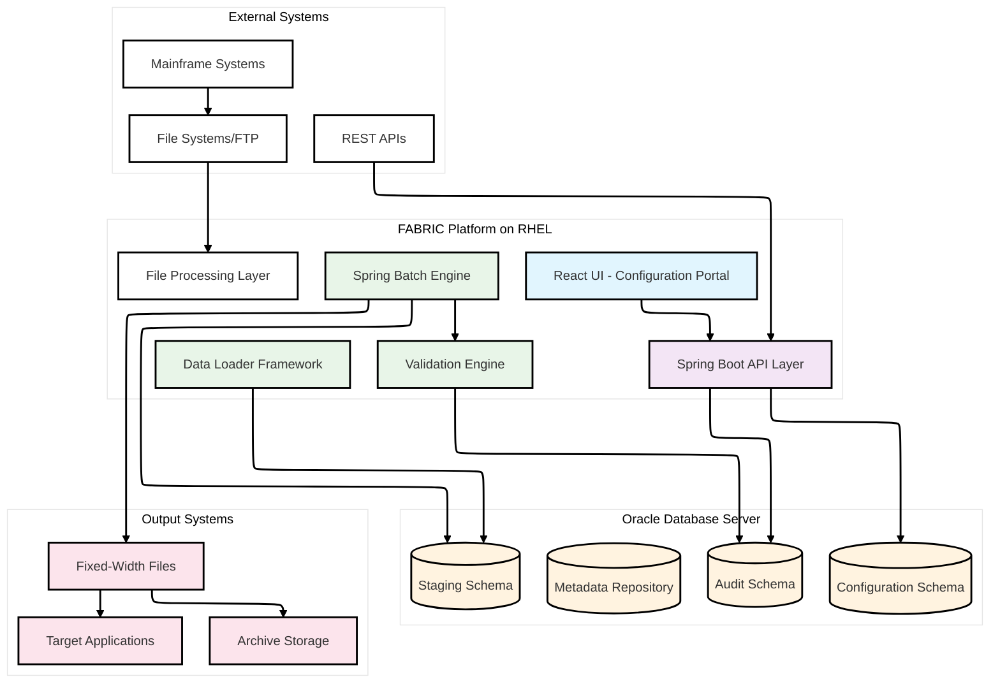
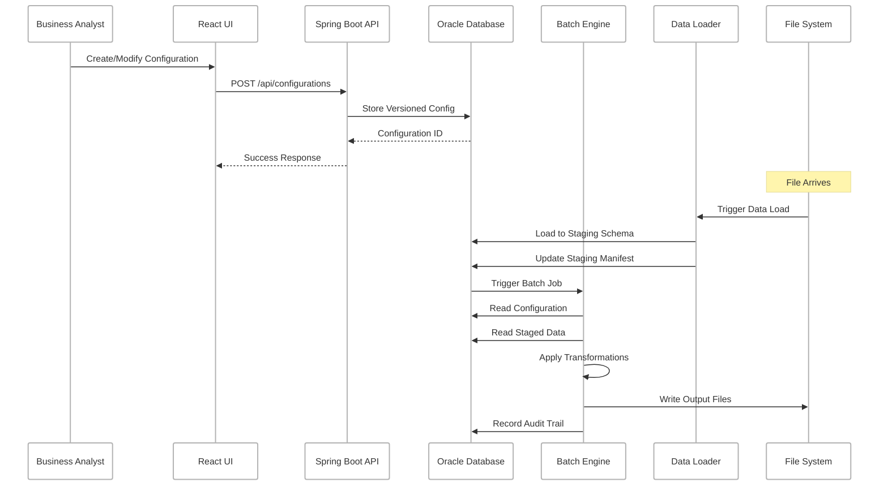
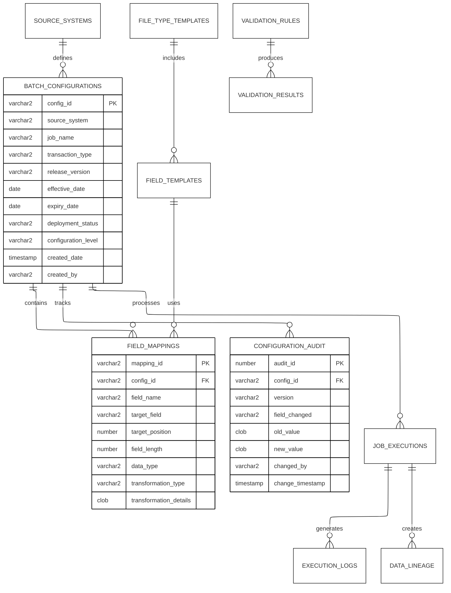
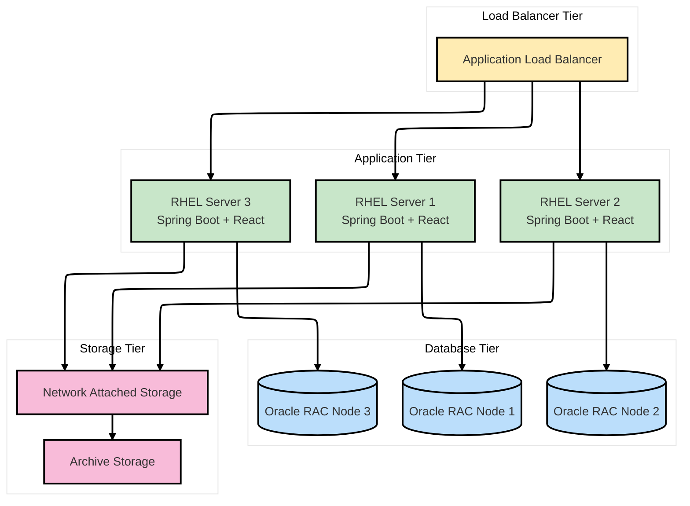
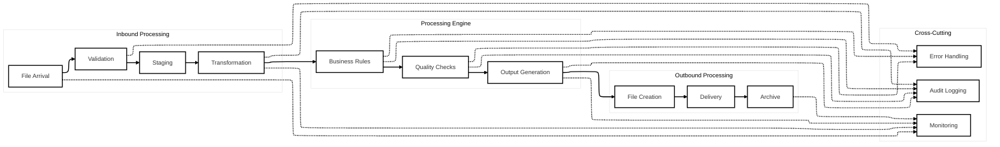
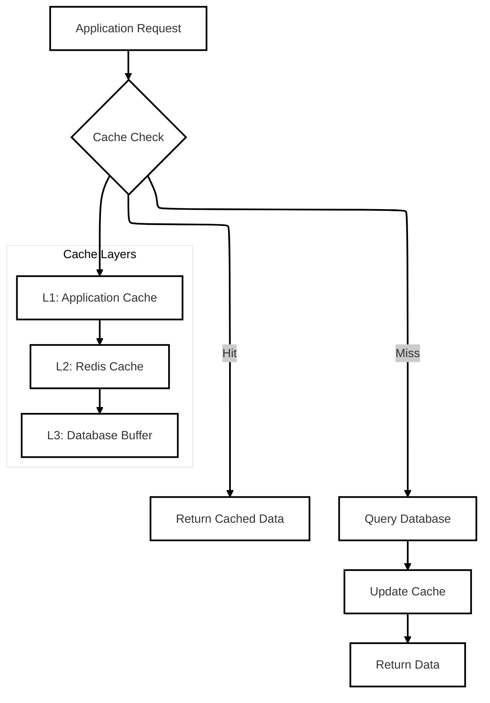

# FABRIC Platform - Enterprise Architecture Document

## Document Control

| Field | Value |
|-------|--------|
| Document Title | FABRIC Platform Enterprise Architecture |
| Version | 1.0 |
| Date | 2025-07-29 |
| Author | Senior Software Architect |
| Status | DRAFT |
| Classification | INTERNAL |
| Review Date | 2025-08-15 |

## Change Log

| Date | Version | Description | Author |
|------|---------|-------------|---------|
| 2025-07-29 | 1.0 | Initial architecture document creation | Senior Software Architect |

---

## 1. Executive Summary

The FABRIC Platform is an enterprise-grade, configuration-driven batch processing framework designed to transform Truist's data integration capabilities from a fragmented landscape of multiple Spring Boot applications into a unified, low-code platform. This architecture document provides a comprehensive technical blueprint for implementing a scalable, secure, and maintainable system that empowers business analysts while reducing operational overhead.

### 1.1 Business Context

The current state involves 10 developers and 10 testers maintaining duplicate codebases across multiple repositories, resulting in weeks-long development cycles for simple mapping changes. The FABRIC Platform addresses this by providing:

- **Configuration-driven transformations** replacing hardcoded business logic
- **Self-service capabilities** for business analysts
- **Centralized orchestration** eliminating manual file mergers
- **Complete audit trails** for regulatory compliance
- **Enterprise-grade scalability** handling hundreds of thousands of records

### 1.2 Architectural Approach

The solution implements a **database-driven configuration system** with a **three-tier architecture** (System, Job, Transaction levels) that provides granular control over batch processing operations. The architecture prioritizes performance through multi-layered caching while maintaining data integrity through ACID-compliant transactions.

---

## 2. System Architecture Overview

### 2.1 High-Level Architecture Diagram



### 2.2 Layered Architecture

The FABRIC Platform follows a **5-layer enterprise architecture**:

1. **Presentation Layer** - React 18 TypeScript application with Material-UI components
2. **API Layer** - Spring Boot 3.x REST services with OpenAPI documentation
3. **Business Logic Layer** - Configuration-driven transformation engine
4. **Batch Processing Layer** - Spring Batch 5.x with parallel execution capabilities
5. **Data Access Layer** - JPA/Hibernate with Oracle Database 19c+

### 2.3 Core Architectural Principles

- **Configuration-First Design**: All business logic externalized to database configurations
- **Event-Driven Architecture**: Asynchronous processing with comprehensive event tracking
- **Microservices-Ready**: Modular design enabling future service decomposition
- **Security by Design**: Field-level encryption, audit trails, and role-based access control
- **Performance-Optimized**: Multi-layered caching and parallel processing
- **Resilience Patterns**: Circuit breakers, retries, and graceful degradation

---

## 3. Component Architecture and Module Interactions

### 3.1 Module Structure

The platform is organized as a **multi-module Maven project** with clear separation of concerns:

```
fabric-core/
├── fabric-api/           # REST API and web layer
├── fabric-batch/         # Spring Batch processing engine
├── fabric-data-loader/   # SQL*Loader integration framework
├── fabric-utils/         # Shared utilities and models
└── fabric-ui/            # React TypeScript frontend
```

### 3.2 Component Interaction Diagram



### 3.3 Module Dependencies

| Module | Dependencies | Purpose |
|--------|-------------|---------|
| fabric-api | fabric-utils, fabric-data-loader, fabric-batch | REST endpoints and web services |
| fabric-batch | fabric-utils | Core batch processing engine |
| fabric-data-loader | fabric-utils | SQL*Loader integration and validation |
| fabric-utils | None | Shared models, utilities, and exceptions |
| fabric-ui | External React libraries | User interface and configuration management |

---

## 4. Data Architecture and Database Design

### 4.1 Schema Organization

The platform uses **three dedicated Oracle schemas** for optimal performance and separation of concerns:

#### 4.1.1 Configuration Schema (CM3INT)
Stores all versioned transformation rules, field mappings, and system configurations.

#### 4.1.2 Audit Schema (CM3AUD)
Dedicated schema for compliance and audit trail data with tamper-evident logging.

#### 4.1.3 Staging Schema (CM3STG)
Temporary storage for in-flight data processing with automated cleanup.

### 4.2 Core Data Model



### 4.3 Data Lineage and Tracking

The platform implements **comprehensive data lineage tracking** across all batch operations:

- **Source-to-Target Mapping**: Complete traceability from input files to output records
- **Transformation Audit**: Detailed logging of all data transformations applied
- **Error Correlation**: End-to-end error tracking with correlation IDs
- **Performance Metrics**: Record-level processing statistics and timing data

### 4.4 Data Retention and Archival

| Data Type | Retention Period | Storage Location | Compliance Requirement |
|-----------|------------------|------------------|------------------------|
| Configuration Data | 7 years | Primary Database | SOX, Basel III |
| Audit Logs | 10 years | Audit Schema + Archive | SOX, GDPR |
| Processing Data | 30 days | Staging Schema | Performance |
| Output Files | 90 days | File System + Archive | Business Requirement |

---

## 5. Security Architecture

### 5.1 Defense-in-Depth Strategy

The platform implements a **comprehensive security framework** addressing multiple threat vectors:

#### 5.1.1 Authentication and Authorization
- **OAuth 2.0/JWT** for API authentication
- **Role-based access control (RBAC)** with fine-grained permissions
- **Single Sign-On (SSO)** integration with enterprise identity provider
- **Session management** with configurable timeouts

#### 5.1.2 Data Protection
- **Field-level encryption** for sensitive financial data (AES-256)
- **PII data masking** with configurable masking patterns
- **Secure key management** using enterprise key management service
- **Data classification** enforcement at field and record levels

#### 5.1.3 Network Security
- **TLS 1.3** for all communications
- **API rate limiting** and throttling
- **WAF integration** for web application protection
- **Network segmentation** with dedicated VLANs

### 5.2 Compliance Framework

| Regulation | Requirement | Implementation |
|------------|-------------|----------------|
| SOX | Audit trail integrity | Tamper-evident logging with digital signatures |
| PCI-DSS | Cardholder data protection | Field-level encryption and access controls |
| GDPR | Data subject rights | Data classification and retention management |
| Basel III | Risk data aggregation | End-to-end data lineage and quality metrics |

### 5.3 Security Monitoring

- **Real-time threat detection** with SIEM integration
- **Anomaly detection** for unusual access patterns
- **Security event correlation** across all platform components
- **Automated incident response** for critical security events

---

## 6. Deployment Architecture

### 6.1 Target Environment

The platform is designed for deployment on **Red Hat Enterprise Linux (RHEL)** with the following infrastructure components:

#### 6.1.1 Application Servers
- **Load-balanced RHEL servers** for high availability
- **JVM optimization** for Spring Boot applications
- **Container readiness** for future Kubernetes deployment

#### 6.1.2 Database Infrastructure
- **Oracle RAC cluster** for high availability and scalability
- **Dedicated schemas** for configuration, audit, and staging data
- **Database connection pooling** with HikariCP

#### 6.1.3 File System Architecture
- **Network-attached storage (NAS)** for input/output files
- **Automated file archival** with lifecycle management
- **Backup and recovery** procedures

### 6.2 Deployment Topology



### 6.3 Configuration Management

- **Environment-specific configurations** using Spring profiles
- **Externalized properties** via Spring Cloud Config
- **Feature toggles** for controlled feature rollouts
- **Blue-green deployment** support for zero-downtime updates

---

## 7. Integration Patterns

### 7.1 Integration Architecture

The platform supports multiple integration patterns to accommodate diverse data sources and targets:

#### 7.1.1 File-Based Integration
- **Batch file processing** with configurable schedules
- **Real-time file monitoring** with event-driven triggers
- **Multiple file formats** (pipe-delimited, fixed-width, Excel, CSV)
- **Error handling and retry mechanisms**

#### 7.1.2 API Integration
- **RESTful service integration** with external systems
- **Asynchronous processing** with message queues
- **Circuit breaker patterns** for resilience
- **Rate limiting and throttling**

#### 7.1.3 Database Integration
- **JDBC connectivity** with multiple database types
- **Connection pooling and management**
- **Transaction coordination** across multiple data sources
- **Bulk data operations** with optimized performance

### 7.2 Message Flow Patterns



### 7.3 Error Handling Strategy

- **Graceful degradation** with fallback mechanisms
- **Dead letter queues** for failed message processing
- **Retry policies** with exponential backoff
- **Circuit breaker patterns** to prevent cascade failures

---

## 8. Scalability and Performance Considerations

### 8.1 Performance Targets

| Metric | Target | Measurement |
|--------|--------|-------------|
| API Response Time | < 200ms | 95th percentile |
| Batch Throughput | 100K+ records/hour | Per job execution |
| Database Query Performance | < 50ms | Average query time |
| File Processing Rate | 10MB/minute | Average throughput |
| System Availability | 99.9% | Monthly uptime |

### 8.2 Scalability Patterns

#### 8.2.1 Horizontal Scaling
- **Load-balanced application servers** for increased capacity
- **Database read replicas** for query performance
- **Partitioned batch processing** for parallel execution
- **Microservices decomposition** for independent scaling

#### 8.2.2 Vertical Scaling
- **JVM tuning** for optimal memory and CPU utilization
- **Database optimization** with proper indexing and partitioning
- **Caching strategies** for frequently accessed data
- **Resource allocation** based on workload characteristics

### 8.3 Performance Optimization Techniques

#### 8.3.1 Caching Strategy


#### 8.3.2 Database Optimization
- **Query optimization** with execution plan analysis
- **Index strategy** for frequently accessed columns
- **Partitioning** for large tables
- **Connection pooling** with optimal pool sizes

### 8.4 Monitoring and Alerting

- **Application Performance Monitoring (APM)** with distributed tracing
- **Infrastructure monitoring** with Prometheus and Grafana
- **Business metrics** with custom dashboards
- **Proactive alerting** based on SLA thresholds

---

## 9. Technology Stack Rationale

### 9.1 Technology Selection Criteria

The technology choices are based on enterprise requirements including:
- **Proven enterprise adoption** with long-term support
- **Security and compliance** capabilities
- **Performance and scalability** characteristics
- **Integration capabilities** with existing systems
- **Skills availability** within the organization

### 9.2 Technology Stack Details

| Category | Technology | Version | Rationale |
|----------|------------|---------|-----------|
| **Backend Language** | Java | 17+ (LTS) | Enterprise standard, Spring ecosystem compatibility |
| **Backend Framework** | Spring Boot | 3.4+ | Mature framework with extensive enterprise features |
| **Batch Processing** | Spring Batch | 5.x | Industry standard for batch processing |
| **Database** | Oracle Database | 19c+ | Enterprise database with proven scalability |
| **Frontend Language** | TypeScript | 4.9+ | Type safety and enhanced developer experience |
| **Frontend Framework** | React | 18+ | Component-based architecture with strong ecosystem |
| **UI Library** | Material-UI | 5.x | Professional components with accessibility support |
| **Build Tools** | Maven/npm | Latest | Standard build tools for Java and JavaScript |
| **Testing** | JUnit 5/Jest | Latest | Comprehensive testing frameworks |
| **Monitoring** | Micrometer/Prometheus | Latest | Enterprise monitoring and metrics |

### 9.3 Technical Decision Records (TDRs)

#### TDR-001: Database-Driven Configuration
**Decision**: Use Oracle database for storing all configuration data instead of file-based configurations.

**Rationale**: 
- Real-time configuration updates without application restarts
- ACID compliance for configuration changes
- Better audit trail and versioning capabilities
- Improved performance with caching strategies

**Consequences**: 
- Slight increase in cold-start latency (~5-10ms)
- Additional database load for configuration reads
- Enhanced flexibility and maintainability

#### TDR-002: Monolithic Architecture for MVP
**Decision**: Implement as a single Spring Boot application rather than microservices.

**Rationale**:
- Simplified deployment and operations for MVP
- Reduced network latency for internal component communication
- Easier transaction management across modules
- Lower operational complexity

**Consequences**:
- Future microservices migration may require refactoring
- Single point of failure (mitigated by load balancing)
- Scaling requires scaling entire application

---

## 10. Architectural Patterns and Principles

### 10.1 Design Patterns Implementation

#### 10.1.1 Configuration Pattern
```java
@Component
public class ConfigurationOrchestrator {
    private final ConfigurationCache configCache;
    private final DatabaseConfigService dbService;
    private final YamlFallbackService fallbackService;
    
    public Configuration getConfiguration(String configId) {
        return configCache.get(configId)
            .orElseGet(() -> loadFromDatabase(configId))
            .orElseGet(() -> fallbackService.loadFromYaml(configId));
    }
}
```

#### 10.1.2 Strategy Pattern for Transformations
```java
public interface TransformationStrategy {
    Object transform(Object input, TransformationRule rule);
}

@Component
public class TransformationEngine {
    private final Map<TransformationType, TransformationStrategy> strategies;
    
    public Object applyTransformation(Object input, TransformationRule rule) {
        return strategies.get(rule.getType()).transform(input, rule);
    }
}
```

#### 10.1.3 Observer Pattern for Audit Logging
```java
@EventListener
public class AuditEventHandler {
    @Async
    public void handleConfigurationChange(ConfigurationChangeEvent event) {
        auditService.recordConfigurationChange(event);
    }
}
```

### 10.2 Enterprise Integration Patterns

- **Message Translator**: Converting between different data formats
- **Content-Based Router**: Routing messages based on data content
- **Dead Letter Channel**: Handling failed message processing
- **Message Filter**: Filtering messages based on criteria
- **Aggregator**: Combining multiple messages into single output

### 10.3 Resilience Patterns

#### 10.3.1 Circuit Breaker
```java
@Component
public class DatabaseService {
    @CircuitBreaker(name = "database", fallbackMethod = "fallbackToFileConfig")
    public Configuration getConfiguration(String configId) {
        return databaseRepository.findById(configId);
    }
    
    public Configuration fallbackToFileConfig(String configId, Exception ex) {
        return yamlConfigService.loadFromFile(configId);
    }
}
```

#### 10.3.2 Retry Pattern
- **Exponential backoff** for transient failures
- **Maximum retry limits** to prevent infinite loops
- **Jitter** to avoid thundering herd problems

---

## 11. Future Architecture Roadmap

### 11.1 Phase 1: MVP Foundation (Months 1-3)
- **Core configuration engine** with database persistence
- **Basic React UI** for configuration management
- **Spring Batch integration** with simple transformations
- **Audit logging** and basic monitoring

### 11.2 Phase 2: Enhanced Capabilities (Months 4-6)
- **Advanced transformation types** (conditional, sequential, composite)
- **Multi-format file support** (Excel, XML, JSON)
- **Performance optimization** with caching and parallel processing
- **Enhanced UI** with drag-and-drop configuration

### 11.3 Phase 3: Enterprise Features (Months 7-9)
- **Advanced security features** (field-level encryption, advanced RBAC)
- **Real-time processing** capabilities
- **Advanced analytics** and reporting
- **API-first architecture** for external integrations

### 11.4 Phase 4: Platform Expansion (Months 10-12)
- **Microservices decomposition** for independent scaling
- **Cloud-native deployment** with Kubernetes
- **Machine learning integration** for data quality and anomaly detection
- **Self-healing systems** with automated remediation

### 11.5 Future Technology Considerations

| Technology | Current | Future | Migration Timeline |
|------------|---------|--------|-------------------|
| **Deployment** | Traditional VMs | Kubernetes | Phase 4 |
| **Data Processing** | Spring Batch | Apache Kafka + Streams | Phase 3 |
| **Frontend** | React SPA | Micro-frontends | Phase 4 |
| **Security** | OAuth 2.0 | Zero Trust Architecture | Phase 3 |
| **Database** | Oracle RAC | Multi-cloud Database | Phase 4 |

---

## 12. Risk Assessment and Mitigation

### 12.1 Technical Risks

| Risk | Impact | Probability | Mitigation Strategy |
|------|--------|-------------|-------------------|
| **Database Performance** | High | Medium | Connection pooling, query optimization, caching |
| **Memory Leaks** | High | Low | Comprehensive testing, monitoring, automatic restarts |
| **Configuration Corruption** | High | Low | Versioning, backup/restore, validation |
| **Integration Failures** | Medium | Medium | Circuit breakers, fallback mechanisms, retry logic |

### 12.2 Business Risks

| Risk | Impact | Probability | Mitigation Strategy |
|------|--------|-------------|-------------------|
| **User Adoption** | High | Medium | Training programs, gradual rollout, user feedback |
| **Regulatory Compliance** | High | Low | Comprehensive audit trails, compliance testing |
| **Performance Degradation** | Medium | Medium | Performance monitoring, capacity planning |
| **Scope Creep** | Medium | High | Clear requirements, change control process |

### 12.3 Operational Risks

| Risk | Impact | Probability | Mitigation Strategy |
|------|--------|-------------|-------------------|
| **System Downtime** | High | Low | High availability design, disaster recovery |
| **Data Loss** | High | Low | Regular backups, point-in-time recovery |
| **Security Breach** | High | Low | Defense-in-depth, security monitoring |
| **Skills Gap** | Medium | Medium | Training, documentation, knowledge transfer |

---

## 13. Conclusion

The FABRIC Platform architecture provides a comprehensive foundation for transforming Truist's batch processing capabilities. The design balances immediate business needs with long-term scalability and maintainability requirements.

### 13.1 Key Architectural Benefits

- **Reduced Development Overhead**: Configuration-driven approach eliminates code changes for business logic modifications
- **Enhanced Auditability**: Comprehensive logging and tracking for regulatory compliance
- **Improved Performance**: Multi-layered caching and parallel processing capabilities
- **Future-Proof Design**: Modular architecture enabling evolution to microservices
- **Enterprise Security**: Defense-in-depth security model with comprehensive protection

### 13.2 Success Metrics

The architecture's success will be measured against:
- **50% reduction** in time-to-market for configuration changes
- **80% reduction** in developer hours for routine modifications
- **99.9% system availability** with comprehensive monitoring
- **Zero security incidents** related to configuration management
- **100% audit compliance** with complete traceability

### 13.3 Next Steps

1. **Architecture Review** with enterprise architecture team
2. **Security Assessment** with information security organization
3. **Performance Validation** through proof-of-concept development
4. **Implementation Planning** with detailed project roadmap
5. **Stakeholder Approval** for proceeding to development phase

---

## Appendices

### Appendix A: Glossary

| Term | Definition |
|------|------------|
| **FABRIC** | Framework for Automated Batch Record Integration and Configuration |
| **Configuration-Driven** | System behavior controlled by external configuration rather than code |
| **Data Lineage** | Complete traceability of data from source to destination |
| **ETL** | Extract, Transform, Load - data processing methodology |
| **RBAC** | Role-Based Access Control - authorization model |

### Appendix B: Reference Architecture

This document serves as the definitive architectural reference for the FABRIC Platform implementation. All design decisions, technology choices, and implementation patterns should align with the principles and guidelines outlined in this document.

### Appendix C: Related Documents

- **Project Brief**: FABRIC Platform business requirements and context
- **Product Requirements Document (PRD)**: Detailed functional and non-functional requirements
- **Technical Specifications**: Detailed implementation specifications for each module
- **Security Architecture**: Comprehensive security design and implementation guidelines
- **Operations Manual**: Deployment, monitoring, and maintenance procedures

---

*This document is classified as INTERNAL and contains proprietary information of Truist Financial Corporation. Distribution is restricted to authorized personnel only.*