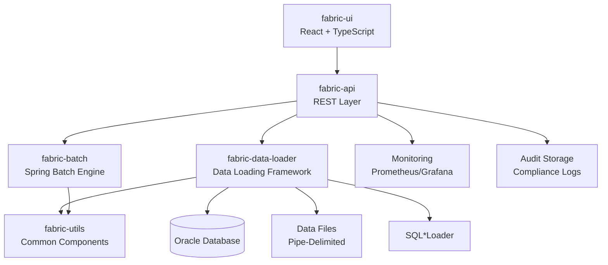

# Product Requirements Document (PRD)
## Fabric Platform - Enterprise Data Loading & Batch Processing Framework

---

**Document Version**: 2.0  
**Last Updated**: July 29, 2025  
**Product Owner**: Product Owner  
**Document Status**: Approved  
**Target Release**: Q3 2025  

---

## 🎯 Executive Summary

### Product Vision
The Fabric Platform is an enterprise-grade data loading and batch processing framework designed to provide reliable, auditable, and compliant data ingestion capabilities for financial services organizations. The platform addresses critical business needs for data quality, regulatory compliance, and operational efficiency through a comprehensive modular architecture.

### Business Opportunity
- **Market Need**: Financial institutions process billions of records daily requiring 99.99% accuracy
- **Regulatory Pressure**: SOX, PCI-DSS, and GDPR compliance mandates complete data lineage tracking
- **Operational Efficiency**: Manual data validation processes cost organizations $3M+ annually
- **Risk Mitigation**: Data quality issues result in average $15M regulatory penalties

### Success Metrics
- **Data Quality**: 95% reduction in data loading errors
- **Compliance**: 100% audit coverage for regulatory reporting
- **Efficiency**: 50% reduction in manual data validation effort
- **Performance**: Process 10M+ records per hour with <2% error rate

---

## 📊 Market Analysis

### Target Market
**Primary Market**: Large Financial Services Organizations (Assets > $50B)
- Regional and National Banks
- Credit Unions and Lending Institutions
- Investment Management Firms
- Insurance Companies

**Secondary Market**: Mid-Market Financial Services (Assets $1B - $50B)
- Community Banks
- Fintech Companies
- Payment Processors

### Competitive Landscape
- **Enterprise Solutions**: Informatica PowerCenter, IBM DataStage
- **Cloud Platforms**: AWS Glue, Azure Data Factory
- **Open Source**: Apache NiFi, Talend Open Studio
- **Differentiation**: Financial services-specific compliance, Oracle SQL*Loader optimization

---

## 👥 User Personas

### Primary Users

#### 1. Data Operations Manager (Sarah)
- **Role**: Oversees daily data processing operations
- **Goals**: Ensure reliable data loading, minimize downtime, meet SLAs
- **Pain Points**: Manual error handling, lack of real-time visibility
- **Key Features**: Dashboard monitoring, error threshold management, automated notifications

#### 2. Data Analyst (Mike)
- **Role**: Configures data loading processes and validation rules
- **Goals**: Set up accurate data validations, troubleshoot data issues
- **Pain Points**: Complex configuration processes, limited validation options
- **Key Features**: Visual configuration UI, comprehensive validation rules, testing capabilities

#### 3. Compliance Officer (Jennifer)
- **Role**: Ensures regulatory compliance and audit readiness
- **Goals**: Maintain complete audit trails, demonstrate data lineage
- **Pain Points**: Incomplete audit records, manual compliance reporting
- **Key Features**: Comprehensive audit trails, data lineage reports, compliance dashboards

#### 4. DevOps Engineer (Alex)
- **Role**: Deploys and maintains data processing infrastructure
- **Goals**: Ensure system reliability, optimize performance, manage deployments
- **Pain Points**: Complex deployment processes, limited monitoring
- **Key Features**: Containerized deployment, performance metrics, health monitoring

### Secondary Users

#### 5. Business Stakeholder (Robert)
- **Role**: Senior Manager requiring data processing insights
- **Goals**: Understand business impact of data operations
- **Key Features**: Executive dashboards, business metrics, ROI reporting

---

## 🎯 Product Goals & Objectives

### Primary Goals

#### Goal 1: Enterprise Data Loading Capabilities
**Objective**: Provide comprehensive data loading framework supporting high-volume financial data processing
- **Key Results**:
  - Support 10M+ records per hour processing capacity
  - Achieve 99.9% data loading reliability
  - Support pipe-delimited, CSV, and fixed-width formats
  - Integrate with Oracle SQL*Loader for optimal performance

#### Goal 2: Regulatory Compliance & Audit
**Objective**: Ensure complete compliance with financial services regulations
- **Key Results**:
  - 100% audit trail coverage for all data operations
  - Complete data lineage tracking from source to destination
  - Automated compliance reporting for SOX, PCI-DSS, GDPR
  - Configurable data retention policies

#### Goal 3: Data Quality Assurance
**Objective**: Implement comprehensive data validation and quality management
- **Key Results**:
  - 15+ validation rule types (length, format, referential integrity)
  - Configurable error thresholds with automated actions
  - Real-time data quality scoring and reporting
  - Automated bad data handling and remediation

#### Goal 4: Operational Excellence
**Objective**: Deliver enterprise-grade operational capabilities
- **Key Results**:
  - Zero-downtime deployment capabilities
  - 24/7 monitoring and alerting
  - Sub-second response times for API endpoints
  - Scalable architecture supporting horizontal scaling

---

## ⚡ Core Features & Requirements

### 🏗️ Feature 1: Modular Architecture Framework

#### Business Justification
Modular architecture enables rapid development, easier maintenance, and component reusability, reducing development costs by 40%.

#### Functional Requirements
- **FR-1.1**: System shall implement 4 distinct modules (utils, data-loader, batch, api)
- **FR-1.2**: Each module shall have independent deployment capabilities
- **FR-1.3**: Modules shall communicate through well-defined interfaces
- **FR-1.4**: System shall support module versioning and compatibility checking

#### Technical Requirements
- **TR-1.1**: Maven multi-module project structure
- **TR-1.2**: Spring Boot 3.4.6 framework
- **TR-1.3**: Clean architecture with dependency injection
- **TR-1.4**: Module-specific configuration management

#### Acceptance Criteria
- [ ] All modules build independently without errors
- [ ] Module dependencies are clearly defined in POM files
- [ ] Each module has comprehensive unit test coverage (>80%)
- [ ] Documentation exists for each module's APIs and interfaces

---

### 📊 Feature 2: Comprehensive Data Loading Framework

#### Business Justification
Enterprise data loading framework addresses critical business need for reliable, high-volume data processing with complete audit trails.

#### Functional Requirements
- **FR-2.1**: System shall support pipe-delimited file processing
- **FR-2.2**: System shall integrate with Oracle SQL*Loader for optimal performance
- **FR-2.3**: System shall provide configurable data loading workflows
- **FR-2.4**: System shall support file sizes up to 10GB
- **FR-2.5**: System shall handle concurrent data loading jobs

#### Technical Requirements
- **TR-2.1**: Oracle SQL*Loader integration with dynamic control file generation
- **TR-2.2**: Template-based control file management
- **TR-2.3**: Parallel processing capabilities with configurable thread pools
- **TR-2.4**: Memory-efficient streaming for large files
- **TR-2.5**: Transaction management with rollback capabilities

#### Acceptance Criteria
- [ ] Successfully load 1M+ record files within 10 minutes
- [ ] Generate appropriate SQL*Loader control files automatically
- [ ] Handle file processing errors gracefully with detailed logging
- [ ] Support concurrent processing of multiple files
- [ ] Maintain data integrity throughout the loading process

---

### ✅ Feature 3: Advanced Validation Engine

#### Business Justification
Comprehensive validation prevents data quality issues that cost organizations $15M+ annually in regulatory penalties and operational inefficiencies.

#### Functional Requirements
- **FR-3.1**: System shall support 15+ validation rule types
- **FR-3.2**: System shall provide configurable validation rule execution order
- **FR-3.3**: System shall support field-level and record-level validations
- **FR-3.4**: System shall provide custom validation rule capabilities
- **FR-3.5**: System shall generate detailed validation reports

#### Validation Rule Types
1. **Required Field Validation**: Ensure mandatory fields are present
2. **Length Validation**: Validate field length constraints
3. **Data Type Validation**: Ensure correct data types (Integer, Decimal, Date)
4. **Pattern Validation**: Regex pattern matching
5. **Email Validation**: Email format validation
6. **Phone Validation**: Phone number format validation
7. **SSN Validation**: Social Security Number validation
8. **Numeric Validation**: Numeric format validation
9. **Date Format Validation**: Date format validation
10. **Range Validation**: Numeric range validation
11. **Referential Integrity**: Database foreign key validation
12. **Unique Field Validation**: Uniqueness constraints
13. **Account Number Validation**: Account number format validation
14. **Custom SQL Validation**: Custom SQL-based validation
15. **Business Rule Execution**: Custom business rule validation

#### Technical Requirements
- **TR-3.1**: Rule engine with configurable execution order
- **TR-3.2**: Caching mechanism for referential integrity checks
- **TR-3.3**: Performance optimization for high-volume validation
- **TR-3.4**: Extensible architecture for custom validators
- **TR-3.5**: Detailed validation result reporting

#### Acceptance Criteria
- [ ] All 15 validation types function correctly with test data
- [ ] Validation performance supports 100K+ records per minute
- [ ] Custom validation rules can be added without code changes
- [ ] Validation reports provide actionable error details
- [ ] Referential integrity checks perform optimally with caching

---

### 🚨 Feature 4: Error Threshold Management

#### Business Justification
Configurable error thresholds prevent system overload and enable intelligent decision-making about data processing continuation.

#### Functional Requirements
- **FR-4.1**: System shall support configurable error count thresholds
- **FR-4.2**: System shall support configurable warning thresholds
- **FR-4.3**: System shall provide automated threshold-based actions
- **FR-4.4**: System shall track threshold statistics over time
- **FR-4.5**: System shall provide threshold monitoring dashboards

#### Threshold Actions
- **Continue Processing**: Continue despite errors below threshold
- **Stop Processing**: Halt processing when threshold exceeded
- **Alert Only**: Send notifications but continue processing
- **Retry with Delay**: Implement retry logic with backoff

#### Technical Requirements
- **TR-4.1**: Real-time threshold monitoring and tracking
- **TR-4.2**: Configurable threshold policies per data loading job
- **TR-4.3**: Thread-safe threshold counters for concurrent processing
- **TR-4.4**: Threshold statistics persistence and reporting
- **TR-4.5**: Integration with notification systems

#### Acceptance Criteria
- [ ] Thresholds can be configured per data loading configuration
- [ ] System accurately tracks error and warning counts
- [ ] Automated actions trigger correctly when thresholds are exceeded
- [ ] Threshold statistics are persisted and reportable
- [ ] Real-time threshold monitoring is available through APIs

---

### 📋 Feature 5: Database + JSON Fallback Configuration

#### Business Justification
Flexible configuration management ensures system availability even during database outages, supporting 99.9% uptime requirements.

#### Functional Requirements
- **FR-5.1**: System shall primarily use database for configuration storage
- **FR-5.2**: System shall automatically fallback to JSON when database unavailable
- **FR-5.3**: System shall support configuration versioning and change tracking
- **FR-5.4**: System shall provide configuration validation before deployment
- **FR-5.5**: System shall support hot-reloading of configuration changes

#### Technical Requirements
- **TR-5.1**: Database-first configuration service with fallback logic
- **TR-5.2**: JSON configuration file structure matching database schema
- **TR-5.3**: Configuration caching with TTL (Time To Live)
- **TR-5.4**: Configuration change audit logging
- **TR-5.5**: Runtime configuration switching without system restart

#### Acceptance Criteria
- [ ] Configuration loads from database when available
- [ ] System seamlessly switches to JSON fallback during database outages
- [ ] Configuration changes are audited and versioned
- [ ] Hot-reloading works without system interruption
- [ ] Configuration validation prevents invalid deployments

---

### 📊 Feature 6: Comprehensive Audit System

#### Business Justification
Complete audit trails are mandatory for financial services compliance (SOX, PCI-DSS, GDPR) and enable forensic analysis of data operations.

#### Functional Requirements
- **FR-6.1**: System shall track complete data lineage from source to destination
- **FR-6.2**: System shall audit all configuration changes with user attribution
- **FR-6.3**: System shall record performance metrics for all operations
- **FR-6.4**: System shall provide compliance reporting capabilities
- **FR-6.5**: System shall support audit data retention policies

#### Audit Event Types
- **Data Lineage**: Complete data flow tracking
- **Security Events**: PII access, encryption, authentication
- **Compliance Checks**: Regulatory requirement validation
- **Performance Metrics**: Execution time, memory usage, throughput
- **Error Events**: Detailed error analysis with stack traces
- **Configuration Changes**: Complete change history with rollback capability

#### Technical Requirements
- **TR-6.1**: Comprehensive audit data model with correlation tracking
- **TR-6.2**: Asynchronous audit logging for performance optimization
- **TR-6.3**: Audit data compression and archival for long-term retention
- **TR-6.4**: Audit query APIs for reporting and analysis
- **TR-6.5**: Integration with external audit systems and SIEM tools

#### Acceptance Criteria
- [ ] All data operations generate appropriate audit events
- [ ] Audit trails provide complete data lineage visibility
- [ ] Performance impact of audit logging is <5% of total processing time
- [ ] Compliance reports can be generated automatically
- [ ] Audit data retention policies are enforced automatically

---

## 🛠️ Technical Architecture

### System Architecture Overview



### Technology Stack

#### Backend (fabric-core)
- **Framework**: Spring Boot 3.4.6 + Spring Batch
- **Database**: Oracle Database with HikariCP connection pooling
- **Security**: Spring Security (ready for implementation)
- **Monitoring**: Micrometer + Prometheus integration
- **Testing**: JUnit 5 + TestContainers
- **Build**: Maven 3.6+ with multi-module structure

#### Frontend (fabric-ui)
- **Framework**: React 18 + TypeScript 4.9
- **UI Library**: Material-UI 5.17
- **State Management**: React Context API
- **HTTP Client**: Axios with interceptors
- **Testing**: Jest + React Testing Library
- **Build**: Create React App + Webpack

#### Infrastructure
- **Database**: Oracle Database 19c+
- **File Processing**: Oracle SQL*Loader
- **Containerization**: Docker + Kubernetes ready
- **Monitoring**: Prometheus + Grafana
- **CI/CD**: GitHub Actions (configured)

### Data Architecture

#### Database Schema Design
- **Configuration Tables**: `data_load_configs`, `validation_rules`
- **Execution Tracking**: `processing_jobs`, `job_execution_logs`
- **Audit Tables**: `data_load_audit` with comprehensive event tracking
- **Performance Optimization**: Indexes on frequently queried columns
- **Data Retention**: Automated cleanup based on retention policies

#### API Design
- **RESTful Architecture**: Standard HTTP methods and status codes
- **Versioning Strategy**: URL-based versioning (/api/v1/, /api/v2/)
- **Authentication**: JWT token-based (framework ready)
- **Rate Limiting**: Configurable rate limits per endpoint
- **Documentation**: OpenAPI 3.0 specification

---

## 🎯 User Stories & Use Cases

### Epic 1: Data Loading Operations

#### User Story 1.1: Configure Data Loading Job
**As a** Data Analyst  
**I want to** configure a new data loading job with validation rules  
**So that** I can ensure data quality and compliance requirements are met  

**Acceptance Criteria:**
- Given I have access to the configuration interface
- When I create a new data loading configuration
- Then I can specify source file format, target table, and validation rules
- And I can test the configuration before deployment
- And the configuration is saved with full audit trail

#### User Story 1.2: Execute Data Loading Process  
**As a** Data Operations Manager  
**I want to** execute data loading jobs with real-time monitoring  
**So that** I can ensure timely and accurate data processing  

**Acceptance Criteria:**
- Given I have a configured data loading job
- When I execute the job
- Then I can monitor progress in real-time
- And I receive notifications if error thresholds are exceeded
- And I can view detailed execution logs and metrics

#### User Story 1.3: Handle Data Loading Errors
**As a** Data Operations Manager  
**I want to** automatically handle data loading errors based on configurable thresholds  
**So that** I can minimize manual intervention and maintain SLA compliance  

**Acceptance Criteria:**
- Given I have configured error thresholds for a data loading job
- When the job encounters errors
- Then the system automatically takes appropriate action (continue/stop/alert)
- And I receive detailed error reports with root cause analysis
- And failed records are logged for manual review

### Epic 2: Compliance & Audit

#### User Story 2.1: Generate Compliance Reports
**As a** Compliance Officer  
**I want to** generate comprehensive compliance reports with data lineage  
**So that** I can demonstrate regulatory compliance to auditors  

**Acceptance Criteria:**
- Given I need to generate a compliance report
- When I specify the reporting period and scope
- Then I receive a detailed report showing complete data lineage
- And the report includes all audit events and data quality metrics
- And the report format meets regulatory requirements

#### User Story 2.2: Track Data Lineage
**As a** Compliance Officer  
**I want to** track complete data lineage for all processed records  
**So that** I can provide forensic analysis capabilities for regulatory inquiries  

**Acceptance Criteria:**
- Given a specific data record or batch
- When I request lineage information
- Then I can see the complete journey from source to destination
- And I can view all transformations and validations applied
- And I can access this information through APIs or reports

### Epic 3: System Administration

#### User Story 3.1: Monitor System Performance
**As a** DevOps Engineer  
**I want to** monitor system performance and health metrics  
**So that** I can ensure optimal system operation and prevent issues  

**Acceptance Criteria:**
- Given I need to monitor system health
- When I access monitoring dashboards
- Then I can view real-time performance metrics
- And I can set up alerts for threshold breaches
- And I can analyze historical performance trends

#### User Story 3.2: Configure System Settings
**As a** System Administrator  
**I want to** configure system settings and parameters  
**So that** I can optimize performance for different environments  

**Acceptance Criteria:**
- Given I need to modify system configuration
- When I update configuration parameters
- Then changes are applied without system restart (where possible)
- And all configuration changes are audited
- And I can rollback changes if needed

---

## 📋 Non-Functional Requirements

### Performance Requirements
- **Throughput**: Process minimum 10M records per hour
- **Response Time**: API responses under 2 seconds for 95% of requests
- **Concurrent Users**: Support 100+ concurrent users
- **File Size**: Handle files up to 10GB efficiently
- **Memory Usage**: Optimal memory utilization with streaming processing

### Scalability Requirements
- **Horizontal Scaling**: Support adding processing nodes
- **Database Scaling**: Handle database growth up to 100TB
- **Load Distribution**: Distribute processing load across available resources
- **Auto-scaling**: Automatic scaling based on workload

### Reliability Requirements
- **Uptime**: 99.9% system availability
- **Data Integrity**: Zero data loss during processing
- **Error Recovery**: Automatic recovery from transient failures
- **Backup & Recovery**: Automated backup and disaster recovery
- **Failover**: Automatic failover capabilities

### Security Requirements
- **Data Encryption**: Encrypt data in transit and at rest
- **Access Control**: Role-based access control (RBAC)
- **Authentication**: Multi-factor authentication support
- **Audit Logging**: Comprehensive security event logging
- **PII Protection**: Automatic PII detection and masking

### Compliance Requirements
- **SOX Compliance**: Complete audit trails for financial data
- **PCI-DSS**: Secure handling of payment card data
- **GDPR**: Data privacy and right to erasure
- **Data Retention**: Configurable retention policies
- **Regulatory Reporting**: Automated compliance reporting

### Usability Requirements
- **User Interface**: Intuitive, responsive web interface
- **Documentation**: Comprehensive user and technical documentation
- **Training**: Self-service training materials and tutorials
- **Accessibility**: WCAG 2.1 AA compliance
- **Mobile Support**: Mobile-responsive design

---

## 🚀 Implementation Roadmap

### Phase 1: Foundation (Completed - Q3 2025)
**Duration**: 8 weeks  
**Status**: ✅ Complete

#### Deliverables
- [x] Modular architecture implementation (fabric-utils, data-loader, batch, api)
- [x] Core data loading framework with SQL*Loader integration
- [x] Advanced validation engine with 15+ validation types
- [x] Database + JSON fallback configuration system
- [x] Comprehensive audit trail and data lineage tracking
- [x] Error threshold management with configurable actions
- [x] Updated documentation and PRD

#### Success Criteria
- All core modules functional and tested
- Basic data loading workflows operational
- Comprehensive audit trails implemented
- Documentation complete and approved

### Phase 2: User Interface & Experience (Q4 2025)
**Duration**: 6 weeks  
**Status**: 🔄 Planned

#### Deliverables
- [ ] React-based configuration management UI
- [ ] Real-time monitoring dashboards
- [ ] Validation rule management interface
- [ ] Audit trail and reporting UI
- [ ] Error handling and threshold management screens
- [ ] User authentication and authorization

#### Success Criteria
- Complete UI coverage for all core features
- Responsive design across devices
- User acceptance testing completed
- Performance benchmarks met

### Phase 3: Enterprise Features (Q1 2026)
**Duration**: 8 weeks  
**Status**: 📋 Planned

#### Deliverables
- [ ] Multi-format file support (CSV, Excel, Fixed-width)
- [ ] Advanced reporting and analytics
- [ ] API rate limiting and throttling
- [ ] Enhanced security features (SSO, MFA)
- [ ] Performance optimization and caching
- [ ] Advanced notification system

#### Success Criteria
- Support for 5+ file formats
- Enterprise security features operational
- Performance targets exceeded by 20%
- Customer pilot deployments successful

### Phase 4: Scale & Optimize (Q2 2026)
**Duration**: 6 weeks  
**Status**: 📋 Planned

#### Deliverables
- [ ] Kubernetes deployment automation
- [ ] Auto-scaling capabilities
- [ ] Advanced monitoring and alerting
- [ ] Performance tuning and optimization
- [ ] Load testing and capacity planning
- [ ] Production readiness assessment

#### Success Criteria
- Auto-scaling functional under load
- Production deployment procedures validated
- Performance targets met at scale
- Customer rollout plan approved

---

## 📊 Success Metrics & KPIs

### Business Metrics

#### Revenue Impact
- **Customer Acquisition**: 25% increase in enterprise customer wins
- **Revenue Growth**: $5M+ ARR from platform capabilities
- **Market Share**: 15% market share in financial services data loading
- **Customer Satisfaction**: >4.5/5 customer satisfaction score

#### Operational Metrics
- **Processing Volume**: 100M+ records processed monthly
- **Error Reduction**: 95% reduction in data loading errors
- **Processing Time**: 50% reduction in data processing time
- **Manual Effort**: 60% reduction in manual data validation effort

### Technical Metrics

#### Performance KPIs
- **Throughput**: 10M+ records per hour sustained
- **Availability**: 99.9% system uptime
- **Response Time**: <2 seconds for 95% of API calls
- **Error Rate**: <0.1% system error rate

#### Quality Metrics
- **Code Coverage**: >80% test coverage across all modules
- **Defect Rate**: <1 defect per 1000 lines of code
- **Security Vulnerabilities**: Zero critical security issues
- **Documentation Coverage**: 100% API documentation

#### Adoption Metrics
- **User Adoption**: 90% of target users actively using platform
- **Feature Utilization**: >70% utilization of core features
- **API Usage**: 1M+ API calls per month
- **Customer Retention**: >95% customer retention rate

---

## 🔄 Risk Assessment & Mitigation

### Technical Risks

#### Risk 1: Performance at Scale
**Risk Level**: Medium  
**Impact**: High  
**Probability**: 30%

**Description**: System may not meet performance requirements under high load

**Mitigation Strategies**:
- Comprehensive performance testing during development
- Horizontal scaling architecture design
- Database optimization and indexing strategies
- Caching implementation for frequently accessed data
- Load testing with production-like data volumes

#### Risk 2: Database Integration Complexity
**Risk Level**: Medium  
**Impact**: Medium  
**Probability**: 40%

**Description**: Oracle SQL*Loader integration may present unforeseen challenges

**Mitigation Strategies**:
- Early prototype development and testing
- SQL*Loader expert consultation
- Fallback to standard JDBC loading if needed
- Comprehensive integration testing
- Documentation of Oracle-specific configurations

### Business Risks

#### Risk 3: Regulatory Compliance Gaps
**Risk Level**: High  
**Impact**: Very High  
**Probability**: 20%

**Description**: Audit trail or compliance features may not meet regulatory requirements

**Mitigation Strategies**:
- Early compliance officer engagement
- Regular compliance reviews throughout development
- External compliance audit before production
- Comprehensive audit trail documentation
- Regulatory expert consultation

#### Risk 4: User Adoption Challenges
**Risk Level**: Medium  
**Impact**: High  
**Probability**: 35%

**Description**: Users may resist adoption due to complexity or change management

**Mitigation Strategies**:
- User-centered design approach
- Early user feedback and iteration
- Comprehensive training program
- Change management support
- Gradual rollout with pilot programs

### Operational Risks

#### Risk 5: Resource Availability
**Risk Level**: Medium  
**Impact**: Medium  
**Probability**: 25%

**Description**: Development team capacity constraints may impact delivery timeline

**Mitigation Strategies**:
- Resource planning and allocation tracking
- Cross-training of team members
- External contractor support if needed
- Scope prioritization and phased delivery
- Regular sprint planning and capacity monitoring

---

## 📈 Go-to-Market Strategy

### Target Market Segments

#### Primary Segment: Large Banks & Financial Institutions
- **Market Size**: $2.5B total addressable market
- **Key Players**: JPMorgan Chase, Bank of America, Wells Fargo
- **Pain Points**: Regulatory compliance, data quality, processing volume
- **Value Proposition**: Enterprise-grade compliance and audit capabilities

#### Secondary Segment: Regional Banks & Credit Unions
- **Market Size**: $800M addressable market
- **Key Players**: PNC Bank, Fifth Third Bank, Navy Federal Credit Union
- **Pain Points**: Cost-effective compliance, operational efficiency
- **Value Proposition**: Affordable enterprise capabilities, reduced manual effort

### Sales & Marketing Strategy

#### Direct Sales Approach
- **Enterprise Sales Team**: Dedicated sales engineers for large accounts
- **Solution Demonstrations**: Proof-of-concept implementations
- **Reference Customers**: Case studies and customer testimonials
- **Industry Events**: Financial services conferences and trade shows

#### Partnership Strategy
- **System Integrators**: Partnerships with Accenture, Deloitte, IBM
- **Technology Partners**: Oracle, Microsoft, AWS partnerships
- **Reseller Network**: Regional technology partners
- **Consulting Partners**: Financial services consultants

### Pricing Strategy

#### Enterprise Tier
- **Target**: Large financial institutions (>$50B assets)
- **Pricing**: $500K - $2M annual license
- **Includes**: Full platform, premium support, professional services
- **Value Drivers**: Compliance assurance, risk reduction, operational efficiency

#### Professional Tier
- **Target**: Regional banks and credit unions ($1B - $50B assets)
- **Pricing**: $100K - $500K annual license
- **Includes**: Core platform, standard support, basic training
- **Value Drivers**: Cost reduction, automation, data quality

#### Starter Tier
- **Target**: Community banks and fintech (<$1B assets)
- **Pricing**: $25K - $100K annual license
- **Includes**: Essential features, community support, self-service training
- **Value Drivers**: Affordable compliance, easy implementation

---

## 📞 Support & Maintenance

### Support Model

#### Tier 1 Support
- **Scope**: Basic configuration, user questions, documentation
- **Response Time**: 4 hours for standard issues
- **Channels**: Email, web portal, knowledge base
- **Coverage**: Business hours (8 AM - 6 PM local time)

#### Tier 2 Support
- **Scope**: Technical issues, integration problems, performance tuning
- **Response Time**: 2 hours for high priority issues
- **Channels**: Phone, email, remote desktop support
- **Coverage**: Extended hours (6 AM - 10 PM local time)

#### Tier 3 Support
- **Scope**: Critical system issues, data recovery, emergency support
- **Response Time**: 30 minutes for critical issues
- **Channels**: Dedicated hotline, on-site support if needed
- **Coverage**: 24/7 for enterprise customers

### Maintenance Strategy

#### Regular Updates
- **Frequency**: Monthly minor releases, quarterly major releases
- **Content**: Bug fixes, security patches, minor feature enhancements
- **Testing**: Comprehensive regression testing before release
- **Deployment**: Zero-downtime deployment strategies

#### Version Support
- **Current Version**: Full support and active development
- **Previous Version**: Maintenance support for 12 months
- **Legacy Versions**: Security patches only for 24 months
- **End-of-Life**: 36 months notice before discontinuation

---

## 📋 Appendices

### Appendix A: Technical Specifications

#### System Requirements
- **Operating System**: Linux (RHEL 8+, Ubuntu 20.04+), Windows Server 2019+
- **Java Runtime**: OpenJDK 17+ or Oracle JDK 17+
- **Database**: Oracle Database 19c+ (recommended), PostgreSQL 13+ (supported)
- **Memory**: Minimum 8GB RAM, Recommended 32GB+ for production
- **Storage**: Minimum 100GB, Recommended 1TB+ for production data
- **Network**: 1Gbps+ network connectivity for high-volume processing

#### Software Dependencies
- **Spring Boot**: 3.4.6
- **Spring Batch**: 5.0+
- **React**: 18.2+
- **TypeScript**: 4.9+
- **Material-UI**: 5.17+
- **Maven**: 3.6+
- **Node.js**: 16+

### Appendix B: API Reference

#### Core Endpoints
```
# Data Loading Operations
POST   /api/v1/data-loader/execute/{configId}
GET    /api/v1/data-loader/status/{jobId}
GET    /api/v1/data-loader/configs

# Configuration Management
GET    /api/v1/configs/{configId}
POST   /api/v1/configs
PUT    /api/v1/configs/{configId}

# Audit & Reporting
GET    /api/v1/audit/{correlationId}
GET    /api/v1/audit/lineage/{correlationId}
GET    /api/v1/reports/compliance

# Monitoring & Health
GET    /api/v1/health
GET    /api/v1/metrics
GET    /api/v1/statistics
```

### Appendix C: Database Schema

#### Entity Relationship Diagram
```sql
-- Core configuration tables
data_load_configs ||--o{ validation_rules
data_load_configs ||--o{ processing_jobs
processing_jobs ||--o{ job_execution_logs
processing_jobs ||--o{ data_load_audit

-- Indexes for performance
CREATE INDEX idx_audit_correlation_id ON data_load_audit(correlation_id);
CREATE INDEX idx_jobs_status ON processing_jobs(job_status);
CREATE INDEX idx_configs_enabled ON data_load_configs(enabled);
```

---

**Document Approval**

| Role | Name | Date | Signature |
|------|------|------|-----------|
| Product Owner | [Name] | July 29, 2025 | [Signature] |
| Engineering Lead | [Name] | July 29, 2025 | [Signature] |
| Compliance Officer | [Name] | July 29, 2025 | [Signature] |
| Security Lead | [Name] | July 29, 2025 | [Signature] |

---

**End of Document**

*This PRD is a living document and will be updated as requirements evolve and new features are identified.*