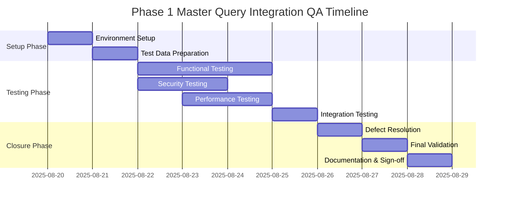

# QA Resource Allocation & Timeline Planning
## Phase 1 Master Query Integration

### Executive Summary

As your Scrum Master, I am presenting a detailed resource allocation plan and timeline for the QA validation of Phase 1 Master Query Integration. This plan ensures optimal resource utilization while maintaining banking-grade quality standards and regulatory compliance.

**Project**: Phase 1 Master Query Integration QA Validation  
**Duration**: 10 business days (August 20 - September 3, 2025)  
**Total Effort**: 32 person-days  
**Team Size**: 3-4 QA professionals  

---

## 1. Resource Requirements Overview

### 1.1 Team Composition

| Role | Count | Primary Responsibilities | Experience Level |
|------|-------|-------------------------|------------------|
| **QA Lead** | 1 | Test planning, coordination, stakeholder communication | Senior (5+ years) |
| **Functional QA Engineer** | 2 | API testing, integration testing, functional validation | Mid-level (3+ years) |
| **Security QA Specialist** | 1 | Security testing, compliance validation, penetration testing | Senior (5+ years) |
| **Performance QA Engineer** | 1 | Load testing, performance validation, monitoring | Mid-level (3+ years) |

### 1.2 Skill Requirements

**Must-Have Skills:**
- Banking/Financial Services testing experience
- API testing (REST, OpenAPI/Swagger)
- SQL query validation and database testing
- Security testing methodologies
- Performance testing tools (JMeter, LoadRunner)
- Oracle Database experience

**Nice-to-Have Skills:**
- Spring Boot application testing
- JWT authentication testing
- SOX compliance knowledge
- PCI-DSS validation experience
- Liquibase database migration testing

---

## 2. Detailed Timeline and Resource Allocation

### 2.1 Phase-by-Phase Breakdown



### 2.2 Daily Resource Allocation

#### **Day 1-2: Setup and Preparation (August 20-21, 2025)**

| Resource | Day 1 Activities | Day 2 Activities | Hours |
|----------|------------------|------------------|-------|
| **QA Lead** | - Kickoff meeting facilitation<br>- Resource coordination<br>- Environment verification | - Test plan review<br>- Test data validation<br>- Team assignment finalization | 16 |
| **Functional QA Engineer #1** | - Environment setup<br>- Database configuration<br>- Application deployment | - Test data setup<br>- API endpoint verification<br>- Postman collection setup | 16 |
| **Functional QA Engineer #2** | - Documentation review<br>- Test case preparation<br>- Tool configuration | - Test environment validation<br>- Initial smoke testing<br>- Test execution setup | 16 |
| **Security QA Specialist** | - Security test plan review<br>- Penetration testing tool setup<br>- Compliance checklist preparation | - Security test data setup<br>- Vulnerability scanner configuration<br>- Initial security assessment | 16 |

**Daily Standup**: 9:00 AM - 9:30 AM  
**Daily Retrospective**: 4:30 PM - 5:00 PM  

#### **Day 3-5: Core Testing Phase (August 22-26, 2025)**

| Resource | Activities | Focus Areas | Hours |
|----------|------------|-------------|-------|
| **QA Lead** | - Progress monitoring<br>- Impediment removal<br>- Stakeholder updates<br>- Defect triage | Daily coordination and escalation management | 24 |
| **Functional QA Engineer #1** | - API endpoint testing<br>- Query execution validation<br>- Parameter testing<br>- Error handling verification | Functional correctness and integration | 24 |
| **Functional QA Engineer #2** | - Database integration testing<br>- Audit trail validation<br>- Connection pool testing<br>- Edge case scenarios | Integration and reliability testing | 24 |
| **Security QA Specialist** | - SQL injection testing<br>- Authentication validation<br>- Authorization testing<br>- Compliance verification | Security and compliance validation | 24 |
| **Performance QA Engineer** | - Load testing execution<br>- Performance benchmarking<br>- Resource utilization monitoring<br>- Scalability assessment | Performance and scalability validation | 24 |

#### **Day 6-8: Specialized Testing Phase (August 27-29, 2025)**

| Resource | Activities | Focus Areas | Hours |
|----------|------------|-------------|-------|
| **QA Lead** | - Cross-team coordination<br>- Risk assessment<br>- Quality gate reviews<br>- Escalation management | Quality assurance and risk mitigation | 24 |
| **Functional QA Engineer #1** | - Regression testing<br>- Fix validation<br>- End-to-end scenarios<br>- Documentation testing | Comprehensive validation and regression | 24 |
| **Functional QA Engineer #2** | - Integration scenarios<br>- Data integrity testing<br>- Transaction testing<br>- Recovery testing | System integrity and reliability | 24 |
| **Security QA Specialist** | - Advanced security testing<br>- Compliance certification<br>- Audit trail validation<br>- Security documentation | Security certification and compliance | 24 |
| **Performance QA Engineer** | - Stress testing<br>- Endurance testing<br>- Resource optimization<br>- Performance reporting | Performance optimization and reporting | 24 |

#### **Day 9-10: Closure and Sign-off (September 2-3, 2025)**

| Resource | Activities | Deliverables | Hours |
|----------|------------|--------------|-------|
| **QA Lead** | - Final quality assessment<br>- Stakeholder presentations<br>- Sign-off coordination<br>- Phase 2 planning | Final QA report and sign-off recommendation | 16 |
| **Functional QA Engineer #1** | - Final test execution<br>- Defect verification<br>- Test report compilation<br>- Knowledge transfer | Functional testing report and artifacts | 16 |
| **Functional QA Engineer #2** | - Integration test closure<br>- Environment documentation<br>- Lessons learned compilation<br>- Handover preparation | Integration testing report and documentation | 16 |
| **Security QA Specialist** | - Security certification<br>- Compliance documentation<br>- Security report generation<br>- Regulatory sign-off | Security validation certificate and compliance report | 16 |

---

## 3. Resource Utilization Matrix

### 3.1 Weekly Resource Distribution

| Week | QA Lead | Functional QA #1 | Functional QA #2 | Security QA | Performance QA | Total Hours |
|------|---------|------------------|------------------|-------------|----------------|-------------|
| **Week 1** | 40 hours | 40 hours | 40 hours | 40 hours | 24 hours | 184 hours |
| **Week 2** | 32 hours | 32 hours | 32 hours | 32 hours | 24 hours | 152 hours |
| **Total** | 72 hours | 72 hours | 72 hours | 72 hours | 48 hours | **336 hours** |

### 3.2 Effort Distribution by Activity

```
Setup & Preparation: 20% (67 hours)
Functional Testing: 30% (101 hours)
Security Testing: 20% (67 hours)
Performance Testing: 15% (50 hours)
Integration Testing: 10% (34 hours)
Documentation & Closure: 5% (17 hours)
```

---

## 4. Critical Path Analysis

### 4.1 Dependencies and Critical Path

**Critical Path Activities:**
1. Environment Setup → Test Data Preparation → Functional Testing → Integration Testing → Final Validation

**Parallel Activities:**
- Security Testing (parallel with Functional Testing)
- Performance Testing (parallel with Security Testing)
- Documentation (parallel with all testing activities)

### 4.2 Risk Mitigation for Critical Path

| Risk | Impact | Probability | Mitigation Strategy | Contingency Plan |
|------|--------|-------------|-------------------|------------------|
| **Environment Setup Delays** | High | Medium | Pre-configured Docker environment | Use backup test environment |
| **Database Connectivity Issues** | High | Low | Dedicated DBA support on Day 1 | Containerized Oracle setup |
| **Security Tool Configuration** | Medium | Medium | Pre-testing of security tools | Manual security testing fallback |
| **Performance Environment** | Medium | Low | Production-like test data | Scaled-down performance testing |

---

## 5. Daily Coordination Schedule

### 5.1 Daily Ceremonies

| Time | Activity | Participants | Duration | Purpose |
|------|----------|-------------|----------|---------|
| **9:00-9:30 AM** | Daily Standup | All QA team members + Scrum Master | 30 min | Progress sync and impediment identification |
| **10:00-10:15 AM** | Development Sync | QA Lead + Development Team Lead | 15 min | Defect clarification and fix coordination |
| **2:00-2:30 PM** | Security Review | Security QA + Security Officer | 30 min | Security findings review and validation |
| **4:30-5:00 PM** | Daily Wrap-up | All QA team members + Scrum Master | 30 min | Progress review and next day planning |

### 5.2 Weekly Ceremonies

| Day | Time | Activity | Participants | Duration |
|-----|------|----------|-------------|----------|
| **Monday** | 8:30-9:00 AM | Weekly Planning | All stakeholders | 30 min |
| **Wednesday** | 3:00-4:00 PM | Mid-week Review | QA team + Product Owner | 60 min |
| **Friday** | 4:00-5:00 PM | Weekly Retrospective | All team members | 60 min |

---

## 6. Stakeholder Communication Plan

### 6.1 Communication Matrix

| Stakeholder | Information Needs | Frequency | Format | Responsible |
|-------------|-------------------|-----------|---------|-------------|
| **Product Owner** | Progress, blockers, quality metrics | Daily | Standup + Email | QA Lead |
| **Development Team** | Defects, clarifications, fixes needed | Real-time | Slack + Meetings | QA Engineers |
| **Technical Leadership** | Technical risks, architectural issues | Weekly | Status report | QA Lead |
| **Security Officer** | Security findings, compliance status | Daily | Security briefing | Security QA |
| **Executive Sponsors** | High-level progress, go/no-go decision | Weekly | Executive summary | Scrum Master |

### 6.2 Reporting Schedule

**Daily Reports** (End of Day):
- Test execution progress
- Defects found and resolved
- Blockers and impediments
- Next day focus areas

**Weekly Reports** (Friday):
- Comprehensive progress against plan
- Quality metrics and trends
- Risk assessment update
- Resource utilization analysis

**Final Report** (September 3):
- Complete test execution summary
- Quality assessment and recommendation
- Lessons learned and improvements
- Go/No-Go recommendation

---

## 7. Resource Allocation Budget

### 7.1 Personnel Costs

| Role | Daily Rate | Days | Total Cost |
|------|------------|------|------------|
| **QA Lead (Senior)** | $800 | 9 days | $7,200 |
| **Functional QA Engineer #1** | $600 | 9 days | $5,400 |
| **Functional QA Engineer #2** | $600 | 9 days | $5,400 |
| **Security QA Specialist** | $750 | 9 days | $6,750 |
| **Performance QA Engineer** | $650 | 6 days | $3,900 |
| **Total Personnel Cost** | | | **$28,650** |

### 7.2 Infrastructure and Tooling Costs

| Resource | Cost | Duration | Total |
|----------|------|----------|-------|
| **QA Environment (Oracle + App Server)** | $200/day | 10 days | $2,000 |
| **Performance Testing Tools (JMeter Pro)** | $500 | One-time | $500 |
| **Security Testing Tools (OWASP ZAP Pro)** | $300 | One-time | $300 |
| **Monitoring and Logging Tools** | $100/day | 10 days | $1,000 |
| **Total Infrastructure Cost** | | | **$3,800** |

**Total Project Cost**: $32,450

---

## 8. Quality Gates and Checkpoints

### 8.1 Quality Gate Criteria

| Gate | Timing | Criteria | Stakeholders | Decision |
|------|--------|----------|-------------|----------|
| **Gate 1: Setup Complete** | Day 2 | Environment ready, test data loaded | QA Lead, DevOps | Proceed/Fix issues |
| **Gate 2: Functional Testing** | Day 5 | 80% test cases passed, critical bugs resolved | QA Lead, Product Owner | Proceed/Extend testing |
| **Gate 3: Security Validation** | Day 7 | Security certification obtained, compliance verified | Security QA, Security Officer | Proceed/Security remediation |
| **Gate 4: Performance Acceptance** | Day 8 | Performance benchmarks met, scalability validated | Performance QA, Technical Lead | Proceed/Performance tuning |
| **Gate 5: Final Approval** | Day 10 | All acceptance criteria met, stakeholder sign-off | All stakeholders | Go-Live/No-Go |

### 8.2 Escalation Triggers

**Immediate Escalation (< 1 hour):**
- Critical security vulnerability discovered
- System-wide failure or data corruption
- Environment completely unavailable

**Same-Day Escalation (< 4 hours):**
- High-severity defects blocking testing
- Performance degradation > 50%
- Multiple test case failures

**Next-Day Escalation (< 24 hours):**
- Medium-severity defects affecting functionality
- Resource unavailability
- Timeline slippage risk

---

## 9. Success Metrics and KPIs

### 9.1 Testing Effectiveness Metrics

| Metric | Target | Measurement | Frequency |
|--------|-------|-------------|-----------|
| **Test Case Execution Rate** | 100% | Executed cases / Total cases | Daily |
| **Defect Detection Rate** | > 95% | Critical defects found / Total critical defects | Weekly |
| **Test Case Pass Rate** | > 90% | Passed cases / Executed cases | Daily |
| **Defect Resolution Time** | < 24 hours (Critical), < 48 hours (High) | Time from detection to resolution | Per defect |

### 9.2 Quality Metrics

| Metric | Target | Measurement | Frequency |
|--------|-------|-------------|-----------|
| **Critical Defect Count** | 0 | Count of severity 1 defects | Daily |
| **Security Vulnerability Count** | 0 | Count of security issues | Daily |
| **Performance Benchmark Achievement** | 100% | Met benchmarks / Total benchmarks | Weekly |
| **Compliance Requirement Coverage** | 100% | Validated requirements / Total requirements | Weekly |

---

## 10. Contingency Planning

### 10.1 Resource Contingencies

**Primary Resource Unavailable:**
- Cross-trained backup resources identified
- Knowledge transfer sessions scheduled
- Documentation maintained for continuity

**Extended Timeline Scenarios:**
- Additional resources available for critical issues
- Weekend work authorization for urgent fixes
- Parallel testing tracks for time optimization

### 10.2 Technical Contingencies

**Environment Issues:**
- Backup test environment ready
- Cloud-based environment as fallback
- Production-like data subset available

**Tool Failures:**
- Alternative testing tools identified
- Manual testing procedures documented
- Vendor support contacts established

---

## 11. Knowledge Transfer and Documentation

### 11.1 Knowledge Transfer Plan

| Topic | From | To | Method | Timeline |
|-------|------|----|---------|-----------|
| **Test Environment Setup** | DevOps | QA Team | Documentation + Demo | Day 1 |
| **Application Architecture** | Development Team | QA Team | Technical walkthrough | Day 1 |
| **Security Requirements** | Security Officer | Security QA | Requirements review | Day 1 |
| **Testing Results** | QA Team | Development Team | Daily standup + Reports | Daily |

### 11.2 Documentation Deliverables

**Test Execution Artifacts:**
- Test case execution reports
- Defect reports and resolution logs
- Performance test results and analysis
- Security assessment and certification

**Process Documentation:**
- Environment setup procedures
- Test data management processes
- Defect triage and resolution workflows
- Lessons learned and improvements

---

## 12. Post-QA Activities

### 12.1 Transition to Production

**Production Readiness Checklist:**
- [ ] All acceptance criteria validated
- [ ] Security certification obtained
- [ ] Performance benchmarks met
- [ ] Documentation complete and approved
- [ ] Stakeholder sign-offs received

**Go-Live Preparation:**
- Production environment setup coordination
- Deployment runbook validation
- Rollback procedures testing
- Monitoring and alerting configuration

### 12.2 Phase 2 Preparation

**Frontend Development Support:**
- Backend API validation complete
- Integration specifications documented
- Security requirements clarified
- Performance baselines established

---

## Scrum Master Coordination Notes

### Daily Responsibilities
- Facilitate daily standups and remove impediments
- Monitor progress against timeline and budget
- Coordinate cross-team dependencies
- Escalate risks and issues to appropriate stakeholders
- Ensure quality gates are properly evaluated

### Weekly Responsibilities
- Conduct sprint retrospectives for continuous improvement
- Update stakeholders on progress and risks
- Facilitate quality gate reviews and decision-making
- Plan resource adjustments based on progress
- Coordinate Phase 2 planning activities

### Key Success Factors
- Clear communication channels established
- Resource allocation aligned with critical path
- Quality gates enforced without compromise
- Stakeholder expectations properly managed
- Banking compliance requirements prioritized

---

**Document Version**: 1.0  
**Created By**: Scrum Master  
**Approved By**: QA Lead, Technical Lead, Product Owner  
**Effective Date**: August 20, 2025  
**Review Date**: August 27, 2025  

This resource allocation and timeline plan ensures optimal utilization of QA resources while maintaining our commitment to banking-grade quality standards and regulatory compliance requirements.