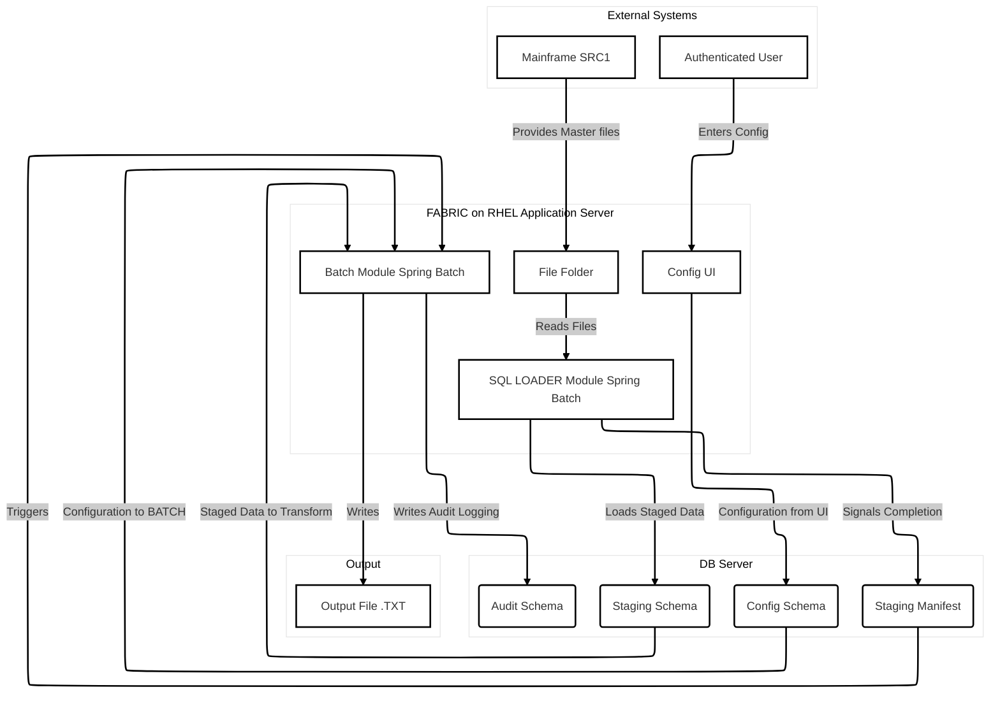

# FABRIC Platform - Complete Documentation Suite

This document contains the complete set of planning and design artifacts for the FABRIC platform, including the Project Brief, the Product Requirements Document (PRD), and the Fullstack Architecture Document.

---

## Part 1: Project Brief

### Executive Summary
This project will create a configuration-driven, low-code batch processing system to serve distinct user roles: **Business Analysts**, who will configure complex, field-level transformations; **Dev Admins**, who will manage the technical configuration of batch jobs (e.g., data sources, parallelism); and **Business Admins/POs**, who will oversee the versioning and release lifecycle of these configurations.

The platform will ingest a wide variety of data formats—including flat files, delimited files, Excel, XML, and JSON—and apply sophisticated, user-defined rules, such as conditional logic based on data values or sequential record numbering.

The core objective is to decouple business logic from technical setup and release management, empowering each role to manage their responsibilities through a dedicated web interface without code deployments. All field mappings and transformations will be **versioned**, ensuring that the nightly batch process always uses the correct configuration and that a complete audit trail of **who** made **what** changes and **when** is maintained.

### Problem Statement

#### Current State & Pain Points
The current batch processing ecosystem is a fragmented landscape of multiple, separate Spring Boot repositories, each handling individual source systems with massive code duplication across applications. This legacy architecture relies on a manual, inefficient workflow for data transformation:
* **Manual Translation of Logic**: Business Analysts define transformation rules in Excel mapping documents, which developers must then manually interpret and hardcode into the specific Spring Boot application.
* **Fragmented Systems**: There is no unified orchestration. A CAESP scheduler triggers independent jobs, and outputs are manually merged from multiple files (`master_File_1.txt`, `master_File_2.txt`, etc.).
* **Lack of Centralization**: REST APIs and transformation logic are maintained in separate, disconnected repositories, and there is no standardization for error handling or logging.
* **Zero Traceability**: The current system has no audit logging or end-to-end data traceability, creating significant compliance and debugging challenges.

#### Impact of the Problem & Resource Crisis
The direct impact of this technical debt is a significant drain on company resources and a severe constraint on business agility.
* **Resource Allocation**: A total of **10 developers and 10 testers** are consumed by maintaining duplicate codebases and performing redundant validation across these similar but separate systems.
* **Extended Development Cycles**: Simple mapping changes requested by the business result in **weeks-long development cycles**, as any modification must be manually coded and tested across multiple repositories.
* **Inability to Scale**: Onboarding a new source system is a major, time-consuming project, and the business is unable to react quickly to new data integration needs or regulatory changes.

#### Why Existing Solutions Fall Short
The current fragmented architecture is the root of the problem. Its lack of centralization and dynamic configuration capabilities makes it impossible to achieve operational efficiency. The system's design inherently prevents code reusability, multiplies testing efforts, and completely blocks any form of self-service for business users. This creates a state of perpetual technical debt where the cost and time required to make even minor changes are unsustainably high.

### Proposed Solution (MVP)

#### Core Concept and Approach
We will develop a configuration-driven, low-code batch processing platform. The solution consists of a **React-based web interface** and a **Spring Batch backend**, with all configurations stored in an **Oracle database**.

The core of the MVP is a **form-based web interface** designed for Business Analysts. This interface will allow them to define, manage, and clone versioned transformation rules through a series of guided forms and input fields. The system will be engineered to support complex **many-to-many** source-to-target mapping relationships from day one.

At runtime, the Spring Batch engine will read the configuration directly from the database to perform transformations on high-volume, **pipe-delimited** source files.

#### Key Features & Feedback Mechanisms (MVP)
* **Form-Based Configuration**: A simple and intuitive UI for analysts to define transformation logic without needing a drag-and-drop interface.
* **Database-Driven Logic**: All mappings and rules are stored as versioned metadata in the database, making the system more robust and scalable.
* **Essential Feedback**: After a batch run, the UI will provide a dashboard showing the most critical feedback: the **status of the last run (Success/Fail)** and links to relevant output or error logs.
* **Full Auditing & Transformation Engine**: The complete, robust auditing and transformation capabilities are core to the MVP and will be included in the first release.

### Target Users

#### Primary User Segment: The Business Analyst
* **Profile**: Data-savvy professionals who are experts in the business logic and data transformation rules, but are not software developers.
* **Pain Points**: They are completely dependent on the development team, leading to long delays. They lack control over the final logic, and there is a high risk of misinterpretation.
* **Goals**: To gain direct control over the transformation logic to implement, test, and manage business rules quickly and accurately.

#### Secondary User Segment: The Dev Admin
* **Profile**: Developers or technical operations staff responsible for the batch processing infrastructure.
* **Pain Points**: Their work involves massive code duplication and repetitive configuration tasks. Onboarding a new source system is a complex project.
* **Goals**: To reduce maintenance overhead and accelerate the onboarding of new data sources through a standardized, centralized system.

#### Secondary User Segment: The Business Admin / Product Owner (PO)
* **Profile**: A lead analyst, product owner, or business manager accountable for data integrity and the release of new business rules.
* **Pain Points**: They lack visibility and governance over the configuration lifecycle and are beholden to the IT release schedule.
* **Goals**: To have a clear, auditable, and controlled process for promoting, approving, and deploying new configurations.

### Goals & Success Metrics

#### Business Objectives
* **Increase Business Agility**: Decrease the lead time for deploying a business rule change from "weeks" to under 48 hours.
* **Reduce Operational Costs**: Reduce developer hours spent on manual transformation logic by 80% within 6 months.
* **Improve Data Quality & Compliance**: Eliminate manual translation errors and provide a complete, auditable trail for every change.
* **Create a Scalable Foundation**: Establish a centralized platform that can be extended to new data sources and user groups.

#### User Success Metrics
* **For Business Analysts**: Can independently create, test, and submit a new rule for approval without developer assistance.
* **For Dev Admins**: Effort for routine rule changes is drastically reduced, allowing focus on higher-value tasks.
* **For Business Admins/POs**: A clear, auditable history of every configuration change is readily available.

#### Key Performance Indicators (KPIs)
* **Time to Deployment for Rule Changes**: Average time from rule definition to production deployment.
* **Developer Hours Saved**: Hours per month redirected from manual mapping to new project work.
* **User Adoption**: Number of Business Analysts actively using the system.
* **Configuration Error Rate**: Percentage of production batch runs failing due to configuration errors.

### MVP Scope

#### Core Features (Must Have)
* A **form-based web UI** for Business Analysts.
* Support for ingesting **pipe-delimited files only**.
* A transformation engine supporting **many-to-many** mappings.
* A complete **versioning and auditing system**.
* Support for **cloning** configurations.
* A simplified dashboard showing the **status of the last batch run**.

#### Out of Scope for MVP
* Support for other data formats (Excel, XML, JSON, APIs).
* A drag-and-drop UI.
* UIs for Dev Admins and Business Admins/POs.
* A comprehensive historical dashboard.
* Side-by-side version comparison.

#### MVP Success Criteria
The MVP is a success when a Business Analyst can independently use the UI to create a valid configuration that is used by the backend to successfully process a test batch file, with the entire process being fully audited and demonstrably faster than the current manual workflow.

### Post-MVP Vision

#### Phase 2 Features
* Add support for additional data formats (CSV, Excel, JSON, XML).
* Build the UIs for the Dev Admin and Business Admin/PO roles.
* Implement the comprehensive historical dashboard.
* Introduce the more complex drag-and-drop UI.

#### Long-term Vision
To evolve the application into the central, enterprise-wide, low-code platform for all batch processing, eliminating fragmented and high-maintenance custom solutions.

### Technical Considerations

* **Platform**: Modern, responsive web application.
* **Frontend**: Based on the existing React 18, TypeScript, and Material-UI application.
* **Backend**: Spring Boot and Spring Batch.
* **Database**: Oracle DB.
* **Architecture**: A centralized service architecture with a REST API to replace the current fragmented systems.

### Constraints & Assumptions

* **Constraints**: The technical stack (React, Spring, Oracle) is fixed. The MVP is limited to pipe-delimited files. Budget and timeline are to be determined.
* **Assumptions**: We assume that dedicated developer, QA, and business SME resources will be available for the project.

### Risks & Open Questions

* **Risks**: User adoption, system performance under load, scope creep, and unforeseen integration challenges with legacy systems.
* **Open Questions**: What is the official budget and timeline? Which specific resources will be allocated? What are the performance benchmarks?

### Next Steps

#### Immediate Actions
1. **Review and Approve**: Circulate this Project Brief with key stakeholders for final sign-off.
2. **Address Open Questions**: Define the budget, timeline, and resource allocation.
3. **Initiate PM Handoff**: Hand this document to the Product Manager to begin PRD creation.

#### PM Handoff
This Project Brief provides the full context for the Low-Code Batch Configuration Platform. The next step is to engage the Product Manager. The PM will review this brief thoroughly and work with you to create the PRD section by section, asking for any necessary clarification and suggesting improvements.

---

## Part 2: Product Requirements Document (PRD)

# Product Requirements Document: FABRIC Platform

## 1. Goals and Background Context

#### Goals
The primary goals of this project are to:
* **Empower Business Users**: Enable Business Analysts to create, manage, and deploy batch transformation rules independently and without developer intervention.
* **Increase Agility**: Radically reduce the time-to-market for business rule changes from the current multi-week cycle to less than 48 hours.
* **Reduce Operational Cost**: Reclaim significant developer and tester hours currently spent on manual, repetitive, and low-value configuration tasks.
* **Improve Governance**: Establish a centralized, version-controlled system to achieve 100% auditability for all production configuration changes from day one.
* **Build for the Future**: Create a scalable platform that can serve as the foundation for all future batch processing needs, starting with an MVP focused on pipe-delimited files.

#### Background Context
The organization's current batch processing capability is fragmented across multiple, disconnected Spring Boot applications. This architecture forces a slow, costly, and error-prone workflow where Business Analysts define logic in static documents, which developers must then manually translate into hardcoded transformations. This developer dependency creates a significant bottleneck, consuming an estimated 10 developers and 10 testers in maintenance and resulting in weeks-long delays for simple rule changes.

This project will replace that fragmented system with a centralized, low-code platform. By building a database-driven configuration UI on top of a robust Spring Batch engine, we will decouple business logic from application code. This empowers business users, streamlines the change management process, and establishes a modern, scalable foundation for future data integration needs. This project is a strategic opportunity to transform our data operations from a reactive cost center into a proactive enabler of business strategy. In essence, this initiative will allow the business to adapt to new data requirements in hours instead of weeks.

#### Change Log
| Date | Version | Description | Author |
| :--- | :--- | :--- | :--- |
| 2025-07-21 | 1.1 | Revised goals and context based on critique. | John, PM |
| 2025-07-21 | 1.0 | Initial PRD draft created from Project Brief. | John, PM |

## 2. Requirements

#### Functional Requirements
* **FR1**: The system shall provide a form-based web UI allowing authenticated Business Analysts to create, view, update, and manage transformation configurations.
* **FR2**: The UI shall provide a function to "clone" an existing configuration to serve as a template for a new one.
* **FR3**: The system shall ingest `pipe-delimited` files as the source data format for the MVP.
* **FR4**: The transformation engine shall support `many-to-many` relationships between source and target files.
* **FR5**: The system shall provide a UI for Business Analysts to define a variety of transformation rules (e.g., direct mapping, default values, conditional logic).
* **FR6**: The system shall produce `fixed-width` text files as the output format.
* **FR7**: The system shall store all user-defined configurations as versioned metadata in the database.
* **FR8**: The Spring Batch engine shall read the active configuration from the database at runtime to execute the batch job.
* **FR9**: The UI shall display the status (e.g., Success, Fail) of the last completed batch run for a given configuration.
* **FR10**: The system shall create and store a comprehensive audit log for all configuration changes, capturing the user, timestamp, and nature of the change.

#### Non-Functional Requirements
* **NFR1**: The backend shall be built using Spring Boot / Spring Batch and connect to an Oracle database.
* **NFR2**: The frontend shall be built using the existing React and Material-UI codebase.
* **NFR3**: The system must be architected to handle batch volumes of hundreds of thousands of records per job within a defined performance benchmark.
* **NFR4**: The system architecture must be extensible to allow for the future addition of new data formats (e.g., XML, JSON) and user-facing features (e.g., Admin UIs).
* **NFR5**: The UI must be intuitive and usable for non-technical Business Analysts with minimal training.
* **NFR6**: The audit trail data must be stored securely and be tamper-evident.

## 3. User Interface Design Goals

#### Overall UX Vision
The vision is to create a clean, professional, and highly intuitive interface that transforms complex configuration tasks into a manageable, error-resistant workflow for non-technical users. The UI should feel like a productivity tool, not a complex piece of software, empowering Business Analysts to confidently manage their logic with minimal training.

#### Key Interaction Paradigms
* **Form-Based Configuration (MVP)**: The primary interaction for creating and editing rules will be through a structured, form-based approach. This ensures clarity, reduces cognitive load, and guides the user through the process.
* **Three-Panel Layout**: The core configuration screen will be organized into a logical three-panel layout (e.g., Sources, Mappings, and Configuration Details) to provide a clear and organized workspace.
* **Immediate Feedback**: The interface will provide immediate validation and feedback as the user builds their configuration, helping to prevent errors before they happen.

#### Core Screens and Views
* **Dashboard / Home Page**: A landing page that provides an overview and shows the status of the most recent batch runs.
* **Configuration Manager Page**: A central hub where users can view, search for, clone, and manage all of their saved configurations.
* **Configuration Editor Page**: The main form-based, multi-panel interface where all rule creation and editing takes place.

#### Accessibility
* **Compliance Target**: WCAG 2.1 AA. The application should be accessible and usable by people with disabilities.

#### Branding
* **Look and Feel**: The UI will adhere to a clean, modern, and professional aesthetic, leveraging the existing Material-UI component library to ensure consistency and a high-quality user experience.

#### Target Device and Platforms
* **Primary Target**: Desktop Web Browsers. The application will be responsive, but it is designed and optimized for a desktop experience, which is the primary environment for this type of detailed configuration work.

## 4. Technical Assumptions

#### Repository Structure: Monorepo
The project will be developed within a single monorepo.
* **Rationale**: This approach will simplify dependency management and make it easier to share code (especially TypeScript types) between the React frontend and the Spring Boot backend.

#### Service Architecture: Centralized Service (Monolith)
The backend will be built as a single, centralized Spring Boot service for the MVP.
* **Rationale**: This directly addresses the core problem of the current fragmented system landscape and simplifies development for the initial release.

#### Testing Requirements: Full Testing Pyramid
A comprehensive testing strategy including unit, integration, and end-to-end (E2E) tests will be required.
* **Rationale**: The critical nature of the data being processed necessitates a robust testing approach to ensure accuracy and reliability.

#### Additional Technical Assumptions and Requests
* **Database-Driven Configuration**: The system's logic will be driven by configuration stored in the Oracle database, not by generating or parsing YAML files.

## 5. Epic & Story Breakdown

### Epic 1: Foundation & Core End-to-End Flow
**Expanded Goal**: This epic lays the complete groundwork for the application. It establishes the monorepo, a basic runnable frontend and backend, and the database schema. The primary business value delivered is proving the entire end-to-end concept. The epic is considered complete only after a successful end-to-end demo to stakeholders.

#### Story 1.1: Project Scaffolding & Setup
**As a** Dev Admin, **I want** a configured monorepo with basic, runnable React and Spring Boot applications, **so that** a foundation for development is established.
* **AC**: A monorepo is created; placeholder React and Spring Boot apps are runnable from the root.

#### Story 1.2: Core Database Schema
**As a** Dev Admin, **I want** the core database tables created via a migration script, **so that** the application can persist data reliably.
* **AC**: Migration tool is integrated; initial schema for configurations and auditing is created and runs on startup.

#### Story 1.3: Define and Share Core Data Contracts
**As a** Developer, **I want** a shared TypeScript interface for the `Configuration` object, **so that** both frontend and backend teams build against a single contract.
* **AC**: A shared package is created; the `Configuration` interface is defined; both apps can import the types.

#### Story 1.4: Basic Single-Field Mapping UI
**As a** Business Analyst, **I want** a simple UI page with a form to define a single source-to-target field mapping, **so that** I can create a complete, testable configuration.
* **AC**: UI page is created with fields for name, description, and one source/target field mapping, using the shared `Configuration` interface.

#### Story 1.5: Save Configuration Endpoint
**As a** Business Analyst, **I want** to be able to save the new configuration, **so that** it is stored for use by the batch engine.
* **AC**: A `POST /api/configurations` endpoint is created that accepts the shared `Configuration` contract and persists the data, version, and audit log.

#### Story 1.6: Dynamic Batch Job Execution
**As a** Dev Admin, **I want** the batch engine to dynamically read a user-saved configuration and process a file, **so that** the end-to-end flow is fully validated.
* **AC**: The batch job is triggered with a configuration ID, dynamically loads that config from the DB, and processes a sample file using the single-field mapping.

### Epic 2: Advanced Transformation Rule Engine & UI
**Expanded Goal**: This epic builds on the foundation of Epic 1 to deliver the core functionality of the platform, focusing on the complete form-based UI for defining complex transformation types and the backend logic to execute them.

#### Story 2.1: Support Many-to-Many Mappings
**As a** Dev Admin, **I want** the system to handle configurations where multiple source files are processed to create multiple target files, **so that** complex scenarios are supported.
* **AC**: DB schema and UI are updated to support many-to-many relationships; the batch engine can orchestrate the flow.

#### Story 2.2: Implement Multi-Field Mapping UI with Modal Editor
**As a** Business Analyst, **I want** to see a list of all field mappings and edit each one individually in a modal window, **so that** I can manage a large configuration without UI performance issues.
* **AC**: UI displays a list of mappings; an "Edit" button on each row opens a modal for that mapping's form; UI maintains performance with 200+ mappings.

#### Story 2.3: Implement Direct & Constant Transformation Types
**As a** Business Analyst, **I want** to specify a "Direct" or "Constant" transformation within the mapping editor modal, **so that** I can handle basic mapping scenarios.
* **AC**: The modal form includes a "Transformation Type" dropdown with "Direct" and "Constant" options and corresponding inputs.

#### Story 2.4: Implement Advanced Conditional Transformation Logic
**As a** Business Analyst, **I want** to define a conditional transformation with multiple 'else if' conditions, **so that** I can apply complex, multi-step logic.
* **AC**: The modal form supports defining a full IF / ELSE IF / ELSE logic chain.

#### Story 2.5: Implement Sequential Transformation Logic
**As a** Business Analyst, **I want** to use a sequential counter in my transformations, **so that** I can number records in the output file.
* **AC**: The modal form supports a "Sequence" transformation type; the backend provides a job-level counter.

#### Story 2.6: Implement Rule Preview Feature
**As a** Business Analyst, **I want** to test my transformation rule with sample data directly in the UI, **so that** I can get immediate feedback and verify my logic.
* **AC**: The editor modal includes a "Preview" panel where users can input sample data and see the real-time output of their rule.

### Epic 3: Auditing, Versioning, and Feedback
**Expanded Goal**: This epic delivers the crucial governance and user feedback features required for a production-ready system, including a complete versioning system, a detailed audit trail, and the MVP dashboard.

#### Story 3.1: Implement Configuration Versioning
**As a** Business Admin, **I want** every saved change to create a new, immutable version, **so that** I have a complete history.
* **AC**: Saving an existing configuration creates a new versioned record in the database instead of overwriting.

#### Story 3.2: Implement Audit Trail for All Changes
**As a** Business Admin, **I want** every action (create, update, clone) to be recorded in an audit log, **so that** I have a compliant record of all activities.
* **AC**: The `audit_log` table is populated in the same transaction as any configuration change.

#### Story 3.3: Basic Configuration History UI
**As a** Business Analyst, **I want** to see a list of all historical versions for a configuration, **so that** I can understand its history.
* **AC**: A "History" view is added to the UI, listing all saved versions for the current configuration.

#### Story 3.4: Record Batch Run History
**As a** Dev Admin, **I want** the batch engine to record the results of every run to the database, **so that** this information can be displayed to the user.
* **AC**: A `batch_run_history` table is created and populated by the batch engine upon job completion with status, stats, and the config version used.

#### Story 3.5: Build MVP Feedback Dashboard
**As a** Business Analyst, **I want** to see the status of the last batch run on the main dashboard, **so that** I can quickly verify if my job was successful.
* **AC**: The Home Page displays the status, timestamp, and stats of the most recent run, with links to logs/output.

## 6. Checklist Results Report
I have run the internal Product Manager's checklist against this document. The PRD has **passed** with a high degree of confidence. The goals are well-aligned with the problem statement, the MVP scope is clearly defined and de-risked, and the epics and stories provide a logical, sequential, and actionable plan for the development team. The document is considered complete and ready for the architecture phase.

| Category | Status | Critical Issues |
| :--- | :--- | :--- |
| 1. Problem Definition & Context | ✅ PASS | None |
| 2. MVP Scope Definition | ✅ PASS | None |
| 3. User Experience Requirements | ✅ PASS | None |
| 4. Functional Requirements | ✅ PASS | None |
| 5. Non-Functional Requirements | ✅ PASS | None |
| 6. Epic & Story Structure | ✅ PASS | None |
| 7. Technical Guidance | ✅ PASS | None |
| 8. Cross-Functional Requirements | ✅ PASS | None |
| 9. Clarity & Communication | ✅ PASS | None |

## 7. Next Steps
This document is now complete and serves as the single source of truth for the project's requirements. The next step is to proceed to the architecture and design phase.

#### UX Expert Prompt
While the user-provided README gives significant direction for the UI, a UX Expert can be engaged to refine the form-based workflows for the complex rule editor, ensuring maximum usability for the Business Analyst persona.

#### Architect Prompt
The PRD for the 'FABRIC' platform is complete. Please review it thoroughly to understand the goals, requirements, epics, and MVP scope. Your task is to create a comprehensive `fullstack-architecture.md` document that provides a detailed technical blueprint for implementation. Pay close attention to the specified technical assumptions (Monorepo, Centralized Service, Full Testing Pyramid, Database-Driven Config) and the non-functional requirements for performance and scalability.

---

## Part 3: Fullstack Architecture Document

# FABRIC Fullstack Architecture Document

### 1. Introduction

#### Starter Template or Existing Project
This project will be built by unifying two existing, purpose-built applications:
1. **Frontend**: The `batch-config-ui` project, a comprehensive React/TypeScript application for visually managing batch configurations.
2. **Backend**: The `interface-spring-batch` project, a Spring Boot application designed to function as a configuration engine for a Spring Batch runtime.

The architecture defined in this document will serve as the blueprint for integrating these two components into a single, cohesive, and performant full-stack application within a monorepo.

#### Change Log
| Date | Version | Description | Author |
| :--- | :--- | :--- | :--- |
| 2025-07-21 | 1.0 | Initial architecture draft based on existing projects. | Winston, Architect |

---

### 2. High Level Architecture

#### Technical Summary
The architecture will be transformed from a static YAML file-based system to a real-time, database-driven configuration platform. This new design features a three-tier configuration hierarchy (System, Job, Transaction) that allows for granular control over batch jobs. Performance is ensured through a multi-layered caching strategy, while reliability is guaranteed with a database-primary approach that includes a YAML file fallback mechanism. While this new model may introduce a negligible increase in latency (~5-10ms) on a cold start compared to direct file reads, this is a deliberate and acceptable trade-off for the immense gains in real-time configuration agility.

#### High Level Overview
The new architecture aligns with the FABRIC design principles, where the React Config UI feeds the database, which in turn provides real-time configurations to the Batch Module. This replaces the legacy file-based loading process, allowing for instant updates to business logic without code deployments. All processing will leverage the existing `GenericProcessor`, ensuring minimal disruption to the core batch runtime.

#### High Level Project Diagram
This diagram is a formal representation of the batch module design, showing the complete data flow from source to destination.



#### Key Architectural Principles
* **Backwards Compatibility**: The system is designed to be backwards compatible by extending existing services, enabling a gradual, zero-downtime migration.
* **Performance First**: A multi-layered caching strategy is employed to ensure high-speed, sub-millisecond access for active batch jobs.
* **Enterprise Ready Governance**: The architecture includes a complete audit trail and release-based version control for all configurations.
* **Proactive Fallback Alerting**: The system must actively notify both operations teams and end-users (e.g., via a UI banner) when it is operating in its YAML fallback mode.
* **Robust Cache Management**: The cache invalidation and refresh strategy must be meticulously designed and tested. The system will include a health-check mechanism to verify cache-to-database synchronization.
* **Comprehensive Operational Monitoring**: The platform will provide detailed, real-time metrics on the health of the database connection, cache performance, and the frequency of fallback events.
* **Decouple Logic from the Runner**: The core transformation engine (the code that interprets the database configuration) will be developed as a separate, standalone module. The Spring Batch job will act as a thin wrapper that calls this reusable library, ensuring the business logic is portable and can be used by other systems in the future.

### 3. Tech Stack
This table represents the single source of truth for the project's technology stack. All development, including work done by AI agents, must adhere to these specific choices and versions.

| Category | Technology | Version | Purpose | Rationale |
|----------|------------|---------|---------|-----------|
| Frontend Language | TypeScript | 4.9+ | Primary frontend language | Provides type safety and a better developer experience. |
| Frontend Framework | React | 18+ | Core UI framework | The foundation of the existing batch-config-ui project. |
| UI Component Lib | Radix UI | Latest | Headless, accessible components | Provides a flexible and accessible foundation for a custom, data-dense UI. |
| Styling | Tailwind CSS | Latest | Utility-first CSS framework | Enables rapid development of custom designs for maximum flexibility. |
| Backend Language | Java | 17+ (LTS) | Primary backend language | The language of the existing Spring Boot application. |
| Backend Framework | Spring Boot | 3.x | Core backend framework | The foundation of the existing interface-spring-batch project. |
| Batch Processing | Spring Batch | 5.x | High-volume data processing | The core engine for executing batch jobs. |
| Database | Oracle DB | 19c+ | Configuration & data persistence | The established enterprise database for the organization. |
| API Style | REST | N/A | Frontend-Backend Communication | The standard for modern web applications. |
| Frontend Build | Vite | Latest | Project scaffolding & build | Offers a significantly faster and more modern developer experience. |
| Frontend Pkg Mngr | npm / yarn | Latest | Frontend dependency mgmt | Standard tooling for the JavaScript ecosystem. |
| Backend Build | Maven | 3.8+ | Backend dependency & build | De-facto standard for building enterprise Spring Boot applications. |
| Frontend Testing | Jest & RTL | Latest | Component & unit testing | Industry standard for testing React applications. |
| Backend Unit Test | JUnit 5 & Mockito | Latest | Unit & mocking framework | De-facto standard for unit testing in the modern Java/Spring ecosystem. |
| Backend Integ Test | Spring Test & Testcontainers | Latest | API & DB integration tests | Provides a robust framework for testing Spring applications against real dependencies. |

### 4. Data Models
This section defines the core data entities that will be persisted in the Oracle database and shared between the frontend and backend. The schema has been normalized to improve scalability, queryability, and data integrity.

#### Naming Convention
The backend service layer is responsible for translating between the database's snake_case naming convention and the camelCase convention used in the shared TypeScript interfaces and REST API.

#### BATCH_CONFIGURATIONS
**Purpose**: The parent table for a versioned set of rules. It acts as a container for a complete configuration for a specific job or transaction type.

**Relationships**: Has a one-to-many relationship with FIELD_MAPPINGS.

**TypeScript Interface**
```typescript
export interface BatchConfiguration {
  id: string;
  sourceSystem: string;
  jobName: string;
  transactionType: string;
  fieldMappings: FieldMapping[];
  releaseVersion: string;
  effectiveDate: Date;
  expiryDate?: Date;
  deploymentStatus: 'DRAFT' | 'ACTIVE' | 'ARCHIVED';
  configurationLevel: 'SYSTEM' | 'JOB' | 'TRANSACTION';
}
```

#### FIELD_MAPPINGS (New Normalized Table)
**Purpose**: Stores the detailed transformation rule for a single field. Each row represents one mapping within a parent BATCH_CONFIGURATION.

**Relationships**: Belongs to one BATCH_CONFIGURATION.

**TypeScript Interface**
```typescript
export interface FieldMapping {
  id: string;
  batchConfigurationId: string;
  fieldName: string;
  targetField: string;
  targetPosition: number;
  length: number;
  dataType: string;
  transformationType: 'constant' | 'source' | 'composite' | 'conditional';
  transformationDetails: ConstantValue | SourceField | ConditionalLogic | SequenceCounter;
}
```

#### CONFIGURATION_AUDIT_LOG (New Audit Table)
**Purpose**: Provides a granular, field-level audit trail of all changes made to configurations.

**Relationships**: Belongs to one BATCH_CONFIGURATION.

**TypeScript Interface**
```typescript
export interface AuditLogEntry {
  id: string;
  batchConfigurationId: string;
  version: string;
  fieldNameChanged: string;
  oldValue: string;
  newValue: string;
  changedBy: string;
  changeTimestamp: Date;
}
```

#### SYSTEM_CONFIGURATIONS & JOB_DEFINITIONS
(No changes from previous version)

### 5. API Specification
This OpenAPI specification serves as the formal contract between the React frontend and the Spring Boot backend.

```yaml
openapi: 3.0.0
info:
  title: "FABRIC Configuration Service API"
  version: "1.0.0"
  description: "API for managing batch processing configurations, transformations, and rules for the FABRIC platform."
servers:
  - url: "/api/ui"
    description: "API Root"

paths:
  /source-systems:
    get:
      summary: "List all source systems"
      # ... details omitted for brevity ...
  
  /mappings/{system}/{job}/{txnType}:
    get:
      summary: "Get a specific mapping configuration"
      # ... details omitted for brevity ...

  /mappings/save:
    post:
      summary: "Save a configuration (creates a new version)"
      # ... details omitted for brevity ...

  /rules/preview:
    post:
      summary: "Preview the result of a single transformation rule"
      # ... details omitted for brevity ...

components:
  schemas:
    # Schemas will be based on the TypeScript interfaces in the Data Models section
```

### 6. Components
This section outlines the major logical components of the full-stack application and their primary responsibilities.

#### Frontend Components
**Config UI**: The single-pane-of-glass React application for managing all system configurations. It is the primary interface for all data source inputs.

#### Backend Schemas (Oracle)
* **Config Schema**: Stores all versioned transformation rules and job configurations.
* **Audit Schema**: A dedicated schema for capturing all granular change data.
* **Staging Schema**: A dedicated schema used for the temporary storage and transformation of in-flight data.

#### Backend Processor Modules
* **SQL LOADER Module (Standalone Spring Batch Job)**: A dedicated Spring Batch job that performs a transactional load of data from mainframe files into the Staging Schema and signals completion via a Staging Manifest table.
* **Batch Module**: The core Spring Batch engine, triggered by the Staging Manifest. It reads from the Staging Schema, applies transformation logic from the Config Schema, writes the output file, and logs results to the Audit Schema.
* **Staging Manifest (New Component/Table)**: A database table that acts as a transactional control mechanism to ensure the Batch Module only processes complete datasets.
* **Utils Module**: Contains the decoupled, reusable TransformationEngine and other shared utilities.

### 7. Unified Project Structure
This is the definitive folder structure for the project.

```
fabric-platform/
├── apps/
│   ├── ui/       # React (Vite) frontend application
│   └── api/      # Spring Boot backend application
├── packages/
│   └── shared-types/ # Shared TypeScript interfaces
└── package.json    # Root package.json for monorepo
```

### 8. Implementation Phases & Handoff
This architecture will be implemented following the sequential, three-epic plan defined in the Product Requirements Document.

#### Phase 1: Database Schema & Core Services (Aligns with Epic 1)
**Tasks**: Implement the core database schema, the ConfigurationOrchestrator service with caching, the EnhancedMappingService with fallback, and the decoupled TransformationEngine module.

#### Phase 2: UI Implementation & Integration (Aligns with Epic 2)
**Tasks**: Develop the modal-based UI for multi-field mapping, implement all transformation type editors, build the "Rule Preview" feature, and integrate with the backend API.

#### Phase 3: Governance & Feedback (Aligns with Epic 3)
**Tasks**: Implement configuration versioning and the granular audit log, build the UI for viewing configuration history, and develop the MVP dashboard for batch run feedback.